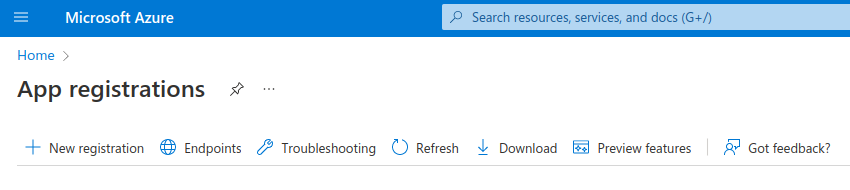
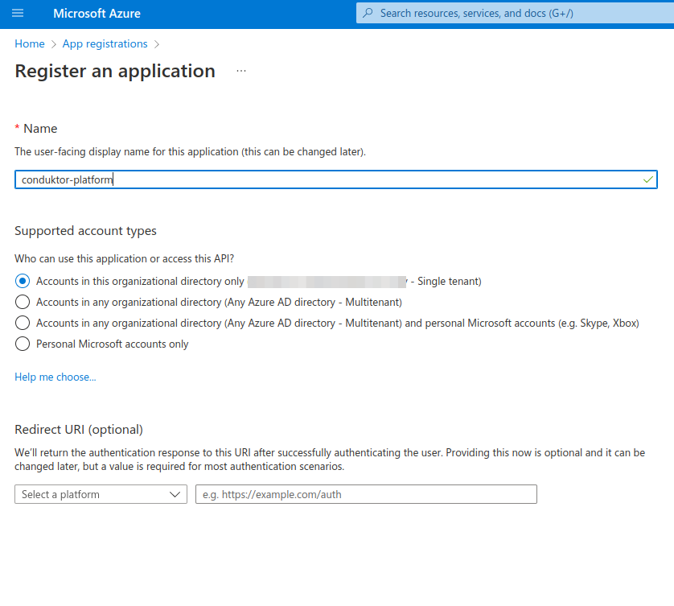
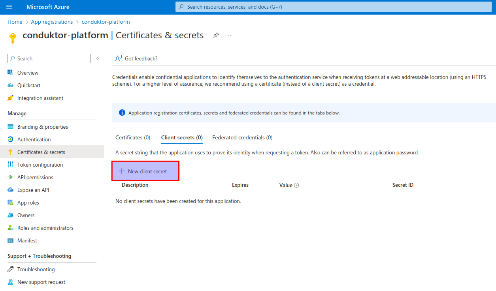
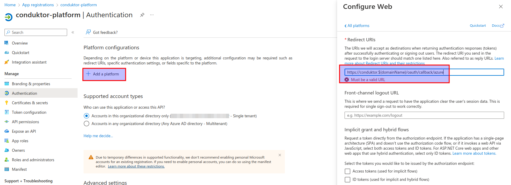

# User Authentication

To configure platform authentication you have several choices.

- [Configure Local Users](#configure-local-users)
- [Configure SSO](#configure-sso-to-an-ldap-or-oauth2-identity-provider-enterprise-plan-only)
  - [LDAP Server](#ldap-server)
  - [Auth0](#auth0)
  - [Okta](#okta)
  - [Keycloak](#keycloak)
  - [Azure](#azure)

## Configure Local Users

Into platform configuration file or from environment variables, configure authorized connection users.

Configuration example

```yaml
auth:
  local-users:
    - email: admin@demo.dev
      password: adminpwd
    - email: user@demo.dev
      password: userpwd
```

Same configuration from environment variables :

```bash
CDK_AUTH_LOCALUSERS_0_EMAIL="admin@demo.dev"
CDK_AUTH_LOCALUSERS_0_PASSWORD="adminpwd"
CDK_AUTH_LOCALUSERS_1_EMAIL="user@demo.dev"
CDK_AUTH_LOCALUSERS_1_PASSWORD="userpwd"
```

## Configure SSO to an LDAP or Oauth2 Identity Provider (**enterprise plan only**)

Detail list of properties [here](./env-variables#sso-properties)

### LDAP server

> **Note** : For example purpose the LDAP used is from [zflexldap](https://www.zflexldapadministrator.com/index.php/blog/82-free-online-ldap)

```yaml
sso:
  ldap:
    - name: 'default' # Custom name for ldap connection
      server: 'ldap://www.zflexldap.com:389' # LDAP server URI with port
      managerDn: 'cn=ro_admin,ou=sysadmins,dc=zflexsoftware,dc=com' # Bind DN
      managerPassword: 'zflexpass' # Bind Password
      search-base: 'ou=users,ou=guests,dc=zflexsoftware,dc=com' # Base DN to search for users
      search-filter: '(uid={0})' # Search filter
      groups-enabled: true # Enable group search
      groups-base: 'ou=groups,ou=guests,dc=zflexsoftware,dc=com' # Base DN to search for groups
      group-filter: 'uniquemember={0}' # Group search filter
```

Or from environment variables :

```bash
SSO_LDAP_0_NAME="default"
SSO_LDAP_0_SERVER="ldap://www.zflexldap.com:389"
SSO_LDAP_0_MANAGERDN="cn=ro_admin,ou=sysadmins,dc=zflexsoftware,dc=com"
SSO_LDAP_0_MANAGERPASSWORD="zflexpass"
SSO_LDAP_0_SEARCH-BASE="ou=users,ou=guests,dc=zflexsoftware,dc=com"
SSO_LDAP_0_SEARCH-FILTER="(uid={0})"
SSO_LDAP_0_GROUPS-ENABLED="true"
SSO_LDAP_0_GROUPS-BASE="ou=groups,ou=guests,dc=zflexsoftware,dc=com"
SSO_LDAP_0_GROUPS-FILTER="uniquemember={0}"
```

#### LDAPS

For LDAP over SSL (LDAPS) connection you have to provide a trust certificate to `conduktor-platform` using Java JKS TrustStore file. 
See [SSL/TLS configuration](./ssl-tls-configuration.md) for more details.


### Oauth2 Identity Provider

### Auth0

Configure a new Application on Auth0 :

- **Step 1**: create regular web application
  

- **Step 2**: get client Id/Secret and domain
  

- **Step 3**: configure callback url
  

> **Note** : Conduktor platform expose a callback URI for Oauth2 authentication flow.
> This URL is defined as `http://<platform hostname>/oauth/callback/<oauth2 config name>`.

- **Step 4**: save changes
  

Platform configuration :
Add the following yaml fragment to your input `platform-config.yml` file.

```yaml
sso:
  oauth2:
    - name: 'auth0'
      default: true
      client-id: '<auth0 app client id>' # Get from step2 - 2
      client-secret: '<auth0 app client secret>' # Get from step2 - 3
      openid:
        issuer: '<auth0 app domain>.auth0.com' # Get from step2 - 1
```

Or from environment variables :

```bash
SSO_OAUTH2_0_NAME="auth0"
SSO_OAUTH2_0_DEFAULT=true
SSO_OAUTH2_0_CLIENT-ID="<auth0 app client id>"
SSO_OAUTH2_0_CLIENT-SECRET="<auth0 app client secret>"
SSO_OAUTH2_0_OPENID_ISSUER="<auth0 app domain>.auth0.com"
```

### Okta

Configure a new Application on Okta :

- **Step 1**: create OpenId Connect web application
  

- **Step 2**: configure callback url
  

> Note: Conduktor platform expose a callback URI for Oauth2 authentication flow.
> This URL is defined as `http://<platform hostname>/oauth/callback/<oauth2 config name>`.

- **Step 3**: configure app assignment and save changes
  

- **Step 4**: Get client Id/Secret
  

Platform configuration :
Add the following yaml fragment to your input `platform-config.yml` file.

```yaml
sso:
  oauth2:
    - name: 'okta'
      default: true
      client-id: '<okta app client id>' # Get from step4 - 8
      client-secret: '<okta app client secret>' # Get from step4 - 9
      openid:
        issuer: '<okta domain>.okta.com' # Your okta domain
```

Or from environment variables :

```bash
SSO_OAUTH2_0_NAME="okta"
SSO_OAUTH2_0_DEFAULT=true
SSO_OAUTH2_0_CLIENT-ID="<okta app client id>"
SSO_OAUTH2_0_CLIENT-SECRET="<okta app client secret>"
SSO_OAUTH2_0_OPENID_ISSUER="<okta domain>.okta.com"
```

### Keycloak

Configure a new client on Keycloak :

- **Step 1**: create new OpenId Connect client
  

- **Step 2**: Select Client auth flows
  

- **Step 3**: Configure redirect url
  

> **Note** : Conduktor platform expose a callback URI for Oauth2 authentication flow.
> This URL is defined as `http://<platform hostname>/oauth/callback/<oauth2 config name>`.

- **Step 4**: Get client secret
  

Platform configuration :
Add the following yaml fragment to your input `platform-config.yml` file.

```yaml
sso:
  oauth2:
    - name: 'keycloak'
      default: true
      client-id: '<keycloak client id>' # Created step 1 - 2
      client-secret: '<keycloak client id>' # Get from step 4 - 5
      openid:
        issuer: 'http://<host(:port)>/realms/<realm name>' # Could be get from the OpenI Endpoint configuration (.well-known) output on Realm settings page.
```

Or from environment variables :

```bash
SSO_OAUTH2_0_NAME="keycloak"
SSO_OAUTH2_0_DEFAULT=true
SSO_OAUTH2_0_CLIENT-ID="<keycloak client id>"
SSO_OAUTH2_0_CLIENT-SECRET="<keycloak client secret>"
SSO_OAUTH2_0_OPENID_ISSUER="http://<host(:port)>/realms/<realm name>"
```

### Azure

Configure new application on MS Azure

- **Step 1**: Create a new application in `App registrations`
  

- **Step 2**: Name the application with a relevant name
  

- **Step 3**: Create a new client secret. Keep these details secret.
  

- **Step 4**: Define the callback URL. Either use the full domain you will use to host the application, or `localhost`
  

In your application summary, you can easily find the tenant ID of your organization in MS Azure.
Replace the `{tenantid}` in the below configuration for `openid`.
Use the application ID as the `client-id`, and the client secret you created earlier as `client-secret`

```yaml
sso:
  oauth2:
    - name: 'azure'
      default: true
      client-id: ${AZURE_APPLICATION_ID}
      client-secret: ${AZURE_CLIENT_SECRET}
      openid:
        issuer: https://login.microsoftonline.com/{tenantid}/v2.0
```

Or from environment variables :

```bash
SSO_OAUTH2_0_NAME="azure"
SSO_OAUTH2_0_DEFAULT=true
SSO_OAUTH2_0_CLIENT-ID="${AZURE_APPLICATION_ID}"
SSO_OAUTH2_0_CLIENT-SECRET="${AZURE_CLIENT_SECRET}"
SSO_OAUTH2_0_OPENID_ISSUER="https://login.microsoftonline.com/{tenantid}/v2.0"
```

> **Note** : do not use the "Secret ID" of the client secret as the `client-id`. You **must** use the application ID.
