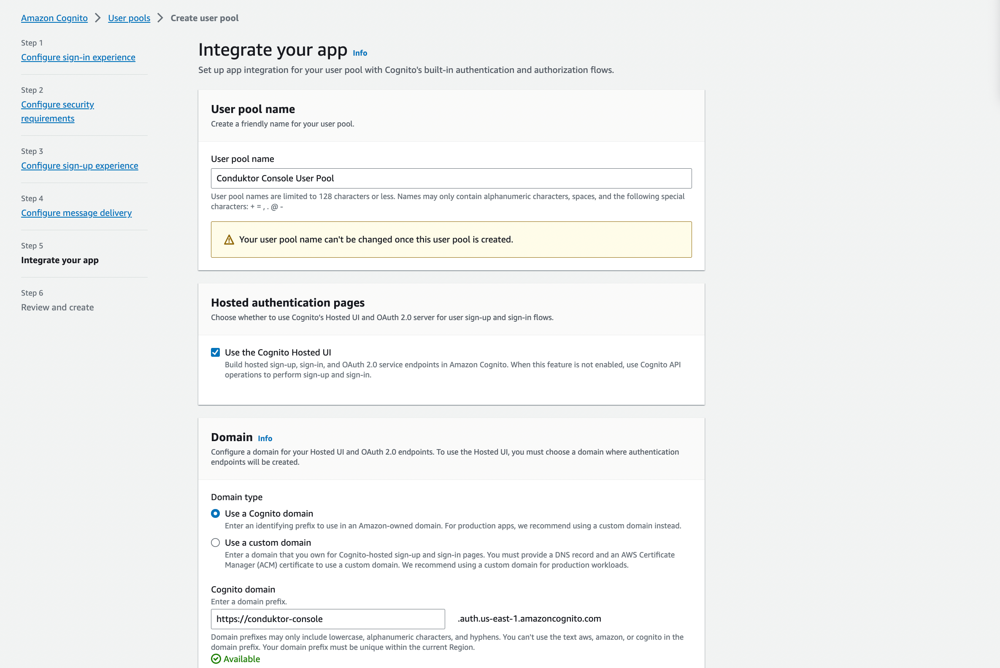
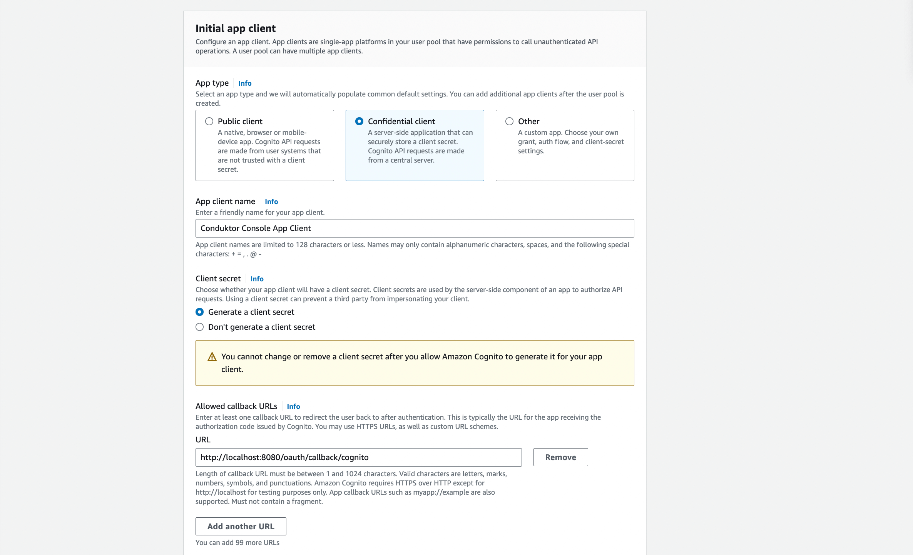
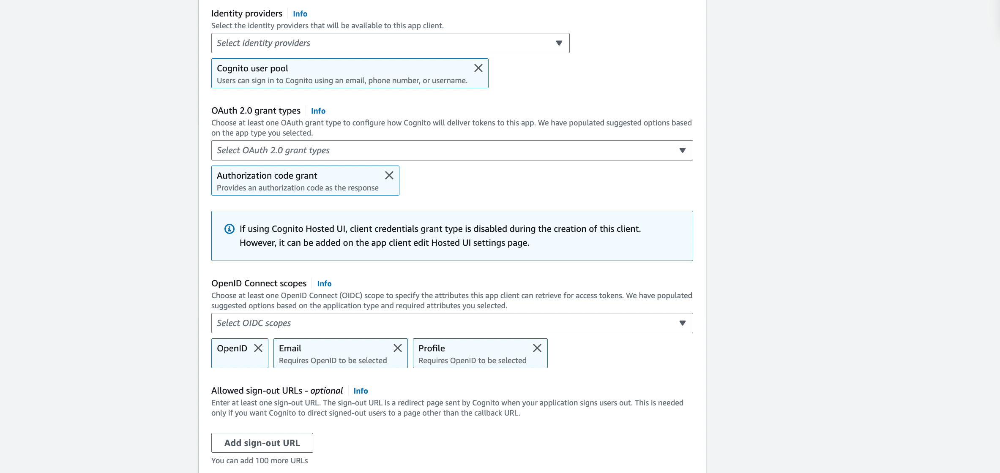
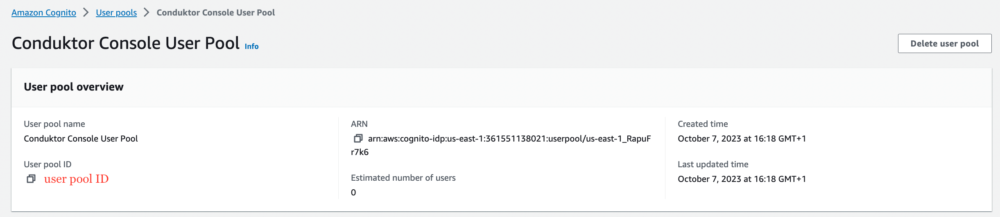
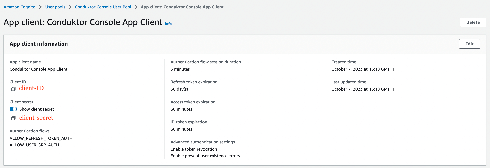

# Configure Amazon Cognito as SSO

## Amazon Cognito Configuration

On Amazon Cognito side, you'll have to create a user pool with an application:

- **Step 1**: Create a new user pool



- **Step 2**: Configure the application client

You can select the name you want, shown here as `Conduktor Console`, and enter the redirect URI as the following: `http(s)://<Console host>:<Console port>/oauth/callback/<OAuth2 config name>`. 

For example, if you deployed Console locally using the name `cognito` in your configuration file, you can use `http://localhost:8080/oauth/callback/cognito`, like on the screenshot below.


Make sure that a client secret will be generate. You can select `Confidential client` for that.



- **Step 3**: Set the scopes `profile`, `email`, and `openid` in the **Advanced app settings**




- **Step 4**: Get the `user pool ID`, `client ID`, and `client secret`, that you'll use in the configuration file of Console




:::tip
You can find the .well-known at: `https://cognito-idp.<region>.amazonaws.com/<user pool ID>/.well-known/openid-configuration`.
:::

## Console Configuration

On Console side, you can add the snippet below to your configuration file. You have to replace the `client ID`, `client secret`, `region`, and `pool ID`, by what you got during the step 4.

```yaml title="platform-config.yaml"
sso:
  oauth2:
    - name: "cognito"
      default: true
      client-id: "<client ID>"
      client-secret: "<client secret>"
      openid:
        issuer: "https://cognito-idp.<region>.amazonaws.com/<user pool ID>"
```

Or using environment variables:

```json
CDK_SSO_OAUTH2_0_NAME="cognito"
CDK_SSO_OAUTH2_0_DEFAULT=true
CDK_SSO_OAUTH2_0_CLIENT-ID="<client ID>"
CDK_SSO_OAUTH2_0_CLIENT-SECRET="<client secret>"
CDK_SSO_OAUTH2_0_OPENID_ISSUER="https://cognito-idp.<region>.amazonaws.com/<user pool ID>"
```

## Groups Configuration

If you want to use the `external groups mapping` to map groups between your Conduktor Console instance and Amazon Cognito, you must set the property `groups-claim` to `"cognito:groups"` in the Console configuration file. Below is the full snippet for your configuration file:

```yaml title="platform-config.yaml"
sso:
  oauth2:
    - name: "cognito"
      default: true
      client-id: "<client ID>"
      client-secret: "<client secret>"
      groups-claim: "cognito:groups"
      openid:
        issuer: "https://cognito-idp.<region>.amazonaws.com/<user pool ID>"
```

Or using environment variables :

```json
CDK_SSO_OAUTH2_0_NAME="cognito"
CDK_SSO_OAUTH2_0_DEFAULT=true
CDK_SSO_OAUTH2_0_CLIENT-ID="<client ID>"
CDK_SSO_OAUTH2_0_CLIENT-SECRET="<client secret>"
CDK_SSO_OAUTH2_0_GROUPS-CLAIM="cognito:groups"
CDK_SSO_OAUTH2_0_OPENID_ISSUER="https://cognito-idp.<region>.amazonaws.com/<user pool ID>"
```

### External Groups Mapping

Now that your configuration is finished, you can [setup the mapping](/platform/configuration/user-authentication/external-group-sync/#create-an-external-group-mapping) between Amazon Cognito and Console groups. That way, when a user will log in, they will be automatically added to the corresponding Console groups, based on the groups they belong to in Amazon Cognito.

The value you need to put as external group is the `Object ID` of the Amazon Cognito group.
