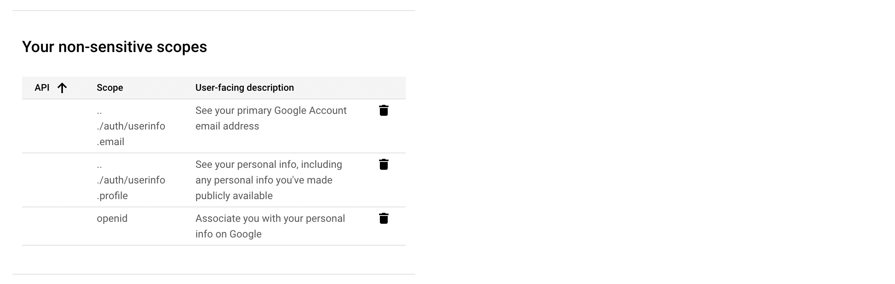
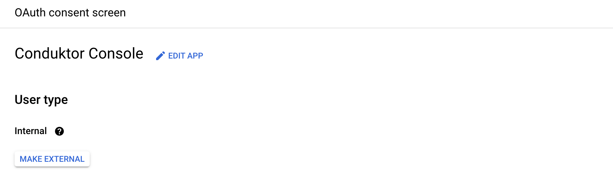
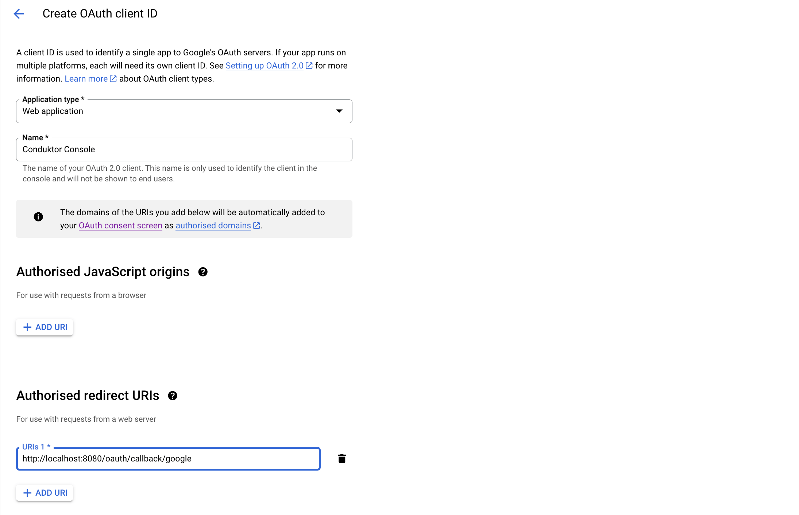
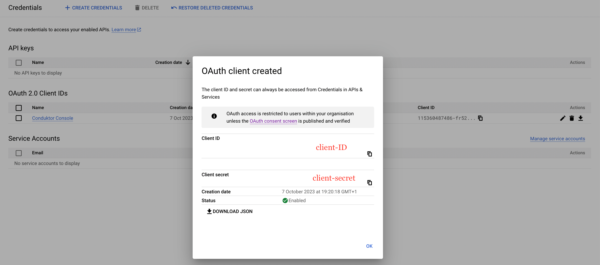

# Configure Google as SSO

## Google Configuration

On Google side, you'll have to follow these steps:

- **Step 1**: Create an application on the **OAuth consent screen** tab

The scopes needed are `email`, `profile`, and `openid`.




- **Step 2**: Restrict the access to your internal workspace by checking the `Internal` user type in the **OAuth consent screen**.



- **Step 3**: Create a new `OAuth client ID`

You can select the name you want, shown here as `Conduktor Console`, and enter the redirect URI as the following: `http(s)://<Console host>(:<Console port>)/oauth/callback/<OAuth2 config name>`. 

For example, if you deployed Console locally using the name `google` in your configuration file, you can use `http://localhost:8080/oauth/callback/google`, like on the screenshot below.

For more details on Console redirect URI for OAuth2, you can check the [documentation](./generic-oauth2.md#more-details-on-console-external-url).



- **Step 4**: Get the `client ID` and the `secret ID`

After the creation, the pop-up below appears. You can save the client ID and secret as JSON if you want.



:::tip
You can find the .well-known at: [`https://accounts.google.com/.well-known/openid-configuration`](https://accounts.google.com/.well-known/openid-configuration).
:::

:::info
If you need to add an **authorized domain** to your Google account, you can follow [this guide](https://support.google.com/cloud/answer/6158849?hl=en-GB#authorized-domains&zippy=%2Cauthorized-domains).
:::

## Console Configuration

On Console side, you can add the snippet below to your configuration file. You have to replace the client ID and secret by what you got during the step 4.

import Tabs from '@theme/Tabs'; import TabItem from '@theme/TabItem';

<Tabs>
<TabItem value="YAML  File" label="YAML File">

```yaml title="platform-config.yaml"
sso:
  oauth2:
    - name: "google"
      default: true
      client-id: "<client ID>"
      client-secret: "<client secret>"
      openid:
        issuer: "https://accounts.google.com"
```

</TabItem>
<TabItem value="Environment Variables" label="Environment Variables">

```json title=".env"
CDK_SSO_OAUTH2_0_NAME="google"
CDK_SSO_OAUTH2_0_DEFAULT=true
CDK_SSO_OAUTH2_0_CLIENT-ID="<client ID>"
CDK_SSO_OAUTH2_0_CLIENT-SECRET="<client secret>"
CDK_SSO_OAUTH2_0_OPENID_ISSUER="https://accounts.google.com"
```

</TabItem>
</Tabs>
