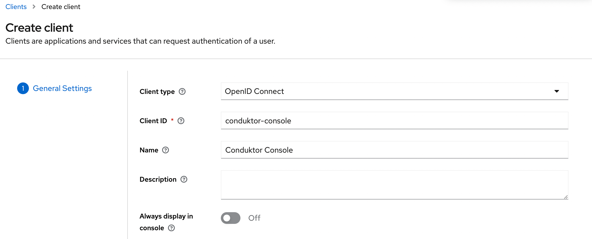
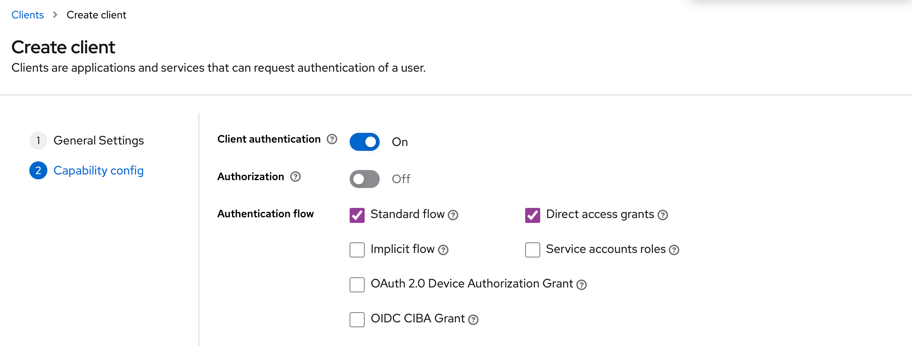
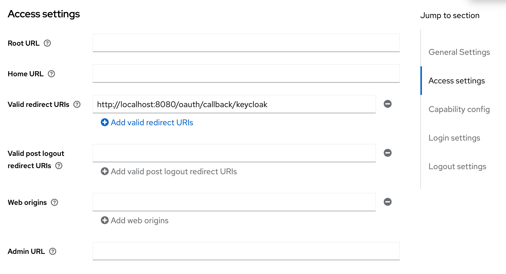
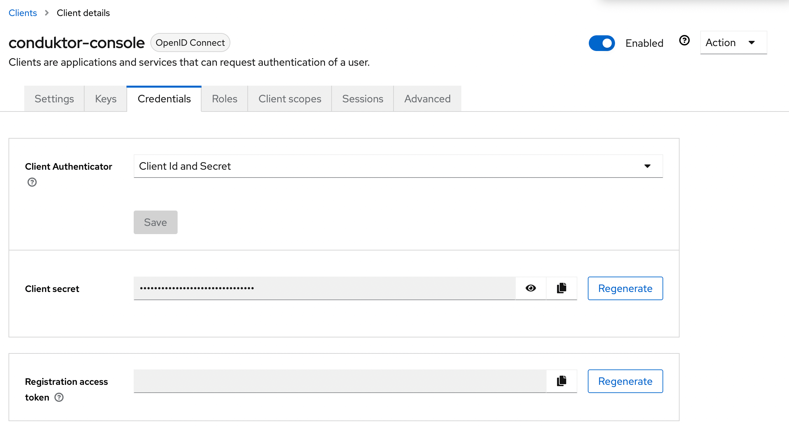
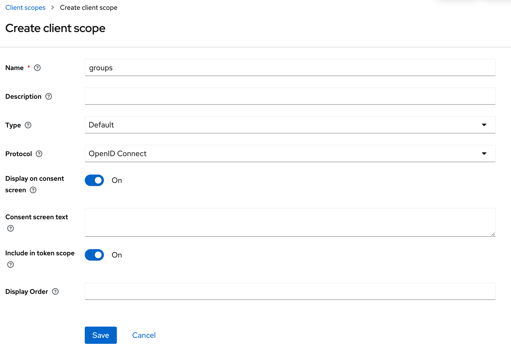
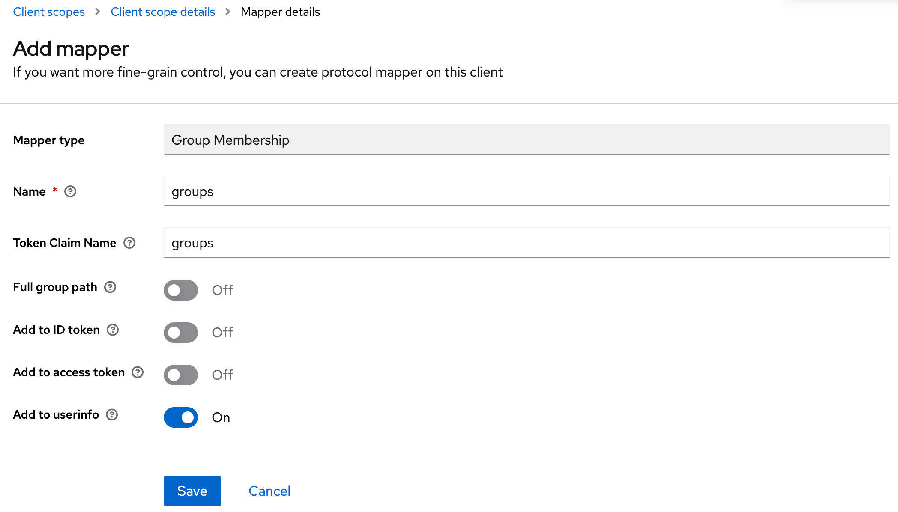
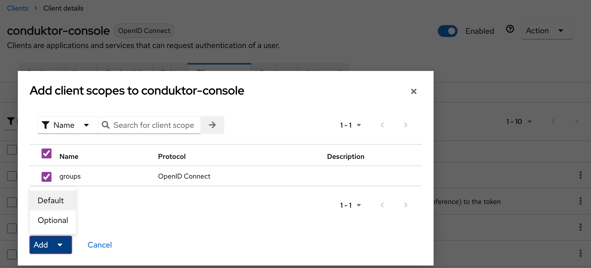

# Configure Keycloak as SSO

## Keycloak Configuration

On Keycloak side, you'll have to create a new application:

- **Step 1**: create a new OpenID Connect client, and set the client ID



- **Step 2**: Select the `Client authentication`



- **Step 3**: Configure the redirect URI as the following: `http(s)://<Console host>:<Console port>/oauth/callback/keycloak`

For example, if you deployed Console locally using the name `keycloak` in your configuration file, you can use `http://localhost:8080/oauth/callback/keycloak`, like on the screenshot below.



- **Step 4**: Get the `client secret` in the `Credentials` tab



## Console Configuration

On Console side, you can add the snippet below to your configuration file. You have to replace the client ID, client secret, and tenant ID, by what you got during the steps 2 and 3.

```yaml title="platform-config.yaml"
sso:
  oauth2:
    - name: "keycloak"
      default: true
      client-id: "<client ID>" # from step 4
      client-secret: "<client ID>" # from step 4
      openid:
        issuer: "http://<Keycloak host>:<Keycloak port>/realms/<realm name>"
```

Or using environment variables :

```json
CDK_SSO_OAUTH2_0_NAME="keycloak"
CDK_SSO_OAUTH2_0_DEFAULT=true
CDK_SSO_OAUTH2_0_CLIENT-ID="<client ID>"
CDK_SSO_OAUTH2_0_CLIENT-SECRET="<client secret>"
CDK_SSO_OAUTH2_0_OPENID_ISSUER="http://<Keycloak host>:<Keycloak port>/realms/<realm name>"
```

:::tip
You can find the .well-known at: `http://<Keycloak host>:<Keycloak port>/realms/<realm name>/.well-known/openid-configuration`.
:::


## Groups Configuration

If you want to use the `external groups mapping` to map groups between your Conduktor Console instance and Keycloak, you must create a scope and add it to your Keycloak application:

- **Step 1**: Create the scope and configure the mapper to `Group Membership`




You can add the claim to the token you want. In this example, the `UserInfo`.

- **Step 2**: Add the scope to the application



Then, you must set the property `groups-claim` to `"groups"` in the Console configuration file. Below is the full snippet for your configuration file:

```yaml title="platform-config.yaml"
sso:
  oauth2:
    - name: "keycloak"
      default: true
      client-id: "<client ID>" # from step 4
      client-secret: "<client ID>" # from step 4
      groups-claim: "groups"
      openid:
        issuer: "http://<Keycloak host>:<Keycloak port>/realms/<realm name>"
```

Or using environment variables :

```json
CDK_SSO_OAUTH2_0_NAME="keycloak"
CDK_SSO_OAUTH2_0_DEFAULT=true
CDK_SSO_OAUTH2_0_CLIENT-ID="<client ID>"
CDK_SSO_OAUTH2_0_CLIENT-SECRET="<client secret>"
CDK_SSO_OAUTH2_0_GROUPS-CLAIM="groups"
CDK_SSO_OAUTH2_0_OPENID_ISSUER="http://<Keycloak host>:<Keycloak port>/realms/<realm name>"
```

### External Groups Mapping

Now that your configuration is finished, you can [setup the mapping](/platform/configuration/user-authentication/external-group-sync/#create-an-external-group-mapping) between Keycloak and Console groups. That way, when a user will log in, they will be automatically added to the corresponding Console groups, based on the groups they belong to in Keycloak.

The value you need to put as external group is the name of the Keycloak group.

:::caution
If you've selected `Full group path` in the mapper details of the scope, you will need to use the full path instead of the name of the group.
:::


