# User Authentication

To configure platform authentication you have several choices.

- [Configure Local Users](#configure-local-users)
- [Configure SSO](#configure-sso-to-an-ldap-or-oauth2-identity-provider-enterprise-plan-only)
  - [LDAP Server](#ldap-server)
  - [LDAPS](#ldaps)
  - [Auth0](#auth0)
  - [Okta](#okta)
  - [Keycloak](#keycloak)
  - [Azure](#azure)
  - [Google](#google)
  - [Amazon Cognito](#amazon-cognito)
- [Manage permissions of users before they login](#manage-permissions-of-users-before-they-login)

## Configure Local Users

Within the platform configuration file or via environment variables, configure authorized connection users.

:::caution
Since Conduktor 1.14.0 you must set a **single root administrator** account in the platform configuration, which is used for initialization. However, it's possible to define multiple users with an administrator role from within the Conduktor interface.
:::

**Configuration example**:

```yaml
organization:
  name: conduktor

admin:
  email: admin@conduktor.io
  password: admin

auth:
  local-users:
    - email: user02@conduktor.io
      password: he11oworld
    - email: user03@conduktor.io
      password: he11oworld
```

Same configuration from environment variables :

```bash
CDK_ADMIN_EMAIL="admin@conduktor.io"
CDK_ADMIN_PASSWORD="admin"
CDK_AUTH_LOCAL-USERS_0_EMAIL="user02@conduktor.io"
CDK_AUTH_LOCAL-USERS_0_PASSWORD="he11oworld"
CDK_AUTH_LOCAL-USERS_1_EMAIL="user03@conduktor.io"
CDK_AUTH_LOCAL-USERS_1_PASSWORD="he11oworld"
```

## Configure SSO to an LDAP or Oauth2 Identity Provider (**enterprise and team plans**)

Detail list of properties [here](/platform/configuration/env-variables/#sso-properties)

### LDAP server

Conduktor platform can be configured to use an LDAP server as an identity provider.

To map LDAP users into Conduktor Platform will search for the following attributes from LDAP user entry :
- `uid` : user id
- `mail` or `email` : user email. **This is the only mandatory field**
- `cn` : user name
- `sn` : user surname
- `givenName` : user first name
- `displayName` : user display name

#### LDAP Groups
Group membership is also supported. Be aware that depending on your LDAP server group class change the attribute used to filter groups. 
For example : 
- if group class is `groupOfNames` then the attribute used to filter groups is `member`. 
- if group class is `groupOfUniqueNames` then the attribute used to filter groups is `uniqueMember`.


> **Note** : For example purpose the LDAP used is from our [example-sso-ldap](https://github.com/conduktor/conduktor-platform/tree/main/example-sso-ldap)

```yaml
sso:
  ldap:
    - name: "default"                              # Custom name for ldap connection
      server: "ldap://openldap:1389"               # LDAP server URI with port
      managerDn: "cn=admin,dc=example,dc=org"      # Bind DN
      managerPassword: "adminpassword"             # Bind Password
      search-subtree: true                         # Search subtree (default to true)
      search-base: "ou=users,dc=example,dc=org"    # Base DN to search for users
      search-filter: "(uid={0})"                   # Search filter (default to "(uid={0})") could also be "(cn={0})" or "(mail={0})" will be used in login form
      groups-enabled: true                         # Enable group membership (default to false)
      groups-base: "ou=groups,dc=example,dc=org"   # Base DN to search for groups
      groups-filter: "(member={0})"                # Filter to search for groups (default to "(member={0})") could also be "(uniqueMember={0})" depending on your LDAP server group class
      groups-attribute: "cn"                       # Attribute to retrieve from LDAP group entry (default to "cn")
```

> **Note** : If your LDAP server is Active directory, and you get "invalid user" error in Conduktor Platform when trying to log-in. Try setting your `search-filter` to the below in your `platform-config.yaml`

```yaml
search-filter: '(sAMAccountName={0})'
```

You can also configure SSO from environment variables :

```bash
CDK_SSO_LDAP_0_NAME="default"
CDK_SSO_LDAP_0_SERVER="ldap://openldap:1389"
CDK_SSO_LDAP_0_MANAGERDN="cn=admin,dc=example,dc=org"
CDK_SSO_LDAP_0_MANAGERPASSWORD="adminpassword"
CDK_SSO_LDAP_0_SEARCH-SUBTREE="true"
CDK_SSO_LDAP_0_SEARCH-BASE="ou=users,dc=example,dc=org"
CDK_SSO_LDAP_0_SEARCH-FILTER="(uid={0})"
CDK_SSO_LDAP_0_GROUPS-ENABLED="true"
CDK_SSO_LDAP_0_GROUPS-BASE="ou=groups,dc=example,dc=org"
CDK_SSO_LDAP_0_GROUPS-FILTER="(member={0})"
CDK_SSO_LDAP_0_GROUPS-ATTRIBUTE="cn"
```

### LDAPS

For LDAP over SSL (LDAPS) connection you have to provide a trusted certificate to `conduktor-platform` using Java JKS TrustStore file. See [SSL/TLS configuration](/platform/configuration/ssl-tls-configuration/) for more details.
LDAPS SSL certificate can also be passed as PEM encoded string using the property `sso.trustedCertificates`.

```yaml
sso:
  ignoreUntrustedCertificate: false
  trustedCertificates: |
    -----BEGIN CERTIFICATE-----
    ...
    -----END CERTIFICATE-----
```

**Troubleshot LDAPS issues**  
Download the script [sso-debug.sh](https://raw.githubusercontent.com/conduktor/conduktor-platform/main/example-sso-ldap/sso-debug.sh) and run it:

If you encounter an error that looks like this:

```console
15:09:15.276 DEBUG i.m.s.l.LdapAuthenticationProvider - Starting authentication with configuration [default]
15:09:15.276 DEBUG i.m.s.l.LdapAuthenticationProvider - Attempting to initialize manager context
15:09:15.279 DEBUG i.m.s.l.LdapAuthenticationProvider - Failed to create manager context. Returning unknown authentication failure. Encountered ldap.conduktor.io:1636
```

In order to confirm your configuration and figure out if the issue is SSL-related, apply the following procedure:

1. Set the property `sso.ignoreUntrustedCertificate` to `true`

```yaml
sso:
  ignoreUntrustedCertificate: true # < ---- THIS
  ldap:
  - name: default
    server: "ldaps://domain:636"
    ...
```

2. Run the script `platform-sso-debug.sh`
3. Try to authenticate to the platform
4. Confirm the message you have looks like this

```console
15:37:03.297 DEBUG i.m.s.l.LdapAuthenticationProvider - Starting authentication with configuration [default]
15:37:03.297 DEBUG i.m.s.l.LdapAuthenticationProvider - Attempting to initialize manager context
15:37:03.336 WARN  nl.altindag.ssl.SSLFactory - UnsafeTrustManager is being used. Client/Server certificates will be accepted without validation.
15:37:03.563 DEBUG i.m.s.l.LdapAuthenticationProvider - Manager context initialized successfully
15:37:03.563 DEBUG i.m.s.l.LdapAuthenticationProvider - Attempting to authenticate with user [test]
15:37:03.586 DEBUG i.m.s.l.LdapAuthenticationProvider - User not found [test]
```

From there, either leave the ignoreUntrusted or add the certificate to the truststore.  
See [SSL/TLS configuration](/platform/configuration/ssl-tls-configuration/) for more details.

### Oauth2 Identity Provider

### Auth0

Configure a new Application on Auth0 :

- **Step 1**: create regular web application 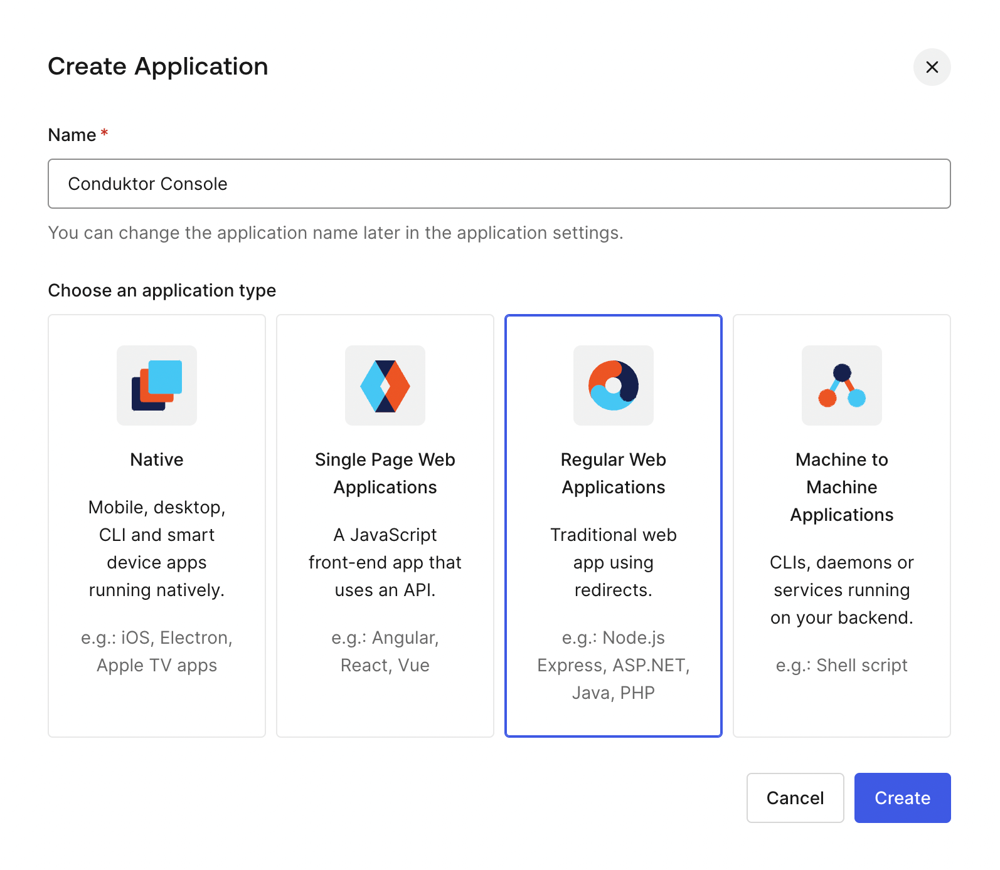

- **Step 2**: get client Id/Secret and domain 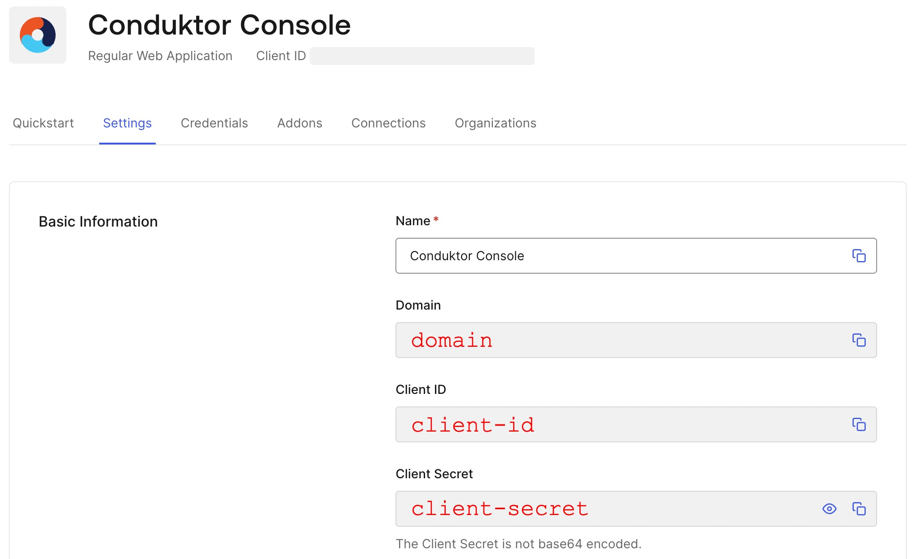

- **Step 3**: configure callback url 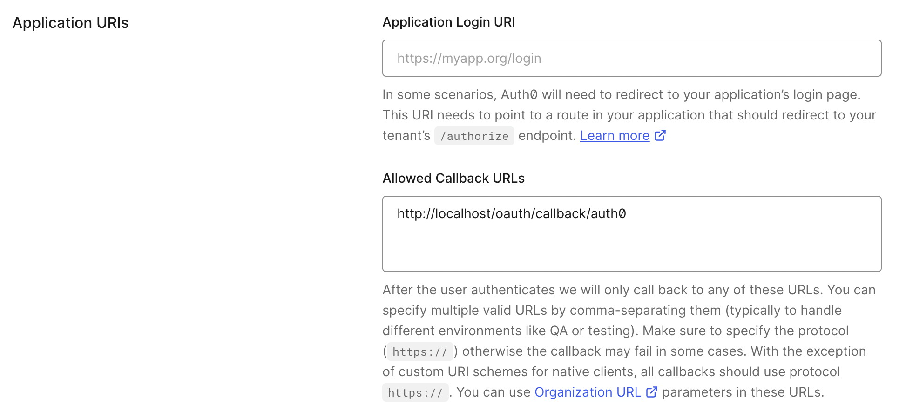

> **Note** : Conduktor platform expose a callback URI for Oauth2 authentication flow. This URL is defined as `http://<platform hostname>/oauth/callback/<oauth2 config name>`.

- **Step 4**: save changes 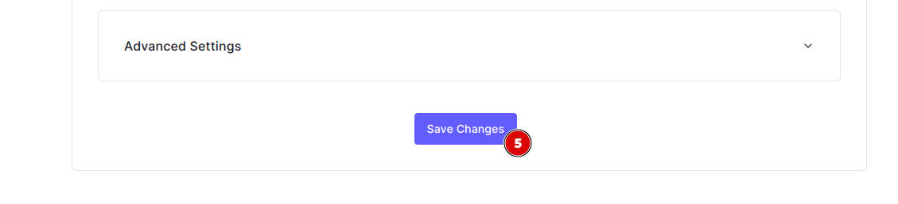

Platform configuration : Add the following yaml fragment to your input `platform-config.yml` file.

```yaml
sso:
  oauth2:
    - name: 'auth0'
      default: true
      client-id: '<auth0 app client id>' # Get from step2 - 2
      client-secret: '<auth0 app client secret>' # Get from step2 - 3
      openid:
        issuer: '<auth0 app domain>.auth0.com' # Get from step2 - 1
```

Or from environment variables :

```bash
CDK_SSO_OAUTH2_0_NAME="auth0"
CDK_SSO_OAUTH2_0_DEFAULT=true
CDK_SSO_OAUTH2_0_CLIENT-ID="<auth0 app client id>"
CDK_SSO_OAUTH2_0_CLIENT-SECRET="<auth0 app client secret>"
CDK_SSO_OAUTH2_0_OPENID_ISSUER="<auth0 app domain>.auth0.com"
```

### Okta

Configure a new Application on Okta :

- **Step 1**: create OpenId Connect web application 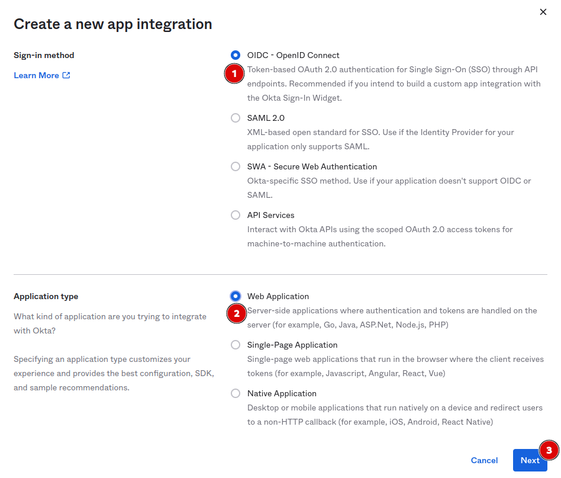

- **Step 2**: configure callback url 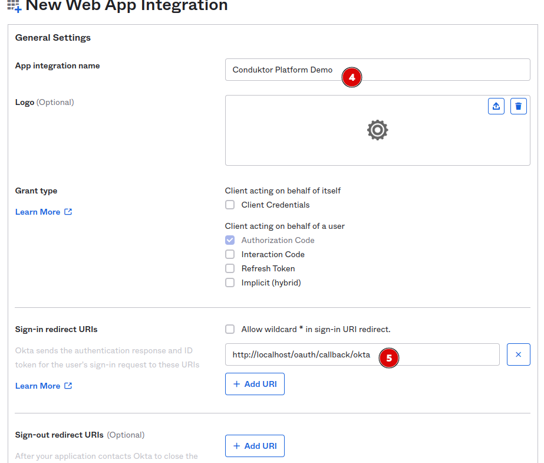

> Note: Conduktor platform expose a callback URI for Oauth2 authentication flow. This URL is defined as `http://<platform hostname>/oauth/callback/<oauth2 config name>`.

- **Step 3**: configure app assignment and save changes 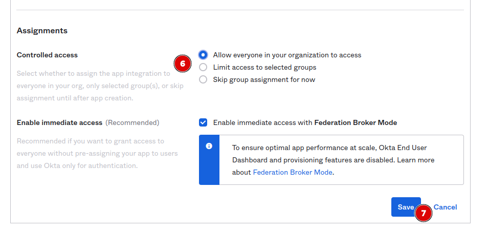

- **Step 4**: Get client Id/Secret 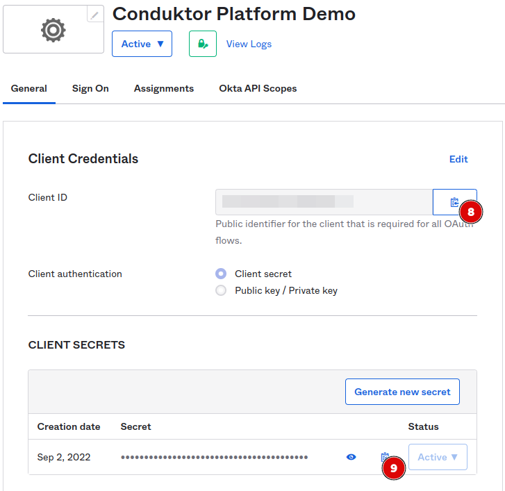

Platform configuration : Add the following yaml fragment to your input `platform-config.yml` file.

```yaml
sso:
  oauth2:
    - name: 'okta'
      default: true
      client-id: '<okta app client id>' # Get from step4 - 8
      client-secret: '<okta app client secret>' # Get from step4 - 9
      openid:
        issuer: '<okta domain>.okta.com' # Your okta domain
```

Or from environment variables :

```bash
CDK_SSO_OAUTH2_0_NAME="okta"
CDK_SSO_OAUTH2_0_DEFAULT=true
CDK_SSO_OAUTH2_0_CLIENT-ID="<okta app client id>"
CDK_SSO_OAUTH2_0_CLIENT-SECRET="<okta app client secret>"
CDK_SSO_OAUTH2_0_OPENID_ISSUER="<okta domain>.okta.com"
```

### Keycloak

Configure a new client on Keycloak :

- **Step 1**: create new OpenId Connect client 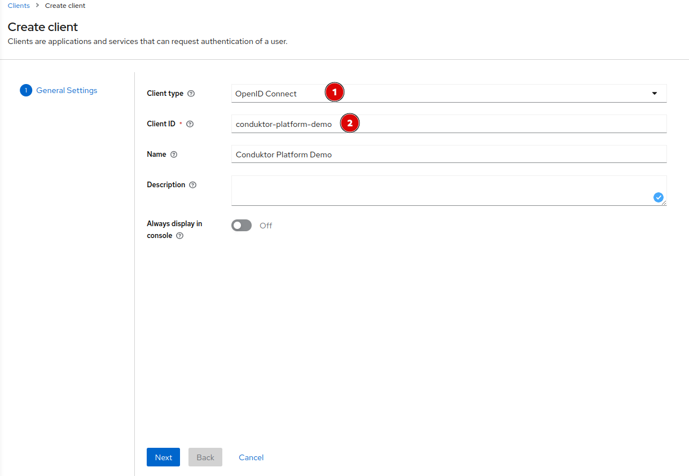

- **Step 2**: Select Client auth flows 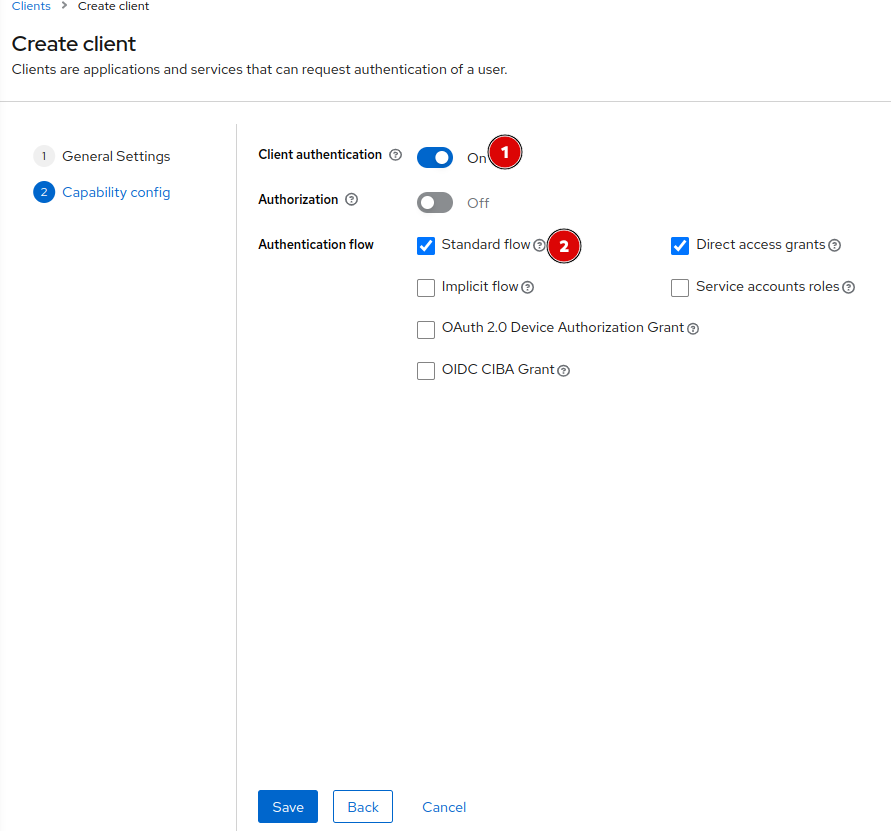

- **Step 3**: Configure redirect url 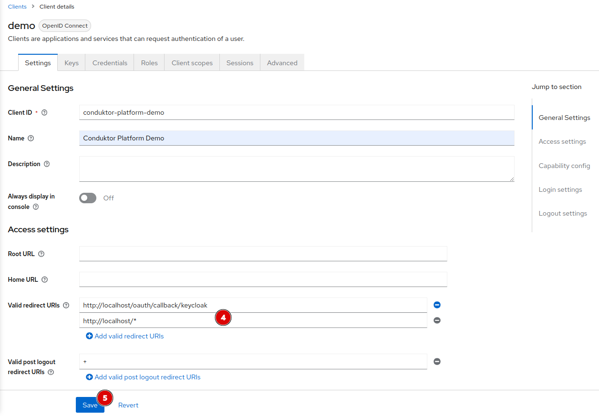

> **Note** : Conduktor platform expose a callback URI for Oauth2 authentication flow. This URL is defined as `http://<platform hostname>/oauth/callback/<oauth2 config name>`.

- **Step 4**: Get client secret 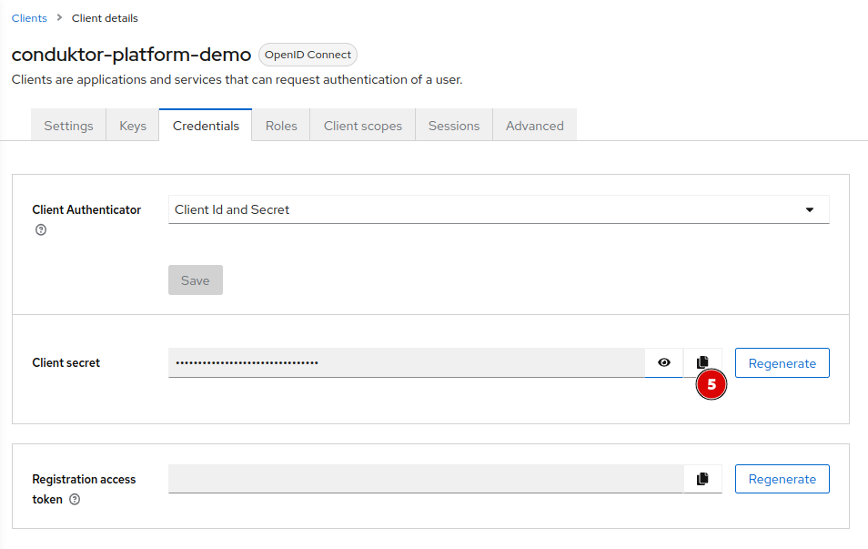

Platform configuration : Add the following yaml fragment to your input `platform-config.yml` file.

```yaml
sso:
  oauth2:
    - name: 'keycloak'
      default: true
      client-id: '<keycloak client id>' # Created step 1 - 2
      client-secret: '<keycloak client id>' # Get from step 4 - 5
      openid:
        issuer: 'http://<host(:port)>/realms/<realm name>' # Could be get from the OpenI Endpoint configuration (.well-known) output on Realm settings page.
```

Or from environment variables :

```bash
CDK_SSO_OAUTH2_0_NAME="keycloak"
CDK_SSO_OAUTH2_0_DEFAULT=true
CDK_SSO_OAUTH2_0_CLIENT-ID="<keycloak client id>"
CDK_SSO_OAUTH2_0_CLIENT-SECRET="<keycloak client secret>"
CDK_SSO_OAUTH2_0_OPENID_ISSUER="http://<host(:port)>/realms/<realm name>"
```

### Azure

Configure a new application on MS Azure

- **Step 1**: Create a new application in `App registrations`

You can select the name you want, shown here as `conduktor-platform`, and enter the redirect URI as the following: `http://<platform_host>/oauth/callback/azure`. For example, if you deployed the Platform locally, you can use `http://localhost/oauth/callback/azure`, like on the screenshot below.

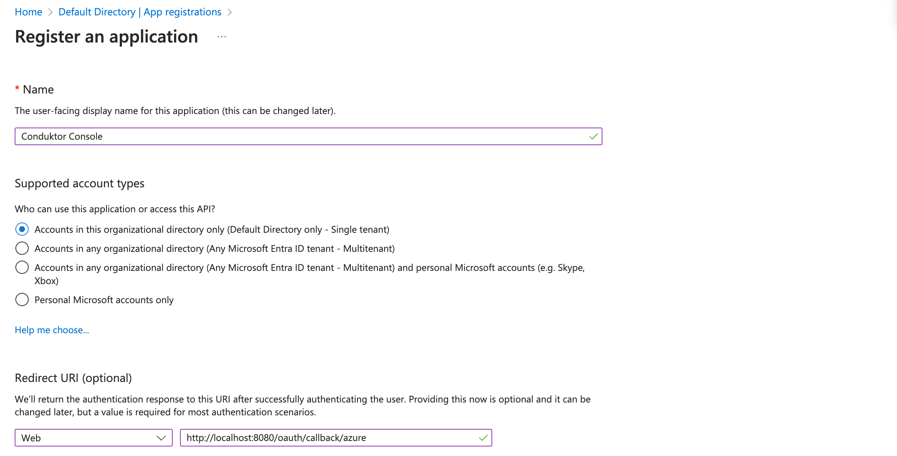

- **Step 2**: Create a new client secret.

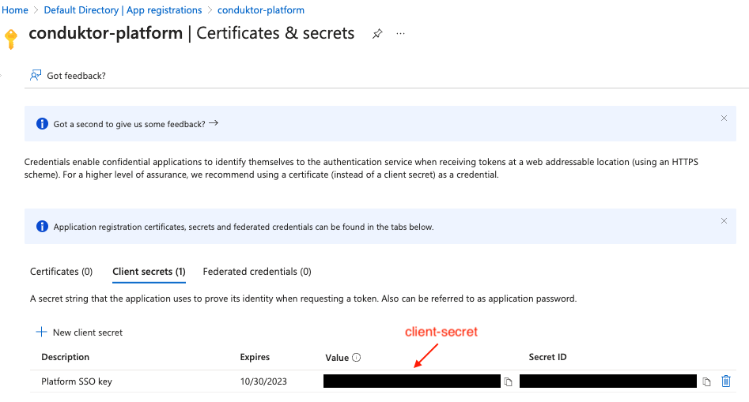

:::warning
You need to keep the `Value` somewhere safe, as you will not have access to it again.
:::

`Value` is marked by the red arrow on the screenshot above and is the one to put as `client-secret` in the configuration file.

- **Step 3**: Find the `Application (client) ID`

This useful information can be found in the overview of you application. It has been marked with a red arrow on the screenshot below. This will be the `client-id` in the configuration file.

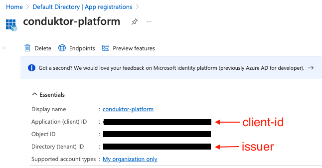

- **Step 4**: Write the configuration snippet

At the end, you should be able to write the following snippet in your Conduktor Platform configuration file:

```yaml
sso:
  oauth2:
    - name: 'azure'
      default: true
      client-id: ${AZURE_APPLICATION_ID} # from step 3
      client-secret: ${AZURE_CLIENT_SECRET} # from step 2
      openid:
        issuer: https://login.microsoftonline.com/{AZURE_TENANT_ID}/v2.0 # from step 3
```

Or using environment variables as shown here:

```bash
CDK_SSO_OAUTH2_0_NAME="azure"
CDK_SSO_OAUTH2_0_DEFAULT=true
CDK_SSO_OAUTH2_0_CLIENT-ID="${AZURE_APPLICATION_ID}"
CDK_SSO_OAUTH2_0_CLIENT-SECRET="${AZURE_CLIENT_SECRET}"
CDK_SSO_OAUTH2_0_OPENID_ISSUER="https://login.microsoftonline.com/{tenantid}/v2.0"
```

:::info
If you want to use the `external groups mapping` to map groups between your Conduktor Platform instance and Azure, please take a look at [here](../external-group-sync/#azure-ad-example).
:::

### Google

First of all, you need to create an application on the `OAuth consent screen` tab of you Google Console. The scopes needed are `email`, `profile`, and `openid`.


To restrict the access to your internal workspace, you need to check the `Internal` user type.


When it's done, you will create new credentials on the `Credentials` tab. You can select `OAuth client ID`. 

Enter the name you want, and the application type and redirect URI as below:


The callback should be like: `http://<platform hostname>/oauth/callback/<OAuth2 config name>`

:::danger If you use another hostname than localhost, you may need to start your callback by https.
:::

When you click on `Create`, you get you credentials. We suggest you to download the JSON file and keep it safe.


Now you have everything you need to setup the platform. Within your `platform-config.yaml` file, you can add the following block:

```yaml
sso:
  oauth2:
    - name: 'google'
      default: true
      client-id: <your_google_id>
      client-secret: <your_google_secret>
      openid:
        issuer: 'https://accounts.google.com'
```

### Amazon Cognito

The first step is to create a user pool on Cognito. You can go through different steps with default properties. At step 5, you need to choose a name for your user pool and your application.

We also suggest you to check the hosted UI and enter the domain you want. 

You can check the `Confidential client` property to get credentials. 

You will be able to see those credentials at the bottom of "App Integration", in your user pool. If you don't have a client id, you can "create app client" , choosing confidential client and give an app client name.

In the callback property, type `http://<platform hostname>/oauth/callback/<OAuth2 config name>`, and select `email`, `profile`, and `openid` as OpenID client scopes, in the `Advanced app client settings` section.

:::danger If you use another hostname than localhost, you may need to start your callback by https 
:::

Finally, click on `Create`. You can get your application credentials here:


Now you have everything you need to setup the platform. Within your `platform-config.yaml` file, you can add the following block:

```yaml
sso:
  oauth2:
    - name: 'cognito'
      default: true
      client-id: <cognito client ID>
      client-secret: <cognito client secret>
      openid:
        issuer: 'https://cognito-idp.<your aws region code>.amazonaws.com/<your user pool ID>
```


## Manage permissions of users before they login

It is now possible to add users to your organization before their first login via SSO. 
This allows an administrator to manage their permissions or add them to groups prior to them logging in. 
Upon login via SSO they will be synced to this account.

**Note**, this is not required but only when you may wish to configure user setup, e.g. *Permissions* before they login, and will only work for SSO setups.

From within the Members screen, select the Create members button to begin creating member profiles within Conduktor.
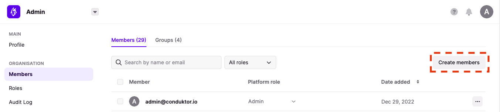

Enter the email(s) you wish to create the member(s) for, followed by *Create users*.
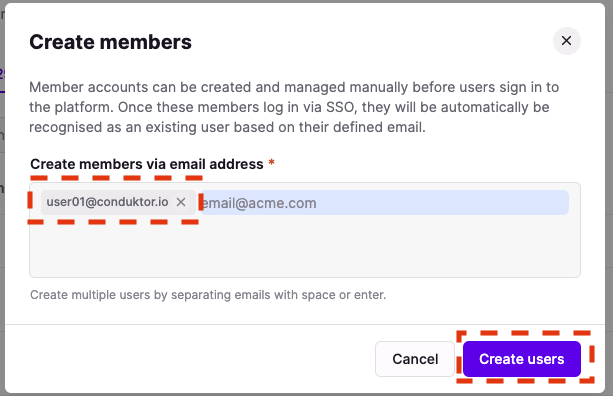

You may then create a group you wish to add the member to, or add to an existing group as you would for logged in members.
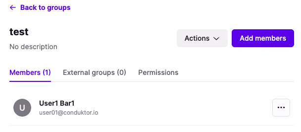
