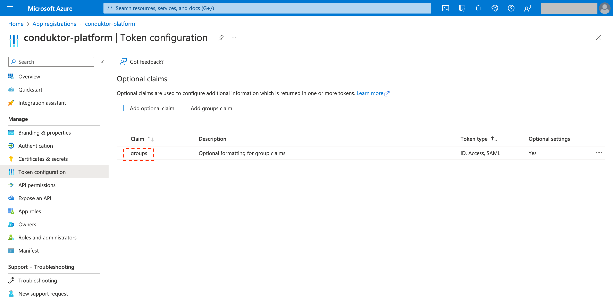
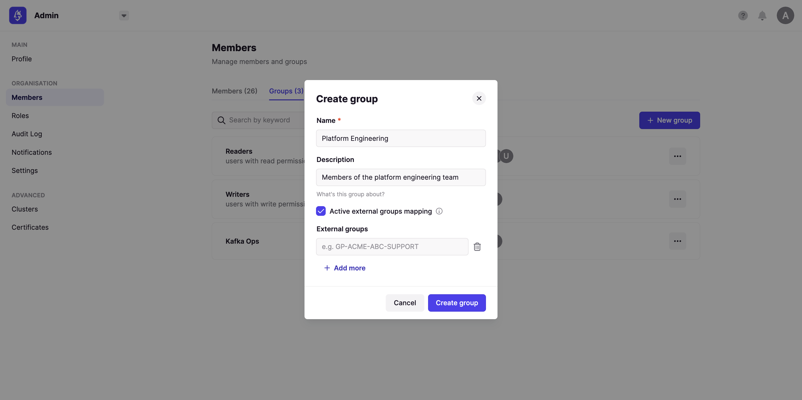
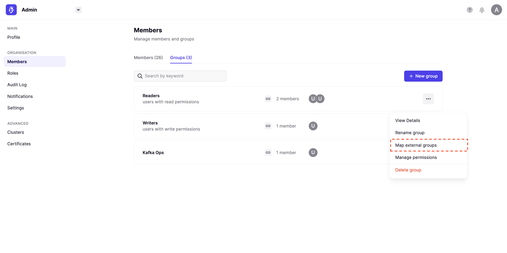

# External Group Sync

## Overview

External group synchronization allows you to integrate Conduktor's RBAC system with your LDAP or OIDC source of truth. When you map an external group, it will ensure a user is added to the Conduktor platform group at login. This mechanism ensures a user inherits necessary group permissions, and that they are removed accordingly from Conduktor groups if their external membership changes.

## Prerequisites

You must first configure [SSO](./user-authentication.md) to an LDAP or OAuth2.0 identity provider. In addition to the properties required for the default configuration, you must also add the relevant group properties.

### LDAP

For LDAP, populate the `groups-base` and `groups-filter` attributes. For more information see [configuration properties and environment variables](../../configuration/env-variables.md).

```yaml
  ldap:
    - name: "default"
      server: "ldap://ldap.test.io:1389"
      managerDn: "cn=admin,dc=conduktor,dc=io"
      managerPassword: "pass"
      search-base: "dc=conduktor,dc=io"
      groups-base: "dc=conduktor,dc=io"
      groups-filter: "member={0}"
```

### OIDC

For OIDC, populate the `groups-claim` attribute. For more information see [configuration properties and environment variables](../../configuration/env-variables.md).

```yaml
sso:
  oauth2:
    - name: 'azure'
      default: true
      client-id: ${AZURE_APPLICATION_ID}
      client-secret: ${AZURE_CLIENT_SECRET}
      openid:
        issuer: https://login.microsoftonline.com/{tenantid}/v2.0
      groups-claim: ${GROUPS_CLAIM}
```
For **Azure AD**, the claim value can be found in the 'Token configuration' tab within your App registration.


## Create a Group Mapping

Now that LDAP or OIDC is configured to map groups, you can now create a sync between an external group and a Conduktor group. You can:
 - Create a new Conduktor group with an external group mapping(s)
 - Map an existing Conduktor group to an external group(s)

**Create a new group with an external group mapping**

From within Admin, navigate to the Members screen and select the Groups tab. 

 - Provide the Name, Description and select Activate external groups mapping
 - Provide 1 or more LDAP/OIDC groups to create a sync



In the above example, any users that are present in the externally mapped groups will inherit permissions that are set against the Conduktor group 'Platform Engineering. To learn how to use Conduktor's RBAC system to enforce permissions, see [RBAC](../../admin/rbac.md).

**Map an existing Conduktor group to an external group**

From within the Members screen, select the breadcrumb next to an existing group and select 'Map external group'.



Once you have mapped external groups, use Conduktor's [RBAC](../../admin/rbac.md) system to enforce permissions.
