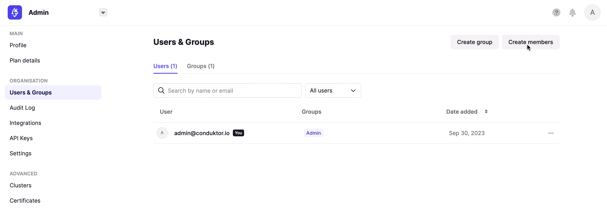
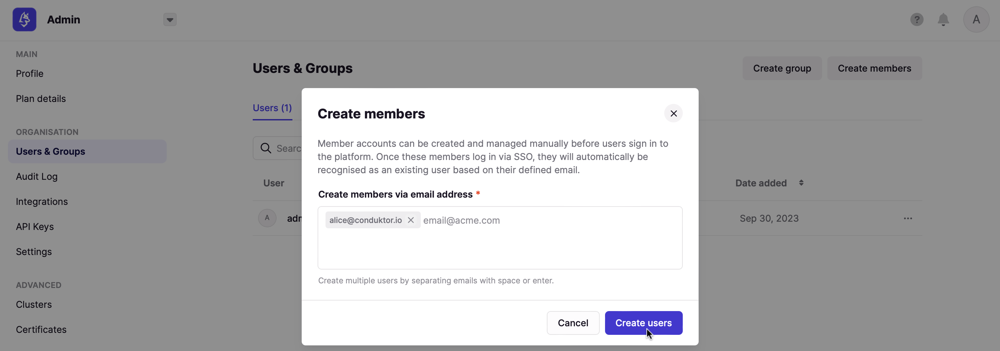
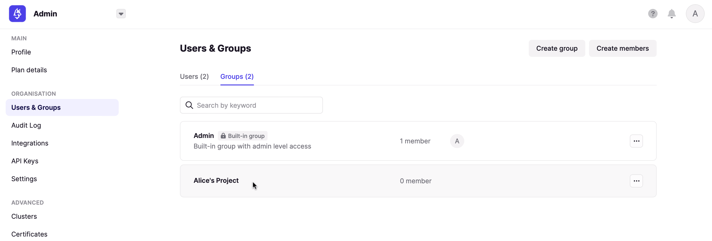
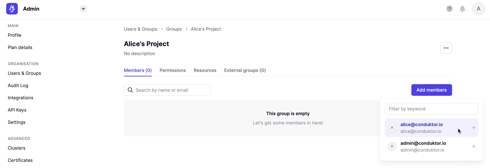

## Configure local admin and users

When you first start Conduktor Console, a **local admin** will be created using the credentials you gave (**mandatory since 1.14.0**). This admin account allows you to make some actions like creating users and groups, connecting clusters, or giving permissions, in order to initialize your instance before onboarding users.

You can also declare some **local users** for testing purpose, to see what users can see.

You can declare local admin and users within the **configuration file** or via **environment variables**.

### Configuration example

Here is an example of snippet you can use in your configuration file to declare the root administrator `admin@conduktor.io`, and two local users `alice@conduktor.io`, and `bob@conduktor.io`.

```yaml title="platform-config.yaml"
admin:
  email: admin@conduktor.io
  password: admin-secret

auth:
  local-users:
    - email: alice@conduktor.io
      password: alice-secret
    - email: bob@conduktor.io
      password: bob-secret
```

Here is the same configuration from [environment variables](/platform/configuration/env-variables/):

```json
CDK_ADMIN_EMAIL="admin@conduktor.io"
CDK_ADMIN_PASSWORD="admin-secret"
CDK_AUTH_LOCAL-USERS_0_EMAIL="alice@conduktor.io"
CDK_AUTH_LOCAL-USERS_0_PASSWORD="alice-secret"
CDK_AUTH_LOCAL-USERS_1_EMAIL="bob@conduktor.io"
CDK_AUTH_LOCAL-USERS_1_PASSWORD="bob-secret"
```

## Configure SSO **(Enterprise feature)**

In addition to these local admin and users, you can setup **Single Sign-On (SSO)** so your users can login using your company **LDAP** or **OIDC** identity provider. To be guided through the steps, please [select your identity provider](/platform/category/configure-sso/).

## Manage permissions of users before they login

To appear in the `Users` list, a user must **first log in**. But sometimes, you'd like to **manage their permissions and groups upstream**. 
For that, you can `Create members` using their **email address**. That way, when they will log in via SSO, they will be synchronised with this account.

Here are the steps to follow:
- From within the `Users & Groups` screen, select the `Create members` button.


- Enter the email of the user you want to create, then click on `Create users`.


- Finally, you can add them to a group by going in the `Groups` section, clicking on a group, and adding the user you just created.



