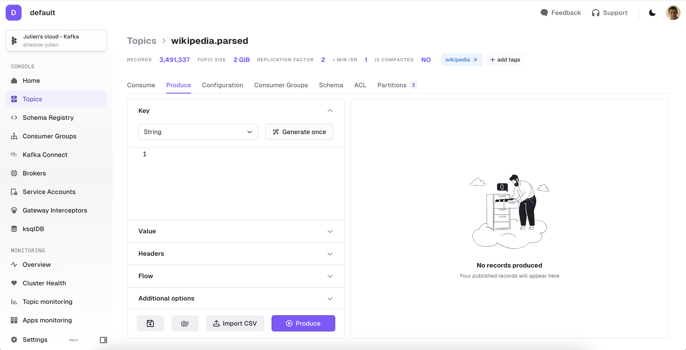
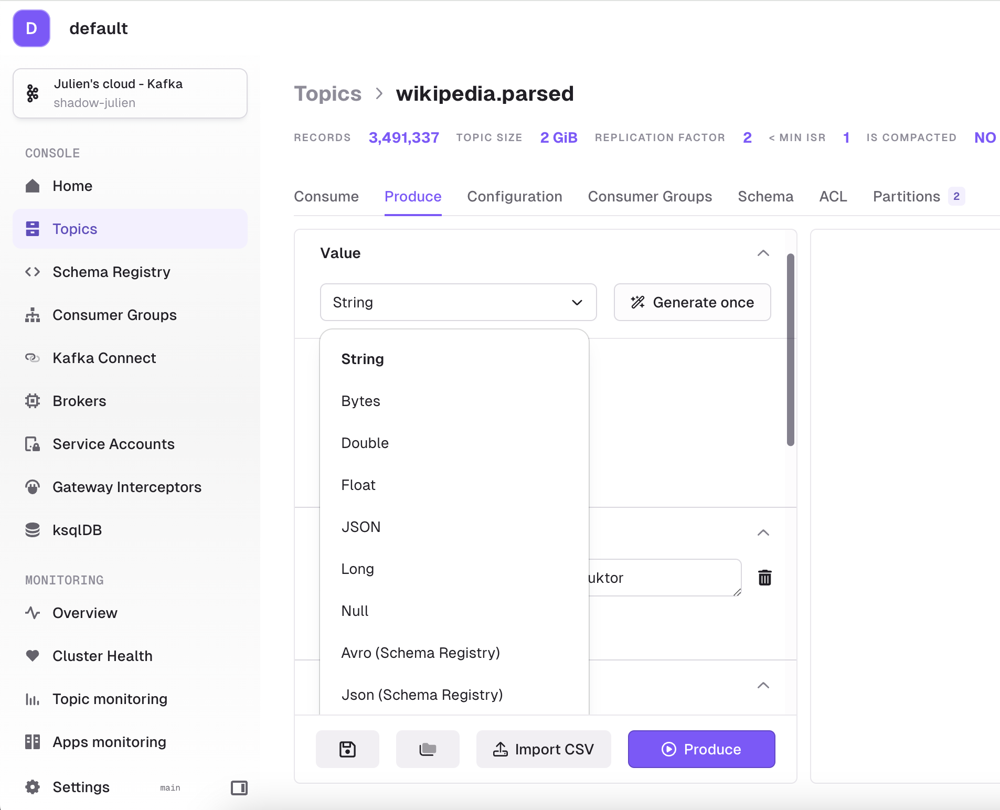
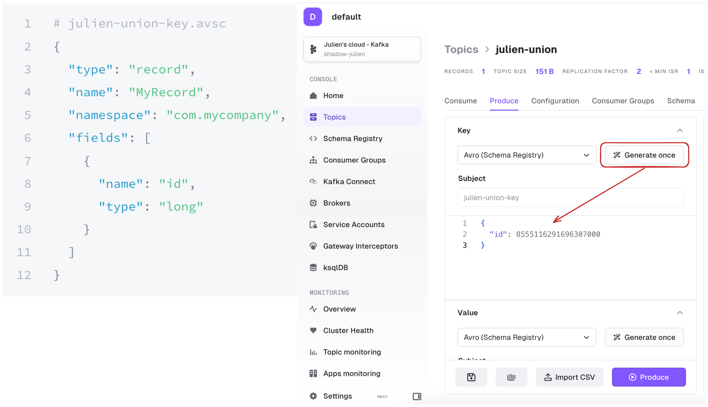
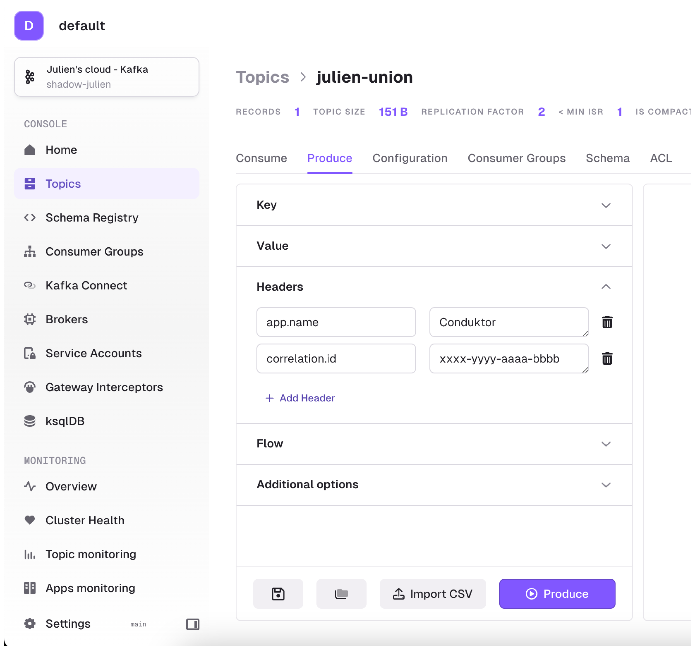
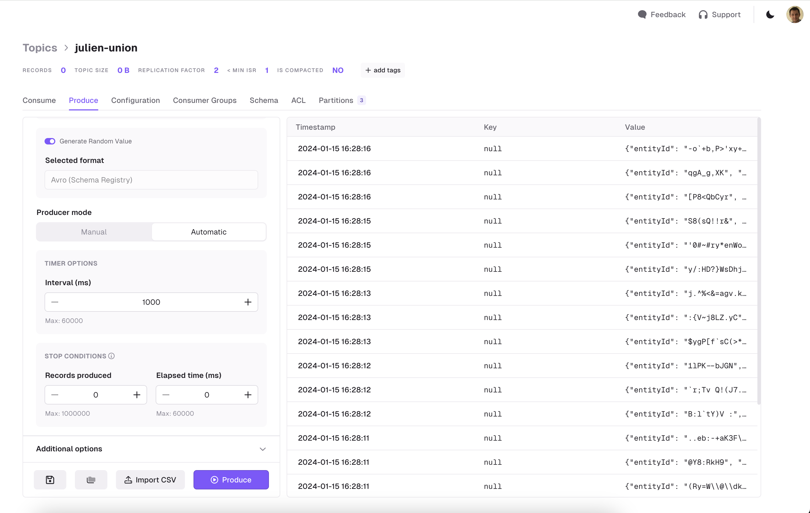
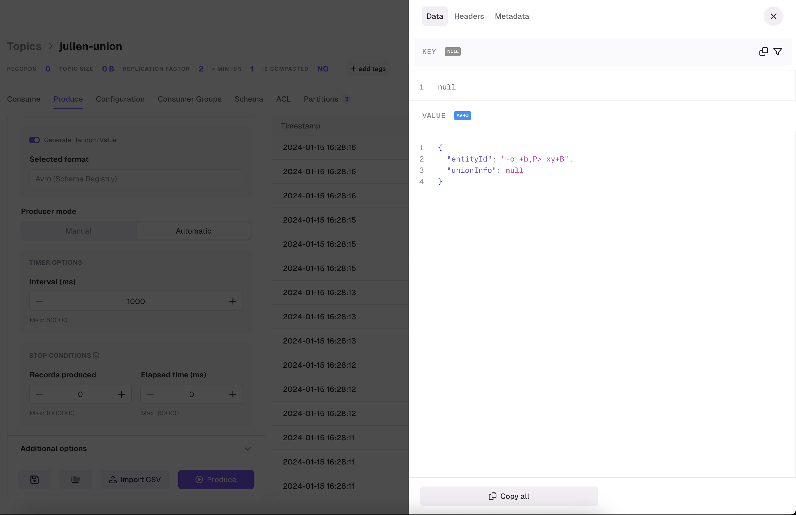
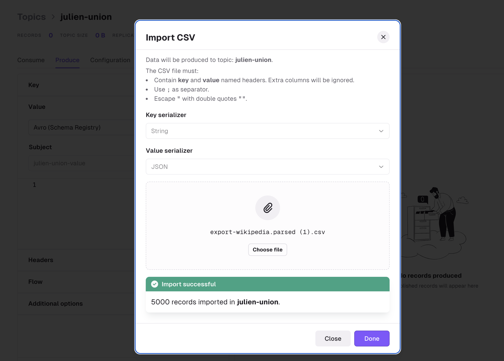

- [Configure Producer](#configure-producer)
- [Produced messages panel](#produced-messages-panel)
- [Operations](#operations)

The Produce page lets you configure all the details necessary to produce a record in your current Kafka topic.

It is already configured with [sensible defaults](#sensible-defaults) that you can customize if necessary.

## Configure Producer

Each section from the accordion menu will allow you to configure the Kafka producer further: Key, Value, Headers, Flow and Additional options.



### Key & Value

This section is similar for both Key and Value. The dropdown menu lets you choose your serializer to encode your message properly in Kafka.



The default Serializer is **String**.

If you have a matching subject name in your Schema Registry (with the **TopicNameStrategy**) the Serializer will be set automatically to the proper Registry type (Avro, Proto, Json Schema) with the subject name set to `<topic-name>-key` or `<topic-name>-value`

:::caution
If using a Schema Registry, please note that Conduktor currently only supports producing messages with the **TopicNameStrategy**. That is, subjects with names `<topic>-key` and `<topic>-value`
:::
#### Random Data Generator

The "Generate once" button will generate a message that conforms to the picked Serializer.

This works with Schema Registry serializers as well:


### Headers

The Headers section lets you add headers to your message.

Header Key and Header Value both expect valid UTF8 String.


### Flow

Using the Flow mode, you can produce multiple records in one go or configure a Live producer that will produce records at a configurable rate.

**Send N records at a time**

This option lets you define how many message should be produce every time you click the "Produce" button.

Default: 1

Range: [1, 10]

**Generate Random Key/Value**

In order to generate a different message each time you click "Produce", you can enable this option.

When enabled, it will override the Key or Value configured above and always rely on the Random Data Generator to produce messages, same as if you clicked "Generate once" prior to producing a record.

When disabled, the producer will use the Key/Value configured above

Default: disabled

**Producer Mode**

Manual Mode starts a single Kafka Produce each time you click the "Produce" button.

Automatic Mode starts a long running process that batches several Kafka Produce.

**Interval (ms) : **

-   Interval between each produce batch in milliseconds
-   Range: [1000, 60000]

**Stop conditions : The first met condition stops the producer**

-   **Number of records produced**
    -   Stops the producer after that many records have been produced.
    -   Range: [0, 1000000]
-   **Elapsed time (ms)**
    -   Stops the producer after a set period of time.
    -   Range: [0, 60000]

In the next screenshot, the producer is configured like this:

-   Produce 3 messages per batch
-   Reuse the same Key for all records
-   Generate a random Value (using the associated Serializer)
-   Generate a batch every second


### Additional options

**Force Partition**

This option lets you choose the partition where to produce your record.

If set to **all**, it will use the [DefaultPartitioner](https://github.com/apache/kafka/blob/3.7/clients/src/main/java/org/apache/kafka/clients/producer/internals/DefaultPartitioner.java) from KafkaClient 3.6+

-   StickyPartitioner when Key is null
-   `Utils.murmur2(serializedKey) % numPartitions` otherwise.

Default: all

**Compression Type**

This option lets you compress your record(s) using any of the available [CompressionType](https://github.com/apache/kafka/blob/3.7/clients/src/main/java/org/apache/kafka/common/record/CompressionType.java) from the KafkaClient

Default: none

**Acks**

This lets you change the `acks` property of the Producer.

Check this article: [Kafka Producer Acks Deep Dive](https://www.conduktor.io/kafka/kafka-producer-acks-deep-dive/)

Default: all

### Sensible Defaults

The following items are preconfigured by default:

-   If you have connected a Schema Registry and there exist a subject named `<topic-name>-key` and `<topic-name>-value` , the serializers will be populated automatically to the right type (Avro / Protobuf / JsonSchema)
    -   otherwise, the `StringSerializer` will be picked.
-   A single header `app.name=Conduktor` will be added

## Produced messages panel

Kafka records produced through this screen will be available from the Produced message panel, which acts similarly as the Consume page, allowing you to review your produced record and check the Key, Value, Headers and Metadata




## Operations

### Import CSV

This feature lets you produce a batch of Kafka Records based on a CSV file.

The 3 required inputs are the Key & Value Serializer, and the input file itself.


As of today, the file must respect the following structure:

- Named headers `key` and `value` must be present. Additional columns will be ignored.
- The separator must be `;`
- Double-quoting a field `"` is optional unless it contains either `"` or `;`, then it's mandatory
- Escape double-quotes by doubling them `""`

Examples

```undefined
# Null key (empty)
key;value
;value without key

# Unused headers
topic;partition;key;value
test;0;my-key;my-value

# Mandatory Double quoting
key;value
order-123;"item1;item2"

# Json data
key;value
order-123;"{""item1"": ""value1"", ""item2"":""value2""}"
```

Click "Import" to start the process.

While in progress, you'll see a loading state.

Once the import is finished, you'll get a summary message.



### Save & Load Producer Templates

If you are regularly using the same set of Producer configuration, you can save your current settings as a template for reuse.

Save icon button will prompt you to enter a name to your template, while the Load icon button will present you with the available template and you can choose to Load one.

