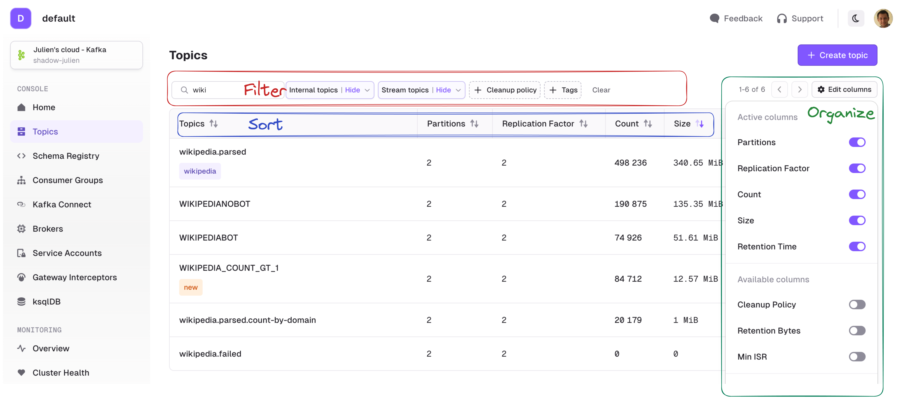

## Topic List

The Topic page lets you search for any topic on your currently selected Kafka cluster.
:::caution
Configure** RBAC** to restrict your users to View, Browse, or perform any operation only to certain topics.  
Check the [Settings](https://slite.com/api/public/notes/_OtvNSKy38tOKS/redirect) for more info.
:::caution
Multiple search capabilities can be combined to help you find to the topic you want faster.

**Filtering** is possible on:

-   Topic name
-   Show/Hide Internal topics (starts with `_`)
-   Show/Hide Kafka Stream topics (ends with `-repartition` or `-changelog`)
-   Cleanup policy
-   Tags (click on tag to add/remove them from the filters)

**Sorting** is possible on all columns.

**Active columns** can be picked from a list of Available columns from the side button « ⚙️ Edit columns »

:::info
Your current **filters**, active **sort**, and **visible columns** are stored in your browser's local storage for each Kafka Cluster and persist across sessions
:::info

## Create Topic

          