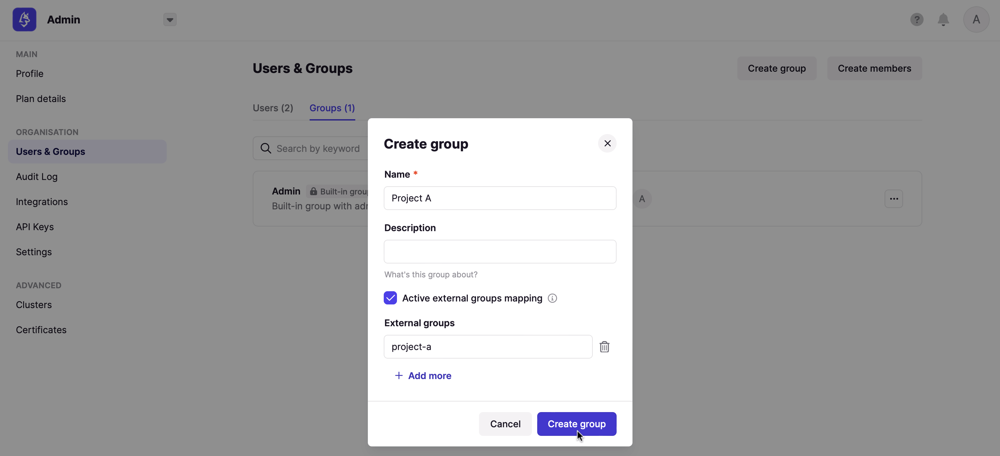
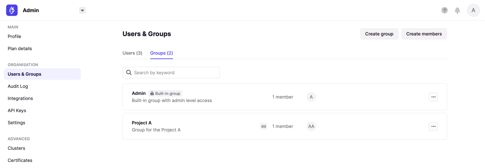

# Configure LDAP as SSO

You can find the list of LDAP properties [here](../../../env-variables/#ldap-properties).

## TL;DR

Here is an example snippet to put in your configuration file, that contains server, users and groups attributes.

import Tabs from '@theme/Tabs'; import TabItem from '@theme/TabItem';

<Tabs>
<TabItem value="YAML  File" label="YAML File">

```yaml title="platform-config.yaml"
sso:
  ldap:
    - name: "LDAP"                                 # Custom name for LDAP connection
      server: "ldap://openldap:1389"               # LDAP server URI with port
      managerDn: "cn=admin,dc=example,dc=org"      # Bind DN
      managerPassword: "adminpassword"             # Bind password
      search-subtree: true                         # Search subtree (default: true)
      search-base: "ou=users,dc=example,dc=org"    # Base DN to search for users
      search-filter: "(uid={0})"                   # Search filter (default: "(uid={0})")
      groups-enabled: true                         # Enable group membership (default: false)
      groups-base: "ou=groups,dc=example,dc=org"   # Base DN to search for groups
      groups-filter: "(member={0})"                # Filter on groups (default: "uniquemember={0}")
      groups-attribute: "cn"                       # Group name entry (default: "cn")
```

</TabItem>
<TabItem value="Environment Variables" label="Environment Variables">

```json title=".env"
CDK_SSO_LDAP_0_NAME="LDAP"
CDK_SSO_LDAP_0_SERVER="ldap://openldap:1389"
CDK_SSO_LDAP_0_MANAGERDN="cn=admin,dc=example,dc=org"
CDK_SSO_LDAP_0_MANAGERPASSWORD="adminpassword"
CDK_SSO_LDAP_0_SEARCH-SUBTREE=true
CDK_SSO_LDAP_0_SEARCH-BASE="ou=users,dc=example,dc=org"
CDK_SSO_LDAP_0_SEARCH-FILTER="(uid={0})"
CDK_SSO_LDAP_0_GROUPS-ENABLED=true
CDK_SSO_LDAP_0_GROUPS-BASE="ou=groups,dc=example,dc=org"
CDK_SSO_LDAP_0_GROUPS-FILTER="(member={0})"
CDK_SSO_LDAP_0_GROUPS-ATTRIBUTE="cn"
```

</TabItem>
</Tabs>

:::tip
If your LDAP server is **Active Directory** and you get "invalid user" error when trying to log-in, try setting your `search-filter` to `'(sAMAccountName={0})'`.
:::

## Users information

Here is the mapping between LDAP users information and Conduktor Console:

| LDAP              | Conduktor Console                         |
| ----------------- | ----------------------------------------- |
| `uid`             | User ID, used to log in                   |
| `mail` or `email` | User email (**The only mandatory field**) |
| `cn`              | User name                                 |
| `sn`              | User family name                          |
| `givenName`       | User first name                           |
| `displayName`     | User display name                         |

## Groups

To retrieve the groups each user belongs to, you have to set `groups-enabled` to `true`, and populate the attributes `groups-base` and `groups-filter`. You can find an example of snippet in the [TL;DR](#tldr).

:::caution
Be aware that depending on your LDAP `objectClass`, the attribute used to filter groups might be changed. 

For example: 

| LDAP `objectClass`   | Conduktor `groups-filter` |
| -------------------- | ------------------------- |
| `groupOfNames`       | `"member={0}"`            |
| `groupOfUniqueNames` | `"uniqueMember={0}"`      | 
:::

### External Groups Mapping

Now that your configuration is finished, you can setup a **mapping** between your LDAP groups and your Console groups. That way, when a user will log in, they will be automatically added to the corresponding Console groups, based on their LDAP groups.

To create this mapping, you have to create a group from Console, and mention the ID of the group on your LDAP (you should find it in the attribute you mentioned as `groups-base`).



After the user logged in, we can see they've been added to the group, without any action:

