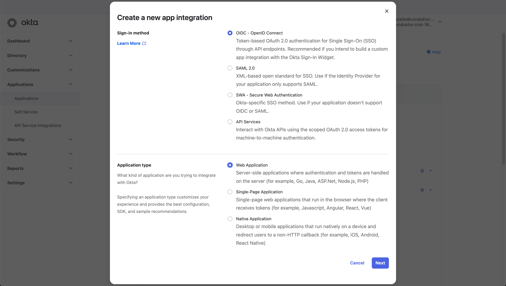
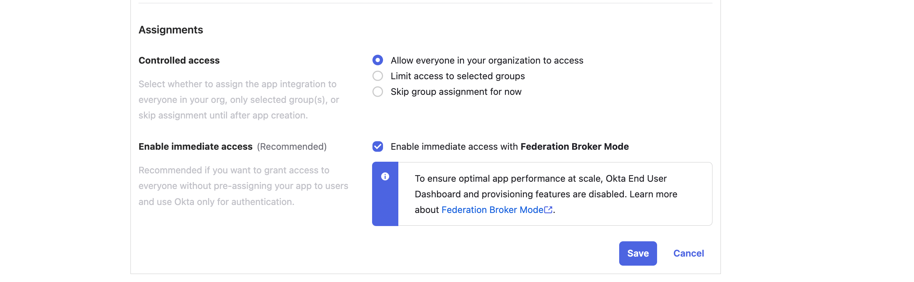
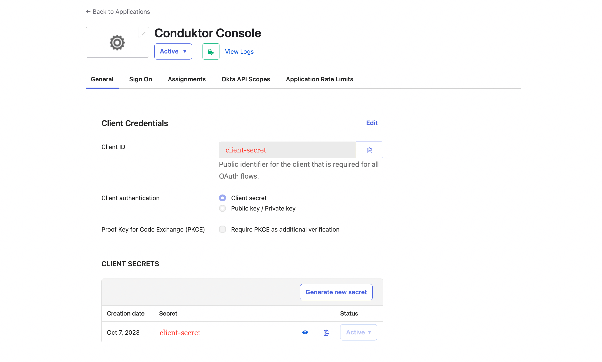
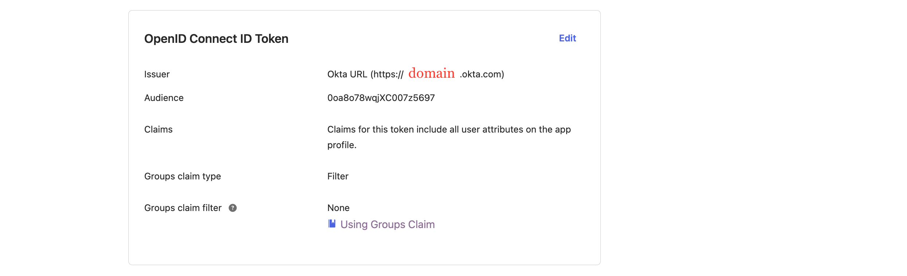

# Configure Okta as SSO

## Okta Configuration

On Okta side, you'll have to create a new application:

- **Step 1**: Create an **OpenID Connect web application**




- **Step 2**: Configure the callback URL

The callback URL must match the URL you log into Console with.  

For example, if you deployed Console locally you can use `http://localhost:8080/`.

:::note
Please note, OKTA is case sensitive, so the callback URL you use, must match exactly to the URL you login to Console with.
:::

- **Step 3**: Configure **app assignments**, and save changes 



- **Step 4**: Get `client ID` and `client secret`, that you'll use in the configuration file of Console



- **Step 5**: Find the `issuer URL` in the **Sign On** tab of your application. It's made like `https://<domain>.okta.com`



## Console Configuration

On Console side, you can add the snippet below to your configuration file. You have to replace the `console url` with the console callback URL specified in step 2, and you also need to replace `client ID`, `client secret`, and `domain`, which you retrieved in steps 4 and 5.

import Tabs from '@theme/Tabs'; import TabItem from '@theme/TabItem';

<Tabs>
<TabItem value="YAML  File" label="YAML File">

```yaml title="platform-config.yaml"
platform.external.url: "<console url>"
sso:
  oauth2:
    - name: "okta"
      client-id: "<client ID>"
      client-secret: "<client secret>"
      openid:
        issuer: "https://<domain>.okta.com"
```
:::note
Please note that if you are using a custom auth server in Okta, the OPENID_ISSUER should be in the form `https://<yourOktaDomain>/oauth2/<authorizationServerId>/` rather than `https://<domain>.okta.com`
You can find documentation on this [here](https://developer.okta.com/docs/guides/customize-tokens-returned-from-okta/main/).
:::


</TabItem>
<TabItem value="Environment Variables" label="Environment Variables">

```json title=".env"
CDK_SSO_OAUTH2_0_NAME="okta"
CDK_SSO_OAUTH2_0_DEFAULT=true
CDK_SSO_OAUTH2_0_CLIENT-ID="<client ID>"
CDK_SSO_OAUTH2_0_CLIENT-SECRET="<client secret>"
CDK_SSO_OAUTH2_0_OPENID_ISSUER="https://<domain>.okta.com"
CDK_PLATFORM_EXTERNAL_URL="<console url>"
```

</TabItem>
</Tabs>
