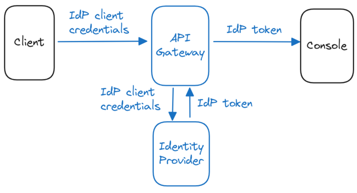

## Overview

Console has the ability to delegate authentication to an external identity provider. 

A common use case is to protect Console by putting an API gateway between Console and its clients. The authentication flow of the client is performed by the gateway and the token from the identity provider is sent directly to Console.
In this case, no authentication is performed by Console. It only checks that the token is valid and issued by the trusted identity provider.



When enabling the delegated authentication mode, tokens issued directly by Console are still accepted.

## Prerequisites
In order to validate a token, Console will retrieve the issuer configuration and public keys. The issuer must expose an OIDC discovery endpoint (`.well-know/openid-configuration`) to provide this information.

The token of the identity provider must contain claims with either an API key or an email. These claims allow Console to map the token to a user or an API key and apply its permissions. 

## Configuration

For more information see [configuration properties and environment variables](../../env-variables/#jwt-auth-properties).

In the following example, we configure Console to accept any token issued by `https://example.org/keycloak/realms/conduktor`.
If a valid API key is defined in `apikey` claim, it will be used.
Otherwise, the email contained in the `email` claim will be mapped to a Console user. If the user does not exist, it will be created.
The `groups` claim is optional and used for [external group mapping](external-group-sync.md).

```yaml title="platform-config.yaml"
sso:
   jwt-auth:
      issuer: "https://example.org/keycloak/realms/conduktor"
      username-claim: "email"
      groups-claim: "groups"
      api-key-claim: "apikey"
```

## Conduktor CLI
 
By default, the Conduktor CLI will try to log in to Console and generate a Conduktor token.
With delegated authentication, we want to avoid the generation of a Conduktor token and directly use the one provided by the identity provider.
You can configure the CLI for this mode by setting the `CDK_AUTH_MODE` environment variable to `external`.

If you already have a token from your identity provider, you can configure the CLI as following:
```shell
# Bearer token (issued by the identity provider)
export CDK_AUTH_MODE="external"
export CDK_API_KEY=<token>
```

If you use an API gateway in front of Console, you can also send the client ID and secret as Basic auth in the Authentication header, as following:
```shell
# Basic auth
export CDK_AUTH_MODE="external"
export CDK_USER=<client id>
export CDK_PASSWORD=<client secret>
```