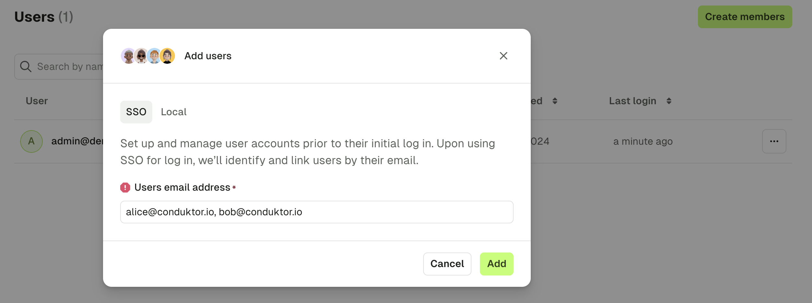
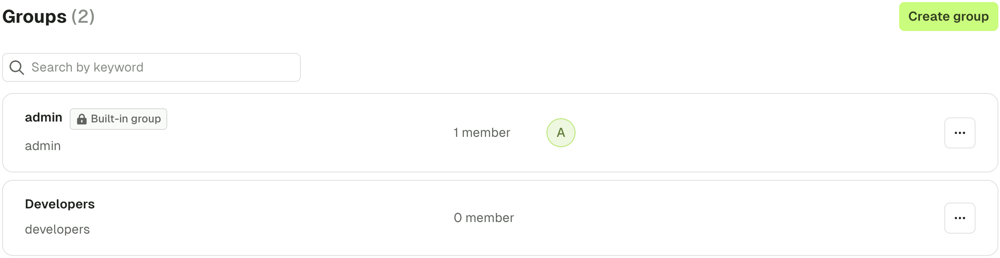
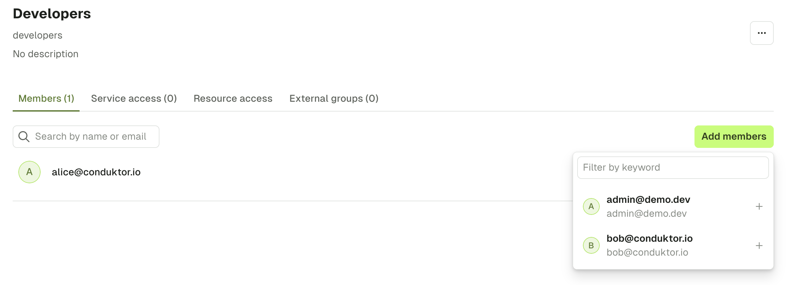

## Configure local admin and users

When you first start Conduktor Console, a **local admin** will be created using the credentials you gave. This admin account allows you to make some actions like creating users and groups, connecting clusters, or giving permissions, in order to initialize your instance before onboarding users.

You can declare **new users** from within the Console UI, via the configuration file or through environment variables.

### Add users in Console UI

From within the **Settings** > **Users & Groups** screen, select **Create members** to add a new user.

 - If you already have SSO configured, see [managing permissions of users before they login](#manage-permissions-of-users-before-they-login)
 - Alternatively, you can add users via basic authentication

Later on you may wish to add users from an IAC approach using the [ConsoleGroup](/platform/reference/resource-reference/console/#consolegroup) component.

import AddUsers from '../../installation/get-started/assets/add-users.png';


### Configuration example

Here is an example of a snippet you can use in your configuration file to declare the root administrator `admin@conduktor.io`, and two local users `alice@conduktor.io`, and `bob@conduktor.io`.

```yaml title="platform-config.yaml"
admin:
  email: admin@conduktor.io
  password: admin-secret

auth:
  local-users:
    - email: alice@conduktor.io
      password: alice-secret
    - email: bob@conduktor.io
      password: bob-secret
```

Here is the same configuration from [environment variables](../../env-variables/):

```json
CDK_ADMIN_EMAIL="admin@conduktor.io"
CDK_ADMIN_PASSWORD="admin-secret"
CDK_AUTH_LOCAL-USERS_0_EMAIL="alice@conduktor.io"
CDK_AUTH_LOCAL-USERS_0_PASSWORD="alice-secret"
CDK_AUTH_LOCAL-USERS_1_EMAIL="bob@conduktor.io"
CDK_AUTH_LOCAL-USERS_1_PASSWORD="bob-secret"
```

## Configure SSO

In addition to these local admin and users, you can set up **Single Sign-On (SSO)** so your users can log in using your company **LDAP** or **OIDC** identity provider.

:::info
This feature only works after setting up Console to use your identity provider as SSO. To be guided through the steps, please [select your identity provider](/platform/category/configure-sso/).
:::


## Manage permissions of users before they log in

To appear in the `Users` list, a user must **first log in**. But sometimes, you'd like to **manage their permissions and groups upstream**. 
For that, you can `Create members` using their **email address**. That way, when they will log in via SSO, they will be synchronised with this account.

Here are the steps to follow:
- From within the `Users & Groups` screen, select the `Create members` button.
- Enter the email of the users you want to create, then click on `Create users`.



- Finally, you can add them to a group by going into the `Groups` section, clicking on a group, and adding the user you just created.



