# Deployment on AWS

## Getting started

This guide will demonstrate how to deploy Console in your AWS environment with all mandatory dependencies. It will demonstrate how to deploy Conduktor as a Docker container on ECS with Fargate and configure it alongside a PostgreSQL database via RDS.

Rather than follow this manual guide, you might prefer to see our [Marktetplace Listing](aws-marketplace-and-cloudformation.md).

:::info
While this guide will help you get started, you may need to make additional configurations to ensure your deployment is [production-ready](/platform/get-started/installation/hardware/#production-requirements).
:::

The process should take no more than 15 - 30 minutes. 

## Security

Before you proceed, it is important to make sure that you have either already created a new Virtual Private Cloud (VPC) or are planning to use an existing one. This is important to ensure that your environment is secure and isolated. Additionally, we strongly recommend avoiding the use of the default VPC, as it can pose a security risk due to its common configuration.

## Networking & Architecture 
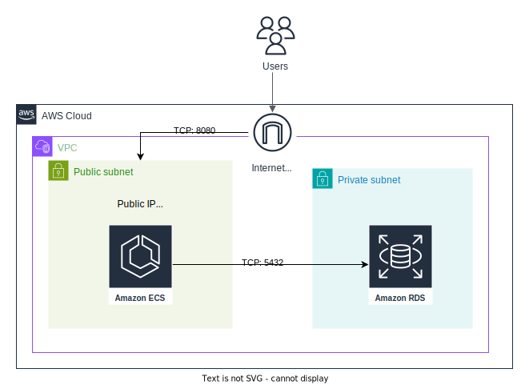

## Deployment Steps

- [Deployment on AWS](#deployment-on-aws)
  - [Getting started](#getting-started)
  - [Security](#security)
  - [Networking \& Architecture](#networking--architecture)
  - [Deployment Steps](#deployment-steps)
    - [Step 1: Create a PostgreSQL database via Amazon RDS](#step-1-create-a-postgresql-database-via-amazon-rds)
    - [Step 2: Create a new Task definition on ECS](#step-2-create-a-new-task-definition-on-ecs)
    - [Step 2.1: Add the core console container](#step-21-add-the-core-console-container)
    - [Step 2.2: Add the conduktor cortex monitoring image](#step-22-add-the-conduktor-cortex-monitoring-image)
    - [Step 3: Create an ECS cluster and setup Conduktor service](#step-3-create-an-ecs-cluster-and-setup-conduktor-service)
    - [Step 4: Access Conduktor and configure Kafka Clusters](#step-4-access-conduktor-and-configure-kafka-clusters)
    - [Step 5: Onboard your team](#step-5-onboard-your-team)
    - [Troubleshooting: Enabling Inbound Rules](#troubleshooting-enabling-inbound-rules)

### Step 1: Create a PostgreSQL database via Amazon RDS

:::info
You can skip this step if you already have an RDS database running you want to use.
:::

Let's start by deploying a database on RDS that Conduktor will use to store its state. 

As per the [system requirements](/platform/get-started/installation/hardware/#production-requirements), the PostgreSQL DB needs to be version **13 or higher**. 
Please be aware that Console is compatible only with PostgreSQL engines of version 14.8 or 15.3 and above **within RDS**; other versions may not be fully supported.

Go to the RDS menu and create a new database.
 - Select **PostgreSQL**
 - In the **Template** section, select **Free Tier** if you are just evaluating Conduktor
 
Under Settings, configure:
 - **Master username**: `conduktor`
 - **Master password**: `change_me`

The default PostgreSQL database port is **5432**.

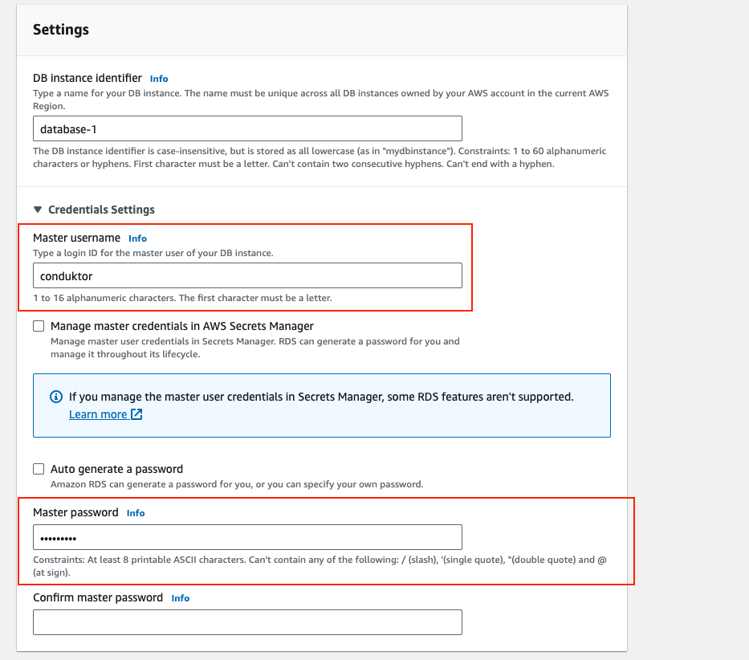

Under **Additional configuration**, configure:
 - **Initial database name**: `postgres`

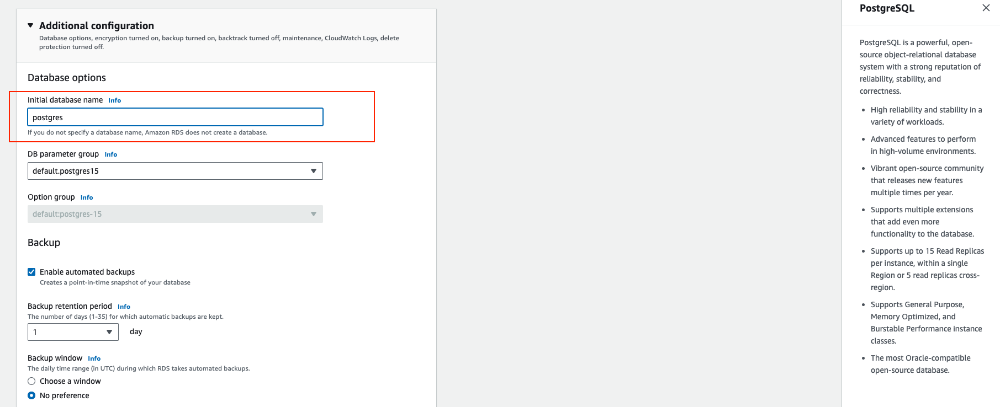

Once your database instance is up and running (it takes a few minutes), click on your new database and copy the endpoint generated by AWS in the **Connectivity & Security** panel:
 - e.g. `conduktor.xxx.eu-central-1.rds.amazonaws.com`

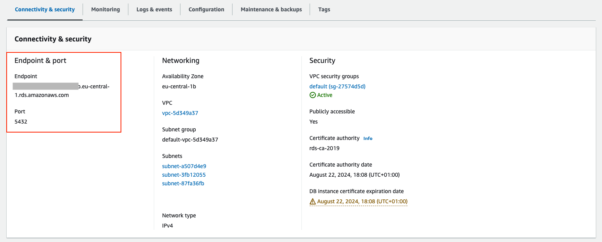

### Step 2: Create a new Task definition on ECS

Now that we have our database, it's time to deploy Conduktor using Docker containers and ECS (Amazon Elastic Container Service).

Go to Amazon Elastic Container Service:
 - Select **Task Definitions**
 - Click on **Create new task definition**

In the **Infrastructure Requirements** section:
 - Define the ECS family name as `conduktor`, this will be useful to update our deployment with newer versions of Conduktor.
 - Specify the infrastructure requirements relevant to your deployment. Per the [system requirements](/platform/get-started/installation/hardware/#production-requirements), we recommend a minimum of **2x CPU cores** and **4GB of RAM**.

### Step 2.1: Add the core console container

In the **Container Details** section:
 - Define the name of the container to `conduktor-console`
 - Specify the Image URI and version for Conduktor Console. You should use the most recent major/minor version.
    - eg: `conduktor/conduktor-console:<tag>`
 - Add a Port mapping on **8080**. This is the port of the UI of Conduktor Console.

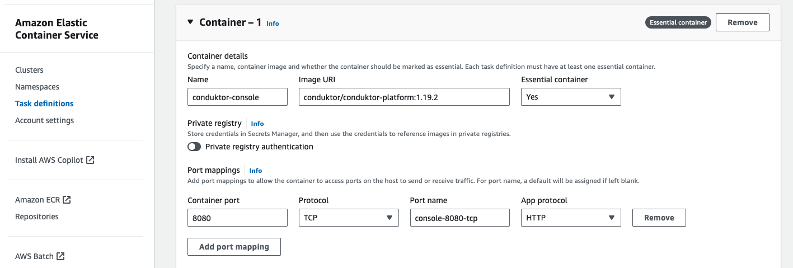

In the **Environment Variables** section, add the essential environment variables required to run Conduktor and connect to its PostgreSQL database on RDS.

 - `CDK_ADMIN_EMAIL`: yourname@yourcompany.com
 - `CDK_ADMIN_PASSWORD`: admin
 - `CDK_DATABASE_HOST`: the endpoint you retrieved earlier, like conduktor-xxx.yyy.eu-central-1.rds.amazonaws.com
 - `CDK_DATABASE_NAME`: postgres
 - `CDK_DATABASE_PASSWORD`: change_me
 - `CDK_DATABASE_PORT`: 5432
 - `CDK_DATABASE_USERNAME`: conduktor
 - `CDK_MONITORING_ALERT-MANAGER-URL`: http://localhost:9010/
 - `CDK_MONITORING_CALLBACK-URL`: http://localhost:8080/monitoring/api/
 - `CDK_MONITORING_CORTEX-URL`: http://localhost:9009/
 - `CDK_MONITORING_NOTIFICATIONS-CALLBACK-URL`: http://localhost:8080
 - `CDK_LICENSE`: Enterprise license key (Exclude if you are using Free)

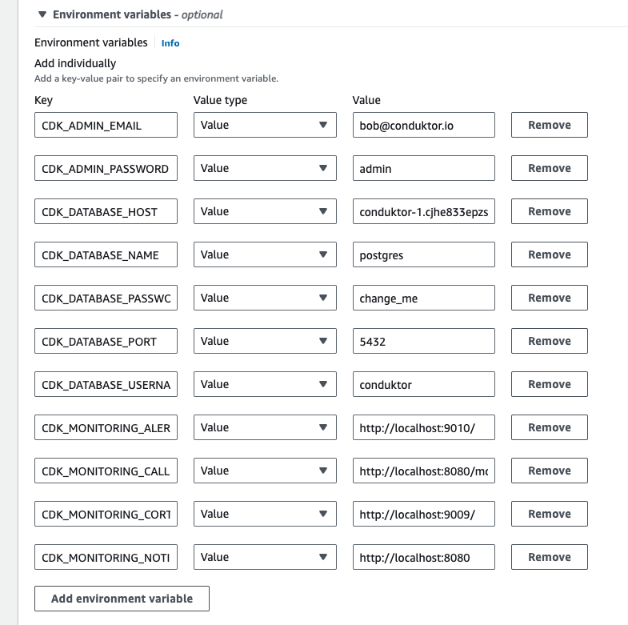

You can see the full list of environment variables [here](/platform/get-started/configuration/env-variables/). 

:::info
Note that you can also add your Kafka cluster, Schema Registry, Connect and ksqlDB configurations as environment variables. But if you're just getting started, we recommend you use the wizard inside the Console UI instead. The wizard provides support for uploading certificates, and help on debugging your connections.
:::

### Step 2.2: Add the conduktor cortex monitoring image
Underneath your first container definition, select **+ Add container** so we can also specify the docker image required to get monitoring benefits inside Conduktor.

In the **Container Details** section:
 - Define the name of the container to `conduktor-monitoring`
 - Specify the Image URI and version for conduktor monitoring. You should use the most recent major/minor version.
    - eg: `conduktor/conduktor-console-cortex:<tag>`

Add the below Port mappings:
- 9090 | TCP | conduktor-cortex-9090-tcp
- 9010 | TCP | conduktor-cortex-9010-tcp
- 9009 | TCP | conduktor-cortex-9009-tcp

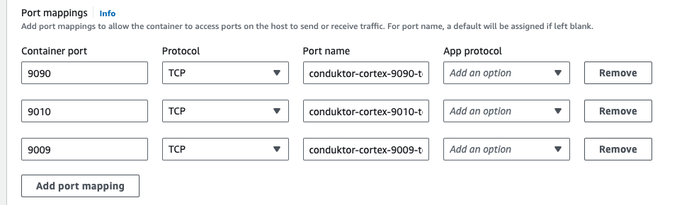

In the **Environment variables** section, add the required environment variable to link the monitoring container with the console container.
 - `CDK_CONSOLE-URL`: http://localhost:8080

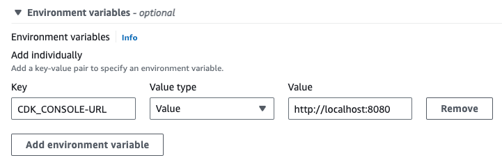

Note that for production environments, you should also configure an [external S3 bucket](/platform/get-started/configuration/cortex/) to store historical monitoring data.

We can now go down below and **Create** our task definition.

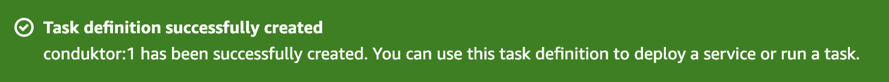

Whenever you want to change something in your configuration, edit your task definition and create a new version containing your changes.

### Step 3: Create an ECS cluster and setup Conduktor service

We created a Task definition, but it's still just a "template". Now, we need a cluster to deploy it. We'll use ECS with Fargate.

Go to Clusters and create a cluster (use the default options)
 - **Name**: conduktor-ecs
 - In the **Infrastructure** section, make sure AWS Fargate (serverless) is selected (default)
 Create the cluster, it might take a few seconds.

We now have a cluster to deploy our container. Our last step is to create a Service that will reference the Task Definition defined in the previous step.

 - Click on your new cluster `conduktor-ecs`
 - Create a new **Service**
 - In the second section, **Deployment configuration**, make sure the Application type is Service, and select our Task Definition `conduktor-console` in the Family dropdown
 - Assign a unique name like Console to be able to identify it properly later on
 - Let the rest of the options by default and click on Create at the bottom

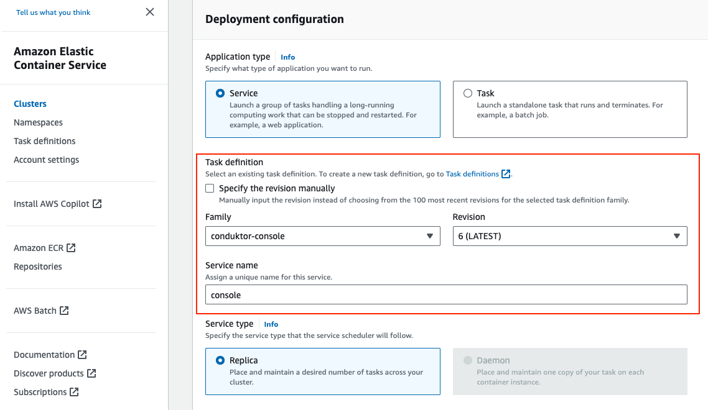

This will take a few minutes before the deployment is effective and Conduktor becomes available.

### Step 4: Access Conduktor and configure Kafka Clusters

From within the **Services > Tasks** screen,  find the Container and navigate to the **Network bindings** tab.

Click on the **External** link to open the Console application.

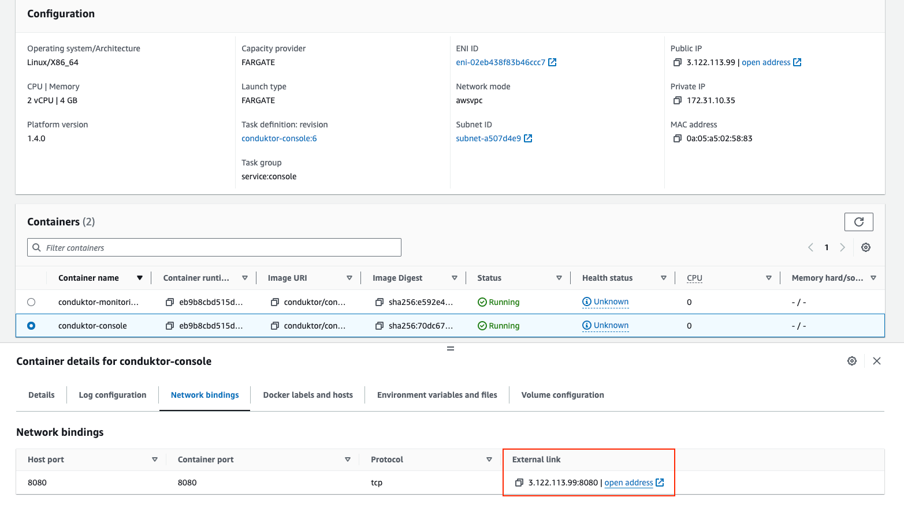

In our example, our application is running at `3.122.113.99:8080`.

You can now log in as admin with the credentials previously defined in the environment variables:
- e.g. `yourname@yourcompany.com` / `admin`

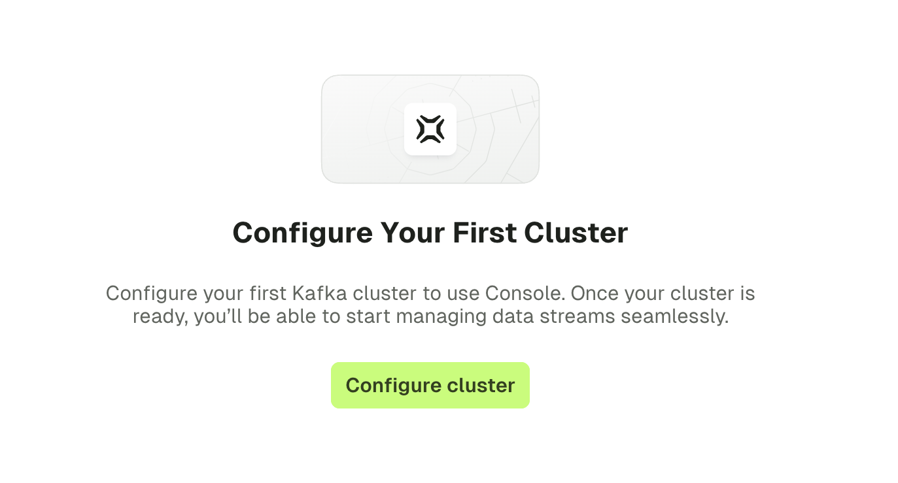

Select the **Configure clusters** option and start adding your Kafka cluster configurations.

### Step 5: Onboard your team

Now that you have an up-and-running deployment of Console, it's time to invite your team!

 - [Configure SSO](/platform/category/configure-sso/) to easily onboard users
 - Configure [local users](/platform/get-started/configuration/user-authentication/local-admin-and-users/) if you are not using SSO

### Troubleshooting: Enabling Inbound Rules

If you cannot access your database or the Console application, you may need to add inbound rules.

For example, in the **security group** attached to the console service, ensure there is an inbound rule (TCP) for port **8080**.

In the **security group** attached to the RDS instance, ensure an inbound rule (Type = PostgreSQL) for port **5432**.
