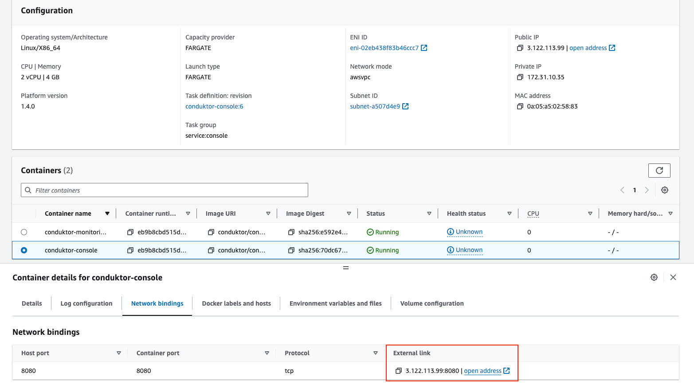

# Deployment on AWS Marketplace

## Getting started

This guide will demonstrate how to use our marketplace offering that utilises [AWS CloudFormation](https://aws.amazon.com/cloudformation/) to deploy Console in your AWS environment with all mandatory dependencies. It will deploy Conduktor as a Docker container on an ECS service with Fargate and configure it alongside a PostgreSQL database via RDS.

:::info
While this guide will help you get started, you may need to make additional configurations to ensure your deployment is [production-ready](/platform/get-started/installation/hardware/#production-requirements).
:::

The process should take no more than 30 minutes.

## Security

This template will create all the resources on a public subnet. However, the DB instance is available on private and public subnets. It is important to keep this in mind when using it.

## Networking & Architecture

## Deployment Steps

1. Go to https://aws.amazon.com/marketplace/pp/prodview-xjv65ie5rjtxu.

2. Select `View purchase options`.

    

3. Agree the terms of service

    

4. Select `Continue to Configuration`.

    

5. Select the Software Version you want to deploy (we currently only offer one fulfillment option). Then press `Continue to Launch`.

    

6. You now can choose how you want to deploy the CloudFormation template. We offer a quicklink that will take you directly to the CloudFormation console with the template pre-filled on your last previously used region. We also offer the raw CloudFormation template that you can download and deploy manually.

    

1. Go to `https://<region>.console.aws.amazon.com/cloudformation`.

2. Click on "Create stack" button and choose the "With new resources" option.

    

3. Choose the following options.

    

4. Click "next".

5. Give your stack a name and define/ review the parameters.

    - If you have chosen the [CDK-lite-template](https://github.com/conduktor/quickstart-conduktor-cloudformation/blob/main/templates/CDK-lite-template.yaml), then you will have to supply the following values before you can continue.

    | Parameter | Value |
    | -------- | ------- |
    | `Subnet` | The ARN of the subnet you want to deploy your ECS service on. |
    | `SecurityGroup` |  The Security group that will have access to your ECS service. |
    | `ClusterArn` | The ARN of the cluster you want to deploy your ECS service on. |
    | `DatabaseEndpoint` | The endpoint of your DB instance. |
    | `DatabaseName` | The name of your DB instance. |
    | `DatabaseUsername` | The username for the above DB instance. |
    | `DatabasePassword` | The password for the above DB instance. |

    

    - If you have chosen the [CDK-Full-template](https://github.com/conduktor/quickstart-conduktor-cloudformation/blob/main/templates/CDK-full-template.yaml), then you **won't** have to supply any parameter values, but you may override the default ones.

    :::warning
    Note the default value for the region is specified in the template as **`eu-west-1a`** (public subnet) and **`eu-west-1b`** (private subnet), if you are deploying in a **different region** you must update these values.
    :::

    

6. Click "next".

7. Acknowledge the tick box. *This will ensure we have the right permissions to access our ECS instance!*

    

8. Click "submit".

9. Wait for all resources to be created. *This may take some time!*

10. From the "Resources" tab, click on `conduktor-ecs` then navigate to your newly created **Service** and then **Task**.  

    
    
    

11. Find the `conduktor-console` Container and navigate to the **Network bindings** tab.

    

12. Click on the **External** link to open the Console application.

    

    > In our example, our application is running at 3.122.113.99:8080.

### Access Conduktor

You can now log in as admin with the credentials previously defined in the environment variables:

- e.g. `bob@conduktor.io` / `admin`

Select the **Configure clusters** option and start adding your Kafka cluster configurations.

### Onboard your team

Now that you have an up-and-running deployment of Console, it's time to invite your team!

 - [Configure SSO](/platform/category/configure-sso/) to easily onboard users
 - Configure [local users](/platform/get-started/configuration/user-authentication/local-admin-and-users/) if you are not using SSO
