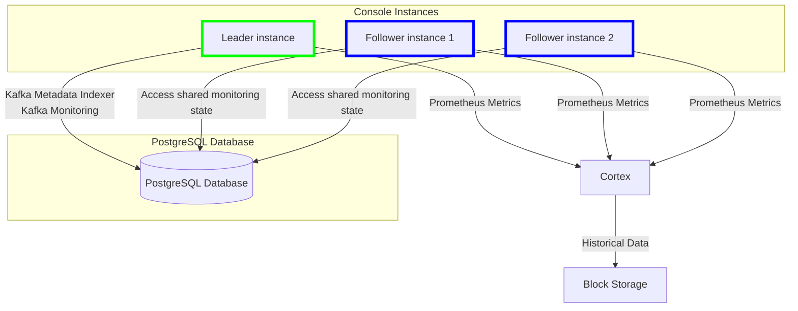

# System requirements

Conduktor Console consists of two containers, the Console container and the Cortex container.

The Console container provides the web interface while the Cortex container provides the metrics.

**Note:**  It is not supported to run Console without the Cortex container.

Jump to:
 - [Production Requirements](#production-requirements)
 - [Hardware Requirements](#hardware-requirements)
 - [Deployment Architecture](#deployment-architecture)

## Production Requirements

For production environments, there are **mandatory requirements** to ensure your deployment is **reliable**, **durable**, and **can be recovered easily**. 

To ensure you meet these requirements, you must:

 - Set up an [external PostgreSQL (13+) database](/platform/get-started/configuration/database/) with appropriate backup policy 
    - This is used to store data relating to your Conduktor deployment; such as your users, permissions, tags and configurations
    - Note we recommend configuring your PostgreSQL database for [high-availability](#database-connection-fail-over)
 - Setup [block storage](/platform/get-started/configuration/env-variables#monitoring-properties) (S3, GCS, Azure, Swift) to store metrics data required for Cortex
 - Meet the [hardware requirements](#hardware-requirements) so that Conduktor has sufficient resources to run without issue
 
Note that if you are deploying the [Helm chart](/platform/get-started/installation/get-started/kubernetes/), the [production requirements](/platform/get-started/installation/get-started/kubernetes#production-requirements) are clearly outlined in the installation guide. 

## Hardware requirements

### Console

**Minimum**

- 2 CPU cores
- 3 GB of RAM
- 5 GB of disk space

**Recommended**

- 4+ CPU cores
- 4+ GB of RAM
- 10+ GB of disk space

### Cortex

**Minimum**

- 4 CPU Cores
- 6 GB of RAM
- 10 GB of disk space

**Recommended**

- 8 CPU Cores
- 8+ GB of RAM
- [block storage](/platform/get-started/configuration/env-variables#monitoring-properties)

## Deployment architecture

As noted in the [production requirements](#production-requirements), a complete deployment of Console depends on:

- **PostgreSQL database** for storing Platform metadata, [Indexer](/platform/navigation/console/about-indexing/) state, and shared Monitoring state
- Our bespoke [**Cortex image**](/platform/get-started/configuration/cortex/) for metric collection and storage
- **Block storage** for storing historical monitoring data

Below outlines how an external persistent store (PostgreSQL) and a leader election service are used to manage stateful data and monitoring tasks across multiple Console instances.

### State Persistence in PostgreSQL

#### Single Instance (Pre-Console 1.25.0)

In the pre-1.25.0 architecture, Kafka Monitoring maintained its state in-memory. This posed several problems in a multi-instance setup, such as discrepancies in metrics or failures when trying to distribute monitoring tasks across instances.

#### Multiple Instances (Post-Console 1.25.0)

From Console 1.25.0 onwards, the monitoring state is now stored in the external PostgreSQL database, allowing the state to be shared and accessed by all instances of Console. This change brings several advantages:
 - **Consistency**: Multiple Console instances can now deployed with a leader elected to handle the stateful components (Kafka [Metadata Indexer](/platform/navigation/console/about-indexing/) and Monitoring).
 - **Redundancy & Fault Tolerance**: If the leader instance fails, another instance takes over as the leader, without losing any monitoring data.
 - **Prometheus Metrics**: Every Console instance is now capable of exposing [Prometheus metrics](/platform/reference/metric-reference/) through the API. This allows for real-time monitoring of the application regardless of which instance is the leader, as the monitoring state is available to all instances.

 ### High-Availability Limitations

 While the architecture introduced in Console 1.25 greatly improves the **UI layers horizontal scalability**, there are notable limitations related to the use of Cortex for metrics storage.

#### Cortex in Standalone Mode 

The system currently uses Cortex in standalone mode, which does not inherently provide high availability. The implications of this limitation are:

 - **Metrics Unavailability**: In the event of a Cortex failure, monitoring data inside Console might not be accessible until the container is restarted.
 - **Alerting Unavailability**: In the event of a Cortex failure, alerting functionality inside Console will not be present until the container is restarted.
 - **No Redundancy**: Without a multi-node or clustered setup for Cortex, the system lacks the resilience and failover capabilities that are present in other components like Console and PostgreSQL.

#### Database Connection Fail-over

Since version 1.30 Console supports using multiple database URLs in configuration to achieve high availability (HA). For example, [Connection Fail-over](https://jdbc.postgresql.org/documentation/use/#connection-fail-over) as seen in the case of PostgreSQL.

For Conduktor configuration details see [Multi-host database configuration](docs/platform/get-started/configuration/database.md#multi-host-configuration) which supports multiple hosts.
For Postgresql HA configuration it's best to discuss with your architect, one example is using [Bitnami's postgresql-ha chart](https://github.com/bitnami/charts/blob/main/bitnami/postgresql-ha/README.md#differences-between-the-postgresql-ha-and-postgresql-helm-charts).

In earlier versions we recommend instead that you configure an HA Postgres database where you should specify the single connection URL (e.g. the endpoint of PgBouncer or HAProxy) in the Conduktor Console database configuration. There are several solutions available such as:
 
 - [**Patroni**](https://www.cybertec-postgresql.com/en/patroni-setting-up-a-highly-available-postgresql-cluster/): Automates Postgres replication and failover
 - **PgBouncer** or **HAProxy**: For connection pooling and distributing connections across multiple Postgres instances
 - **Cloud-managed solutions**: Managed Postgres services like AWS RDS, Google Cloud SQL, or Azure Database for PostgreSQL often provide built-in HA

