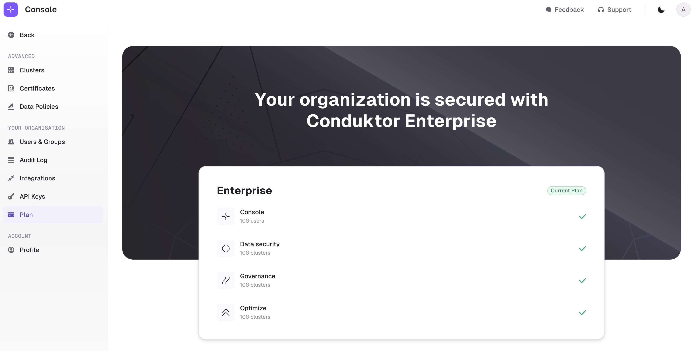

## License installation

Conduktor requires a license to enable features beyond the base features. The license can be put in the environment variables (recommended), or into the YAML configuration file.

import Tabs from '@theme/Tabs'; import TabItem from '@theme/TabItem';

<Tabs>
<TabItem value="Environment Variables" label="Environment Variables">

```js title=".env"
CDK_LICENSE='YOUR_LICENSE_HERE'
```

</TabItem>
<TabItem value="YAML  File" label="YAML File">

```yaml title="platform-config.yaml"
license: 'YOUR_LICENSE_HERE'
```

</TabItem>
</Tabs>

## License verification in Console

You can check that your license has been used to launch the Console by looking at the logs or the UI.

### In the logs

When you run the Console, you can find these meaningful logs in the head:

<Tabs>
<TabItem value="As of 1.21.0" label="As of 1.21.0">

```
License Enterprise v2 is valid until 2025-12-31 00:00:00
```

</TabItem>
<TabItem value="Before 1.21.0" label="Before 1.21.0">

```
Input configured license : Some("YOUR_LICENSE_HERE")
License is valid ! Remaining days : 365
```

</TabItem>
</Tabs>

### In the UI

You can find your plan details in `Settings` > `Plan`:



## Renew or install a new license

To renew or install a new license, change the `license` configuration in the YAML configuration file, or the `CDK_LICENSE` environment variable, depending on what you used. Then deploy the Conduktor Console container again.
