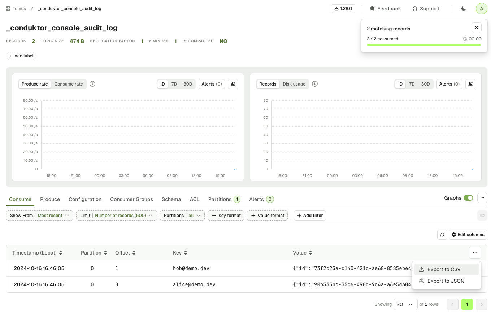

## Introduction

By default, Console's Audit Log is stored in the connected PostgreSQL database.
From version [1.28.0](/changelog#console-1280), you can have Console emit this Audit Log to a Kafka topic. 

Complementing this with the [export feature](/platform/navigation/console/topics/topic-consume/consume/#export-records-in-csv--json), you can easily integrate the Console Audit Log with your SIEM or log management system.

Let's see how to configure the Audit Log to be sent to a Kafka topic, and then export it as CSV or JSON.

:::info
You can find the [list of Audit Log events](/platform/navigation/settings/audit-log/#exportable-audit-log-events) here.
:::

## Send the Console Audit Log in a Kafka Topic

In the Console deployment configuration, you simply have to set the following properties:

```yaml
CDK_AUDITLOGPUBLISHER_CLUSTER: my-kafka-cluster                 # Mandatory
CDK_AUDITLOGPUBLISHER_TOPICNAME: _conduktor_console_audit_log   # Mandatory
CDK_AUDITLOGPUBLISHER_TOPICCONFIG_PARTITION: 1                  # Optional, default is 1
CDK_AUDITLOGPUBLISHER_TOPICCONFIG_REPLICATIONFACTOR: 1          # Optional, default is 1
```

Once you've added these properties in your Console deployment configuration, you can simply restart it.

This will create a new topic (if it doesn't exist) in the cluster named `my-kafka-cluster`. This new topic will be named `_conduktor_console_audit_log`, and will have 1 partition and 1 replication factor.

## Troubleshooting

If you don't see the topic `_conduktor_console_audit_log` in your Kafka cluster, you can check the Console logs for any error message.

This is probably because you have misconfigured the name of the Kafka cluster. In that case, you will see this message showing up regularly:
```
Failed to publish audit log event: Not found. Could not find cluster my-kafka-cluster
```

Please make sure that the Kafka cluster name matches with the ID you can see in the clusters dropdown in the Console:

import ClustersDropdown from './img/clusters-dropdown.png';


## Export the Audit Log

In order to export the Audit Log from this Kafka topic, you should go to the Consume page of this topic in the Console.

Here, click on the `...` button on the top right of the records table, and select either `Export to CSV` or `Export to JSON`.



You can now import that file in your SIEM or log management system.