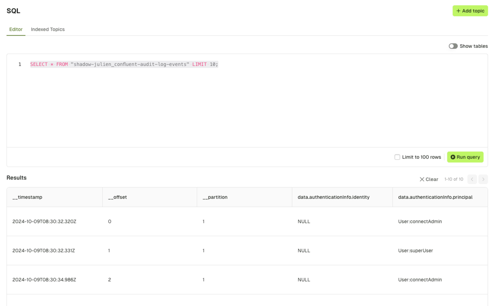
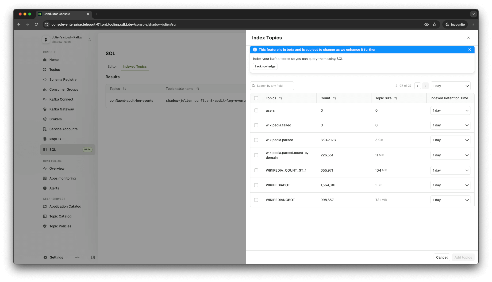
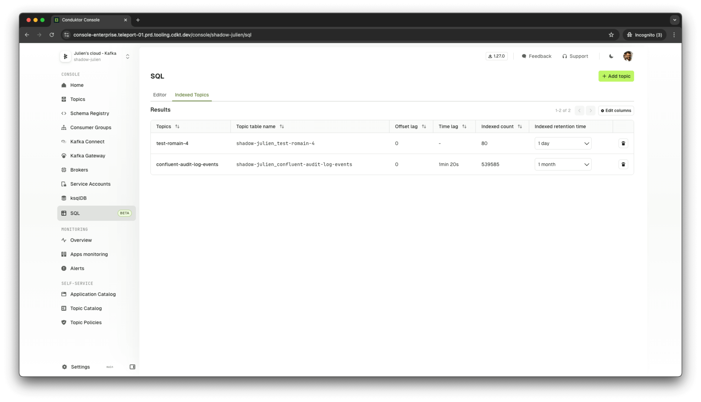

## Configure Conduktor SQL

:::info
This feature is in **beta** and is subject to change as we enhance it further.
:::

Index data from Kafka topics in a database to enable users to query data from the **UI**, **API** or **CLI** using **SQL**. 

Note this feature enables you to troubleshoot, sample, analyze, aggregate and join data through:

- Querying Kafka message data 
- Querying Kafka metadata (such as the offset, partition and timestamp)

Note this feature is currently only available to Console **admins**, and will be made available for all users when integrated with our security model (i.e. RBAC, Data Masking).




## Console Configuration

### Database Configuration

By default, the SQL feature is disabled. You will need to add additional configuration about the database for storing the data.

:::warning
You should provision a second database for storing SQL data that is different from the existing one used by Console backend. This ensures separation of concerns and continued operation of the core Console experience if the SQL database becomes unavailable.

See [database requirements](../get-started/configuration/database.md) and [about database isolation](#database-isolation) for more guidance. 
:::

Configure the second database through environment variables:

 - `CDK_KAFKASQL_DATABASE_URL`: database connection url in the format `[jdbc:]postgresql://[user[:password]@]netloc[:port][/dbname][?param1=value1&...]`

Alternatively, set each value explicitly:

 - `CDK_KAFKASQL_DATABASE_HOST`: Postgresql server host name
 - `CDK_KAFKASQL_DATABASE_PORT`: Postgresql server port
 - `CDK_KAFKASQL_DATABASE_NAME`: Database name
 - `CDK_KAFKASQL_DATABASE_USERNAME`: Database login role
 - `CDK_KAFKASQL_DATABASE_PASSWORD`: Database login password
 - `CDK_KAFKASQL_DATABASE_CONNECTIONTIMEOUT`: Connection timeout option in seconds

### Additional Configuration

Note that additional configuration can be made in relation to the indexing process:

 - `CDK_KAFKASQL_CONSUMER-GROUP-ID`: Consumer group name for the indexing process (default is `conduktor-sql`)
 - `CDK_KAFKASQL_CLEAN-EXPIRED-RECORD-EVERY-IN-HOUR`: The interval in which the clean-up process will run to purge data outside the desired [retention period](#index-topics-in-the-ui).


## Index Topics for Querying

### Index Topics in the UI

To create a new indexed topic, you can use the UI by navigating to the new **SQL** tab. Note you will only see this tab if you have [configured](#configure-conduktor-sql) the SQL database as a dependency.

When selecting a topic for indexing, you will be asked to configure the:

 -  **Indexed Retention Time**: The furthest point in time from which the data will be indexed. Note that any data before this point in time will be purged periodically.
    - By default, purging happens every 1h, but it's configurable using the environment variable `CDK_KAFKASQL_CLEAN-EXPIRED-RECORD-EVERY-IN-HOUR`



**Understanding the state of indexing**

After choosing to index a topic, you will be able to see the state of the indexing process in the **Indexed Topics** tab. The table name will only become available when data starts to be indexed.

The process gives into the:

 - **Offset lag**: The difference between the latest message offset in the Kafka topic and the current offset of the consumer group, indicating how much data is yet to be processed.
 - **Time lag**: The delay between the timestamp of the latest message in the Kafka topic and the time when the message was indexed, reflecting processing latency.
 - **Indexed count**: The total number of messages successfully indexed into the database table from the Kafka topic.





### Index Topics in the CLI

Alternatively, you can index a topic through the conduktor [CLI](../reference/cli-reference.md):

```yaml
apiVersion: "v1"
kind: "IndexedTopic"
metadata:
  name: "customer-orders"
  cluster: "kafka-cluster-dev"
spec:
  retentionTimeInSecond: "86400" # 1 day of retention
```

```bash
conduktor apply -f index-topics.yml
```

Upon execution, the console backend will index messages from the (current time) - (retention time), and subsequently start listening for new records.

## Querying the data

* Using the UI:
   * Note the cluster name is used as a prefix for the table name (see [database storage format](#database-storage-format))


* Using the API:
```bash
curl -XPOST  -H "Authorization: $token" 'localhost:8080/api/public/sql/v1/execute?maxLine=2' --data 'select * from "kafka-cluster-dev_customer_orders"'
```

* Using the CLI:
```bash
conduktor sql 'select * from "kafka-cluster-dev_customer_orders"' -n 2
```

## Database Storage Format

Each indexed topic will have its dedicated SQL table. The name of the table will apply the following convention `${cluster-slug}_${topic-name}`.

The table will contain special columns type, each of those columns are indexed:
* `__timestamp`
* `__partition`
* `__offset`


The content of each record is flattenned. Given the following record:

```json
{
    "a": {
        "b": {
            "c": "Hello World"
        },
        "userId": "109210921092"
    }
}
```

Then, you'll have the following table structure:

| __timestamp | __partition | __offset | a.b.c                       | userId |
|-------------|-------------|----------|-----------------------------|-------------|
| 123456789   | 0           | 42       | Hello World                 | 109210921092|


If records with a different shape come later, the table schema will be updated:
```json
{
    "newField": "Kafka"
}
```

| __timestamp | __partition | __offset | a.b.c                       | userId | newField |
|-------------|-------------|----------|-----------------------------|-------------|----------------|
| 123456789   | 0           | 42       | Hello World                 | 109210921092     | NULL           |
| 123456790   | 0           | 43       | NULL                        | NULL        | Kafka           |

### Shrinker

As column names are limited in size (63 characters), the field name can be shrunk in some cases. We try do to that in a smart way so its still meaningful for users.
The head characters are removed first:

`my.reaaaally.loooooooooooooooooooooooooooooong.path.to.a.field` 

will give

`m.r.oong.path.to.a.field`

### Collision Solver

In some cases, table name or column name can be the same for two differents topics or fields. To resolve the conflict, we suffix the name by `_${inc}` (e.g. `my.field` & `my.field_2`).

Relation between a table/column and a topic/field is tracked in special metadata tables:
* `_table_mappings`
* `_table_fields_mappings`

### Database isolation

The Kafka SQL feature, while providing flexibility, introduces potential security risks. By allowing users (only admin) to execute arbitrary SQL commands, there's a chance of unauthorized access or malicious activities.

To mitigate these risks, we've implemented several security measures. 

 - **Read-Only Connections**: While not foolproof, enforcing read-only connections limits the potential for data modification.
 - **SQL query pre-parsing and sanitizing**:
    - **Schema restriction**: Restricting queries to the public. schema prevents access to sensitive data in other schemas. For example, in the Conduktor database, the public schema is empty (except the Flyway migration table which is also hidden).
    - **Query Type Limitation**: Allowing only SELECT statements ensures that users cannot modify or delete data. For example, it forbids ROLLBACK that would break the previous limitation.

Despite these measures, it's crucial to isolate the Kafka indexing database from the console backend database. This isolation provides additional benefits:

 - **Resource Contention**: Prevents the Kafka indexing process or a user's arbitrary request from consuming excessive resources and impacting the overall system performance.
 - **Data Breach Mitigation**: Limits the potential damage in case of a security breach in the SQL endpoint protection (not totally foolproof).


## Known Limitations

There are a number of known limitations regarding the current beta experience. 

Those are:

- Data formats currently supported are plain `JSON` and `Avro` using TopicNameStrategy.
- To efficiently import data in Postgres, we didn't set any primary key, so a record can be there more than once.
- 