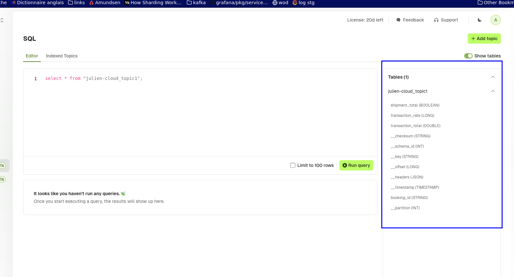
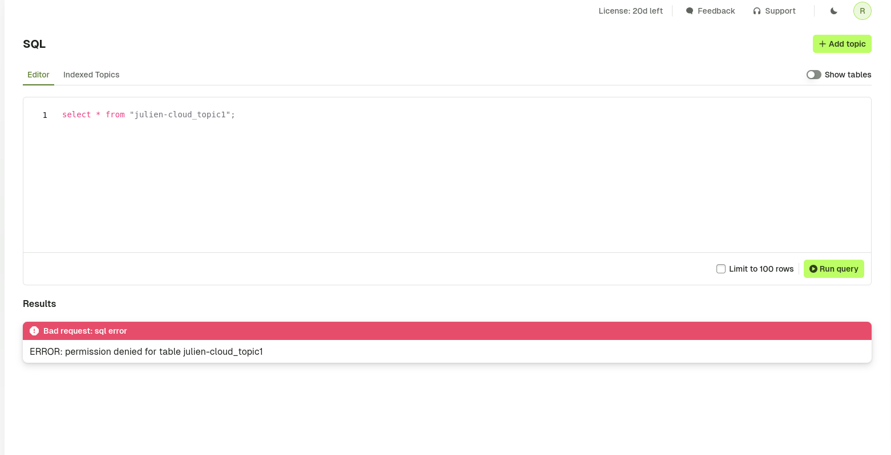

## Overview

:::info
This feature is in **Beta** and is subject to change as we enhance it further. 

It's currently only available to Console **Admins**, and will be made available for all users when integrated with our security model (i.e. RBAC, Data Masking).
:::

Index data from Kafka topics in a database to enable users to query data from the **UI**, **API** or **CLI** using **SQL**. 

Note this feature enables you to troubleshoot, sample, analyze, aggregate and join data through:

- Querying Kafka message data 
- Querying Kafka metadata (such as the offset, partition and timestamp)

We encourage you to use this feature in non-production environments and give us [feedback](https://conduktor.io/roadmap).


## Console Configuration

For a fully integrated Docker Compose, run our [get started](https://conduktor.io/get-started/) stack to try SQL. The below guide details how to add this feature to your existing deployment. 

### Database Configuration

By default, the SQL feature is disabled. You will need to add additional configuration about the database for storing the data.

:::warning
You should provision a second database for storing SQL data that is different from the existing one used by Console's backend. This ensures separation of concerns and continued operation of the core Console experience if the SQL database becomes unavailable.

See [database requirements](../get-started/configuration/database.md) and [about database isolation](#database-isolation) for more guidance. 
:::

Configure the second database through environment variables:

 - `CDK_KAFKASQL_DATABASE_URL`: database connection url in the format `[jdbc:]postgresql://[user[:password]@]netloc[:port][/dbname][?param1=value1&...]`

Alternatively, set each value explicitly:

 - `CDK_KAFKASQL_DATABASE_HOST`: Postgresql server host name
 - `CDK_KAFKASQL_DATABASE_PORT`: Postgresql server port
 - `CDK_KAFKASQL_DATABASE_NAME`: Database name
 - `CDK_KAFKASQL_DATABASE_USERNAME`: Database login role
 - `CDK_KAFKASQL_DATABASE_PASSWORD`: Database login password
 - `CDK_KAFKASQL_DATABASE_CONNECTIONTIMEOUT`: Connection timeout option in seconds

### Additional Configuration

Note that additional configuration can be made in relation to the indexing process:

 - `CDK_KAFKASQL_CONSUMER-GROUP-ID`: Consumer group name for the indexing process (default is `conduktor-sql`)
 - `CDK_KAFKASQL_CLEAN-EXPIRED-RECORD-EVERY-IN-HOUR`: The interval in which the clean-up process will run to purge data outside the desired [retention period](#index-topics-in-the-ui).
  - `CDK_KAFKA_SQL_REFRESH-TOPIC-CONFIGURATION-EVERY-IN-SEC`: TO DO 
   - `CDK_KAFKASQL_REFRESH-USER-PERMISSIONS-EVERY-IN-SEC`: See [RBAC](#rbac)


## Index Topics for Querying

### Index Topics in the UI

To create a new indexed topic, you can use the UI by navigating to the new **SQL** tab. Note you will only see this tab if you have [configured](#configure-conduktor-sql) the SQL database as a dependency.

Currently, only Admins have the `kafka.topics.config.sql` permission required to opt topics in for indexing. This permission is verified whenever a user attempts to update the [`sqlStorage`](#index-topics-in-the-cli) configuration for a topic. 

When selecting a topic for indexing, you will be asked to configure the:

 -  **Indexed Retention Time**: The furthest point in time from which the data will be indexed. Note that any data before this point in time will be purged periodically.
    - By default, purging happens every 1h, but it's configurable using the environment variable `CDK_KAFKASQL_CLEAN-EXPIRED-RECORD-EVERY-IN-HOUR`


**Understanding the state of indexing**

After choosing to index a topic, you will be able to see the state of the indexing process in the **Indexed Topics** tab. The table name will only become available when data starts to be indexed.

The process gives insight into the:

 - **Offset lag**: The difference between the latest message offset in the Kafka topic and the current offset of the consumer group, indicating how much data is yet to be processed
 - **Time lag**: The delay between the timestamp of the latest message in the Kafka topic and the time when the message was indexed, reflecting processing latency
 - **Indexed count**: The total number of messages successfully indexed into the database table from the Kafka topic


### Index Topics in the CLI

Alternatively, you can index a topic through the conduktor [CLI](../reference/cli-reference.md):

```yaml
---
apiVersion: kafka/v2
kind: Topic
metadata:
  cluster: kafka-cluster-dev
  name: customers
  sqlStorage:
    retentionTimeInSecond: 86400 # 1 day of retention
    enabled: true
spec:
  replicationFactor: 1
  partitions: 1
  configs:
    cleanup.policy: delete
```

```bash
conduktor apply -f topics.yml
```

Upon execution, the console backend will index messages from the (current time) - (retention time), and subsequently start listening for new records.

## Querying the data

**Using the UI**  
Query syntax requires the cluster technical-id is used as a prefix for the table name e.g. for the topic `customers` on the cluster `kafka-cluster-dev`:
```sql
SELECT *
  FROM "kafka-cluster-dev_customers";
```
See [database storage format](#database-storage-format) for the underlying table structure.


**Using the API**  
```bash
curl \
 --header "Authorization: $token" \
 --request POST 'localhost:8080/api/public/sql/v1/execute?maxLine=2' \
 --data 'select * from "kafka-cluster-dev_customers"'
```

**Using the CLI**  
```bash
conduktor sql 'select * from "kafka-cluster-dev_customers"' -n 2
```

## Database Storage Format

Each indexed topic will have its dedicated SQL table. The table's name will apply the following convention `${cluster-technical-id}_${topic-name}`.

The table will contain special column types, each of those columns is indexed:
* `__timestamp`
* `__partition`
* `__offset`
* `__checksum`: the checksum of the tuple (message(s) key, message(s) value)
* `__headers`: the message(s) headers
* `__schema_id`: the schema id
* `__key`: the message(s) key


The content of each record is flattened. Given the following record:

```json
{
    "a": {
        "b": {
            "c": "Hello World"
        },
        "userId": "109210921092"
    }
}
```

Then, you'll have the following table structure:
| __timestamp | __partition | __offset | __checksum                           | __headers | __schema_id | __key     | a.b.c                       | userId |
|-------------|-------------|----------|--------------------------------------|-----------|-------------|-----------|-----------------------------|-------------|
| 123456789   | 0           | 42       |8d4fd66a16a84da2ddc709ddc5657c17      | conduktor | 1           | something | Hello World                 | 109210921092|


If records with a different shape come later, the table schema will be updated:
```json
{
    "newField": "Kafka"
}
```

| __timestamp | __partition | __offset | __checksum                           | __headers | __schema_id | __key     | a.b.c                       | userId | newField |
|-------------|-------------|----------|--------------------------------------|-----------|-------------|-----------|-----------------------------|-------------|----------------|
| 123456789   | 0           | 42       |8d4fd66a16a84da2ddc709ddc5657c17      | conduktor | 1           | something | Hello World                 | 109210921092| NULL           |
| 123456790   | 0           | 42       |8d4fd66a16a84da2ddc709ddc5657c18      | conduktor | 1           | something | NULL                 | NULL| Kafka           |


### Shrinker

As column names are limited in size (63 characters), the field name must sometimes be shrunk. We try to do that intelligently so it is still meaningful for users.
The head characters are removed first:

`my.reaaaally.loooooooooooooooooooooooooooooong.path.to.a.field` 

will give

`m.r.oong.path.to.a.field`

### Collision Solver

Sometimes, the table or column names can be the same for two different topics or fields. To resolve the conflict, we suffix the name by `_${inc}` (e.g. `my.field` & `my.field_2`).

Relation between a table/column and a topic/field is tracked in special metadata tables:
* `_table_mappings`
* `_table_fields_mappings`

### Database isolation

The Kafka SQL feature, while providing flexibility, introduces potential security risks. By allowing users (only admin) to execute arbitrary SQL commands, there's a chance of unauthorized access or malicious activities.

To mitigate these risks, we've implemented several security measures. 

 - **Read-Only Connections**: While not foolproof, enforcing read-only connections limits the potential for data modification
 - **SQL query pre-parsing and sanitizing**:
    - **Schema restriction**: Restricting queries to the public schema prevents access to sensitive data in other schemas. For example, in the Conduktor database, the public schema is empty (except for the Flyway migration table which is also hidden)
    - **Query Type Limitation**: Allowing only SELECT statements ensures that users cannot modify or delete data. For example, it forbids ROLLBACK which would break the previous limitation

Despite these measures, it's crucial to isolate the Kafka indexing database from the console backend database. This isolation provides additional benefits:

 - **Resource Contention**: Prevents the Kafka indexing process or a user's arbitrary request from consuming excessive resources and impacting the overall system performance
 - **Data Breach Mitigation**: Limits the potential damage in case of a security breach in the SQL endpoint protection (not totally foolproof).

## SQL security

Conduktor's RBAC model & data masking capabilities are applicable when using SQL.

### RBAC

The Console RBAC model is integrated with the PostgreSQL database using PostgreSQL's built-in ROLE feature.

There are two distinct processes involved:

1. **Initial Role Creation:** When a user executes an SQL query on the Console for the first time, the system checks if the corresponding user ROLE exists in the PostgreSQL database. If it does not, the RBAC system is consulted to determine the topics for which the user has the `kafka.topics.read` permission. The user's ROLE is then created in PostgreSQL, and read access to the relevant topic tables is granted.

2. **Periodic Role Updates:** A background process in the Console periodically updates the access rights for each user ROLE to ensure they remain aligned with the RBAC permissions. The job is run every 30 seconds by default and can be customized by setting env variable `CDK_KAFKASQL_REFRESHUSERPERMISSIONSEVERYINSEC`.

### Data masking

Data masking policies are implemented similarly to RBAC. By default, access is granted to all columns in a table. However, if a data masking policy applies to a specific column for a given user, access to that column is denied.

There are some limitations:
- Instead of applying the masking policy as defined in the Console, access to the entire column is restricted for simplicity.
- For JSON blob columns, we are unable to restrict access to sub-objects, so access to the entire column content is restricted instead.
- If access to a column is denied, the user cannot use a wildcard in a `SELECT` query (e.g., `SELECT * FROM table`). Attempting to do so will result in an access denied error.


### UI Experience

The user will only see the table(s) and field(s) they have access to on the UI:



If a user tries to access a table for which they lack the necessary rights, they will receive an 'access denied' error:




## Known Limitations

There are several known limitations regarding the current beta experience. 

Those are:

- Data formats currently supported are plain `JSON`, and both `Avro` & `JSON` with Confluent Schema Registry
- If for any reason a record can't be parsed, they are ignored and the consumer continues
- To efficiently import data in Postgres, we didn't set any primary key, so a record can be there more than once
- If you try to index a topic with a schema that is not supported, the lag value will be 0 but no records will appear in the table

If you identify more limitations or want to provide feedback, please [contact us](https://support.conduktor.io/).
