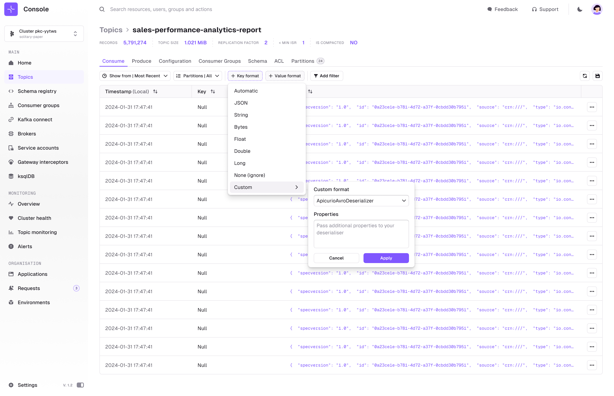

### Overview
This guide will help you install, configure and use your Custom [Kafka Deserializer](https://kafka.apache.org/37/javadoc/org/apache/kafka/common/serialization/Deserializer.html) with Console.  

Importing your Custom Deserializers will allow Console to present to your users your serialized messages in a human friendly way.

It assumes that you already have your Custom Deserializer available and that you know how to configure it.
:::tip
This is especially interesting if your Deserializer is presenting data in a JSON-ish form. This will allow you to exploit the full extend of Console's filtering and visualization capabilities.
:::


You can find some Kafka deserializer implementation examples in this open-source Github repository: [my_custom_deserializers](https://github.com/conduktor/my_custom_deserializers)


### Install your Custom Deserializer

Console looks for jars present in folder `/opt/conduktor/plugins` during startup.

There are different ways of making your Custom Deserializers available into Console.

import Tabs from '@theme/Tabs'; import TabItem from '@theme/TabItem';

<Tabs>
<TabItem value="Docker Compose" label="Docker Compose">

```yml
  conduktor-console:
    image: conduktor/conduktor-console
    ports:
      - "8080:8080"
    volumes:
      - /local/my_custom_deserializers_2.13-2.0.0.jar:/opt/conduktor/plugins/my_custom_deserializers_2.13-2.0.0.jar
```
</TabItem>
<TabItem value="Kubernetes" label="Kubernetes">


First upload your jar as a ConfigMap
```yaml
kubectl create configmap my-deserializer-cm --from-file=/local/my_custom_deserializers_2.13-2.0.0.jar
```
Then mount in the Pod
```yaml
apiVersion: v1
kind: Pod
metadata:
  name: conduktor-console
spec:
  containers:
  - name: conduktor-console
    image: conduktor/conduktor-console
    volumeMounts:
    - name: deserializer-mount
      mountPath: /opt/conduktor/plugins/my_custom_deserializers_2.13-2.0.0.jar
  volumes:
  - name: deserializer-mount
    configMap:
      name: my-deserializer-cm
```

</TabItem>
<TabItem value="Extend Console Image" label="Extend Console Image">

1. Write a Dockerfile
  ```Dockerfile
  FROM conduktor/conduktor-console::<version>
  COPY ./my_custom_deserializers_2.13-2.0.0.jar /opt/conduktor/plugins/my_custom_deserializers_2.13-2.0.0.jar
  ```
2. Build the Dockerfile
  ```yaml
  docker build . -t custom-console:<version>
  ```
3. Then replace the image in your docker compose or helm files

</TabItem>
</Tabs>

<hr />

:::caution warning
**If your Custom deserializers that have dependencies, they must be embedded within the same JAR file (Fat JAR / Uber JAR).**
:::

If everything went well, you should see this in the Console starting:
````
2024-03-23T17:29:23,852Z [console:zio-default] INFO  io.conduktor.plugins.PluginResource - Loading plugin my_custom_deserializers_2.13-2.0.0 from jar: /opt/conduktor/plugins/my_custom_deserializers_2.13-2.0.0.jar
2024-03-23T17:29:26,668Z [console:zio-default] INFO  io.conduktor.plugins.PluginResource - Register custom Kafka Deserializer: class io.example.conduktor.custom.deserializers.MyCustomDeserializer
2024-03-23T17:29:26,668Z [console:zio-default] INFO  io.conduktor.plugins.PluginResource - Register custom Kafka Deserializer: class io.example.conduktor.custom.deserializers.MyCustomProtobufDeserializer
2024-03-23T17:29:26,668Z [console:zio-default] INFO  io.conduktor.plugins.PluginResource - Register custom Kafka Deserializer: class io.example.conduktor.custom.deserializers.constant.ConstantBoolean
````

### Configure your Custom Deserializer and consume data

From the Consume page, open the "Value Format" filter and pick your Custom Deserializer from the list.
- a dropdown allowing you to select your custom deserializer implementation class
- a textarea field allowing you to pass some properties to configure your custom deserializer instance (We'll call the [`org.apache.kafka.common.serialization.Deserializer<T>::configure`](https://kafka.apache.org/37/javadoc/org/apache/kafka/common/serialization/Deserializer.html#configure(java.util.Map,boolean)) method with these properties)
````properties title="Properties example"
apicurio.registry.url=https://test.serviceregistry.rhcloud.com/t/d4d411af-xxxx-4184-xxxx-342e6cd03580/apis/registry/v2
apicurio.auth.username=srvc-acct-a95c41e8-xxxx-4e99-xxxx-217755ad7046
apicurio.auth.password=7d94b05a-xxxx-4f70-xxxx-1e6aba25a8b4
````



