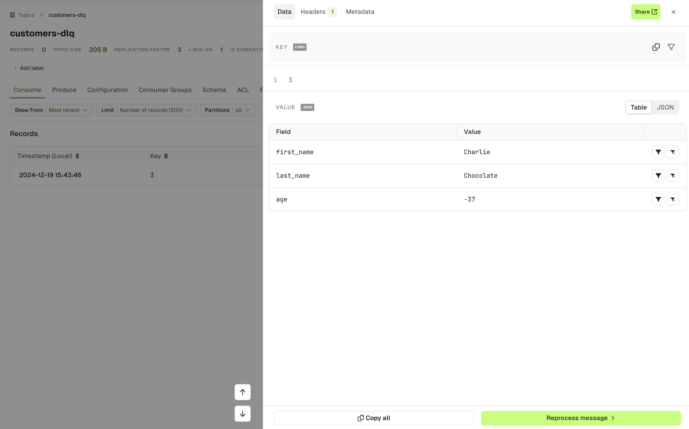
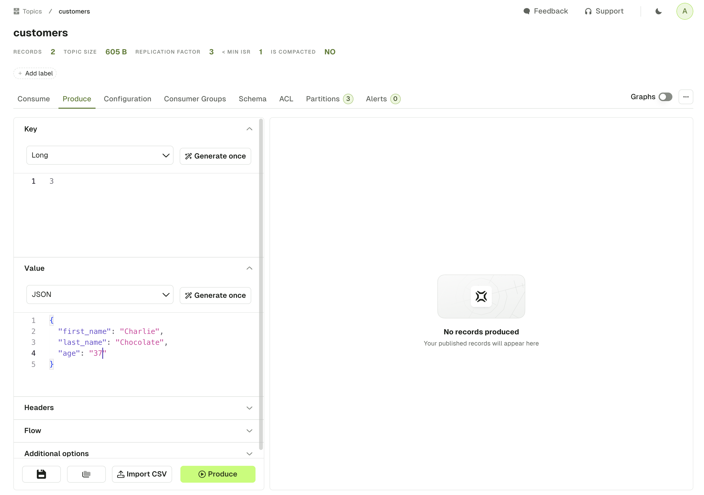
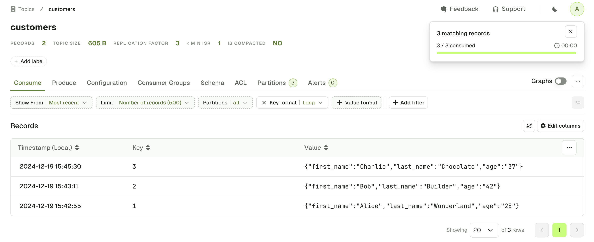

# Reprocess Messages

Conduktor Console can help you reprocess a message within a topic. This could be used for reprocessing a message from an existing DLQ (Dead Letter Queue), or for pushing any message into another topic.

## Find a record to reprocess

Identify a message that you wish to reprocess by finding it from within the topic view.

Select the record, and click the **reprocess message** button from within the slide-out component.

In our example below, this record is in our DLQ topic `customers-dlq` because the age of the customer is negative. Let's fix this and reprocess it to the `customers` topic, with the right age.

## Choose the target topic

On the subsequent screen, select the **target topic** that you wish to publish the message.

Here, we want to reprocess the message in the `customers` topic.

import SelectTargetTopic from './assets/select-target-topic.png';

## Edit and process the message

The previous step leads us to the **Produce** page of the target topic, with an auto-populated form containing our record. From there, we can easily modify its key, value and headers.

When you're ready, you can press the **Produce** button and you will see your record being produced. Go to the **Consume** page of this topic in order to retrieve your reprocessed record.

