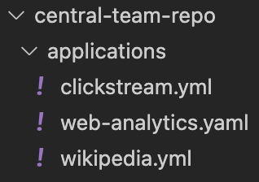
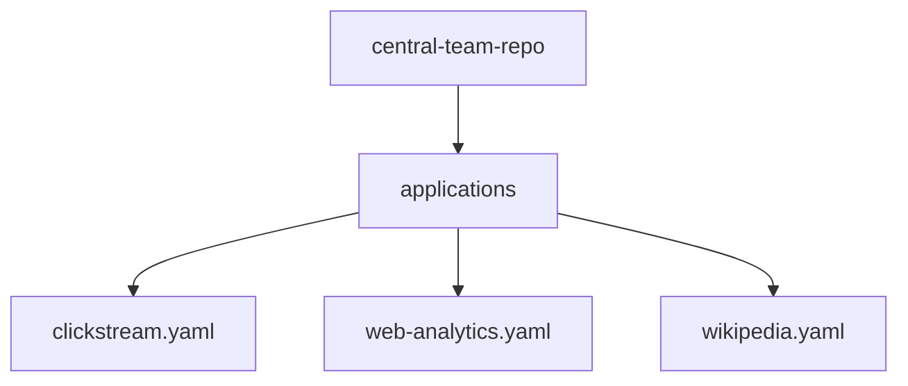
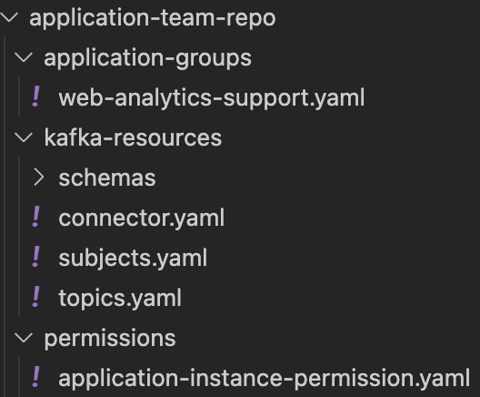
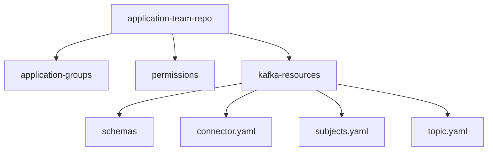
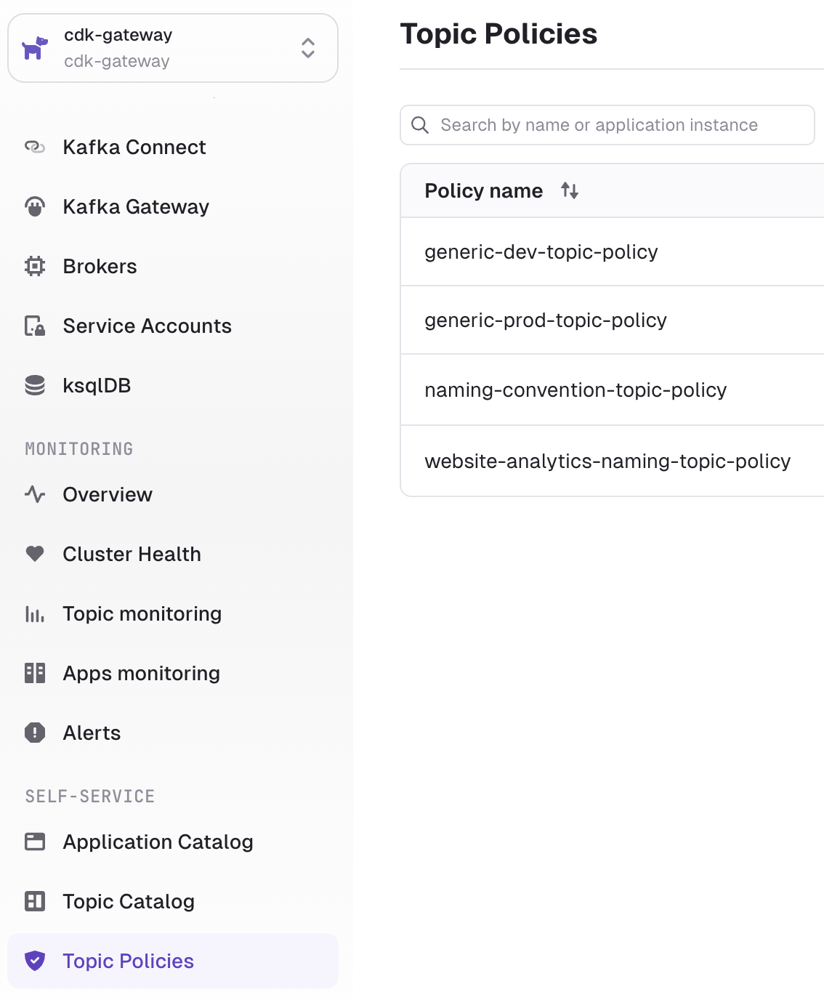
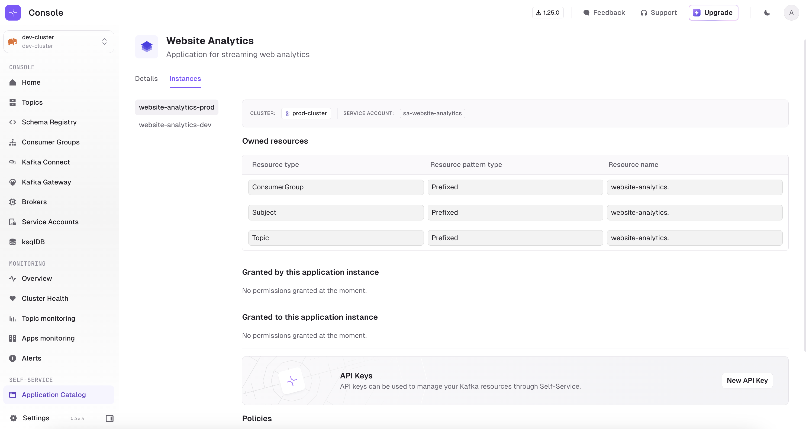
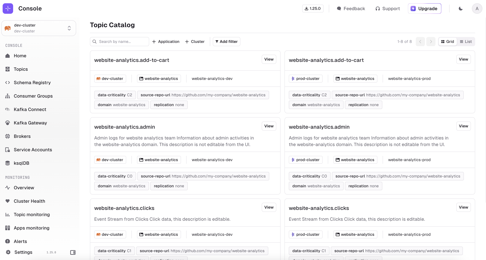
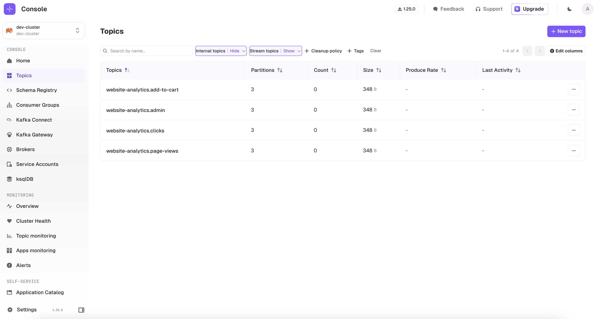

# Getting Started with Self-service

This guide gives an overview of Conduktor's self-service offering through a worked example where you will:
 - Define Applications for your teams
 - Setup policies to enforce governance over topic usage
 - Expose topics in the topic catalog
 - Experience trying to create resources that breach policies

After running the demo you will have an appreciation of how Conduktor's self-service framework benefits teams and how it can be applied within your organization. 

For the full definition of each resource, see [Self-service Resources Reference](/platform/reference/resource-reference/self-service/).

To follow-along this demo you'll need to clone our repository.
````shell
git clone https://github.com/conduktor/self-service-getting-started
````

- [Central team's repo](#central-teams-repo)
- [Application team's repo](#application-teams-repo)
- [Worked Example](#worked-example)
- [Running the example](#running-the-example)
  - [Set-up Demo](#set-up-demo)
  - [Apply the resources, central team perspective](#apply-the-resources-central-team-perspective)
  - [Apply the resources, application team perspective](#apply-the-resources-application-team-perspective)
  - [Attempt to create topics out of bounds](#attempt-to-create-topics-out-of-bounds)


This demo repository (repo) contains two directories which each represent a mock repo, `central-team-repo` and `application-team-repo`. 


# Central team's repo
This repo is where the central team would make, or approve, changes.
It should contain definitions of infrastructure e.g. the cluster configuration and definitions of the Applications, Application Instances and Application Instance policies. These concepts are detailed on the [concepts](/platform/navigation/self-serve/#concepts) of the self-service page.

# Application team's repo
This repo would exist and be owned by an application team. As the application team is the owner, they make or approve changes, without requiring the central team's involvement.  
This model works because the central team has delegated appropriate scope by creating the Application and Application Instance(s) in advance. This delegation is key to Conduktor's self-service.  

Application teams can then create, modify and approve changes on their own resources without having to request further action from the central team.

The application team's repo will have sections for the different types of resource, Kafka resources, Application Instance Permissions and Application Groups. These concepts are detailed on the [application team resources](/platform/navigation/self-serve/#application-team-resources) of the self-service page.

# Worked Example
The Central team repo has created a cluster configuration in `/clusters`. Here the cluster state is assumed to be maintained by a combination of some infrastucture as code (IaC) and container management provider e.g. a Terraform & Kubernetes type setup. No need to change this file as you'll see below a full example is provided for you to test. They may have groups defined in code here too.

The central team has defined three teams, the **clickstream**, **wikipedia** and **website-analytics** each with their own application, as can be seen by their respective yaml files in `/applications`.

<!--  -->




Each team file has both their application and application instances defined within their file. Lastly, the central team has a folder for their topic policies.

This example will focus on the website-analytics team.

The website analytics team has their own "repo", which is the `application-team-repo` directory in this example. Within they have defined their *Kafka resources* (topics, schema registry subjects, connectors), *application group(s)* for permissions within their team and an *application instance permission* for granting a different team access to their resource.

<!--  -->


## Running the example

### Set-up Demo

1. Spin up local resources, Conduktor & Kafka. A Docker compose file is provided, simply start it by navigating with your shell to the cloned repo and run the command below, you may need to download the images if you've not run them before and Docker is required
    ````bash
    docker compose up -d
    ````
2. Login to Console at http://localhost:8080 , with the credentials provided in the docker-compose, `admin@conduktor.io` : `admin-secret`
3. Generate an admin API key for the Conduktor CLI. Navigate to Settings > API Keys, **copy this value**. 
   - Note: This could also be done from the CLI to by setting the following variables and running the command below, but for the demo we'll stick to using the UI.
     ````bash
     # not part of today's demo, shown as an example
     export CDK_USER=admin@conduktor.io 
     export CDK_PASSWORD=admin-secret 
     conduktor login
     eyJ0eXAiOiJKV1QiLCJhbGciOiJSUzUxMiIsImtp...
     ````
4. Open the `docker-compose.yml` file, assign the value you earlier copied to the `CDK_API_KEY` value. Save the file & re-run docker compose to create the Conduktor CLI container
    ````bash
    docker compose up -d
    ````
5. Open a Conduktor CLI by exec'ing into the container 
    ````bash
    docker compose exec -it conduktor-ctl /bin/sh
    ````
*Conduktor CLI is run as a container for convenience in this example but you can also install it to your local machine.*

### Apply the resources, central team perspective
With setup complete we're now ready to create the Conduktor Applications, so we can delegate responsibility to our application teams. This is from the perspective of the central team.

1. Create the Group (in the Settings menu), `website-analytics-team` in Conduktor Console. We are going to assign ownership of our application to this, so the group must exist
2. Create the policies that some application instances might leverage using the Conduktor CLI
```bash
conduktor apply -f ./self-service/central-team-repo/topic-policies/
```
These are now visible within the UI under Topic Policies:


3. Create the team resources, the Application and the Application Instances
```bash
conduktor apply -f ./self-service/central-team-repo/applications/web-analytics.yaml #web analytics
```
Applications and their instances are visible in the Applications Catalog (refresh your browser tab if not immediately available):



We now have everything ready to delegate to the application team.

### Apply the resources, application team perspective
 We are to assume the perspective of the application team and try some typical activities.

1. Create some topics on our clusters
```bash
conduktor apply -f ./self-service/application-team-repo/kafka-resources/topics.yaml
```
As these topics are now associated to the application instances, we are able to visualise this link in the UI (Topic Catalog), this helps teams discover who (which team) owns a topic to initiate a conversation, or even request access to it directly as part of a pull request.

Great success topics created with ownership and visibility! (*May take up to 30 seconds for the new topics to appear depending when the indexer last polled for topics.*)



### Attempt to create topics out of bounds
We've demo'd this working, but now let's try make a topic that doesn't fit the criteria set by the central team.

The API key we've been using up until now has been an Admin API key, so truth be told this was always going to work, and we needed it to create topics beyond the scope of a single Application Instance. Remember we have created two application instances in this demo (prod and dev) so we wouldn't want to use an application level token. However, to properly recreate the application team experience, for this failure, we need to use a key that is scoped to the Application Instance level. Let's swap in the correct key now.

1. Inside Console, navigate to the Application Catalog, our application Website Analytics, the prod instance of the application and click `New API Key`. You could also run this from the CLI:
    ````bash 
    conduktor token create application-instance -i=website-analytics-prod my-new-key-name
    eyJ0eXAiOiJKV1QiLCJhbGciOiJSUzUxMiIsImtp...
   ````


2. Leave the CLI container
    ````bash
    # You are in the CLI container
    / $ exit
   ````
3. Open the `docker-compose.yml` again to swap in the **new value for `CDK_API_KEY`** and restart docker compose again
    ````bash
    docker compose up -d
    ````
4. When the container is restarted, step back in the CLI container
    ````bash
    docker compose exec -it conduktor-ctl /bin/sh
    ````
With the CLI running using the **application instance API key** we can properly do the test. Now back to the example!

Earlier the central team setup the `generic-prod-topic-policy` (go checkout the file if you want to [here](https://github.com/conduktor/self-service-getting-started/blob/main/central-team-repo/topic-policies/generic-prod-topic-policy.yaml)), which specifies the following rules;  

* A `data-criticality` label must be provided, with one of the specified values
* Number of partitions must be in a certain range
* Replication factor must be in a certain range
* Retention must be in a certain range

```yaml
policies:
    metadata.labels.data-criticality:
      constraint: OneOf
      values: ["C0", "C1", "C2"]
    spec.replicationFactor:
      constraint: Range
      min: 1
      max: 10
    spec.partitions:
      constraint: Range
      min: 1
      max: 10
    spec.configs.retention.ms: 
      constraint: Range
      min: 604800000 # 7 days
      max: 2419000000 # 28 days
```

When the central team created the production [application instance](https://github.com/conduktor/self-service-getting-started/blob/main/central-team-repo/applications/web-analytics.yaml) they tied this policy to it, so when this application instance tries to make topics it must follow these rules(policies). Reminder below.

```yaml
kind: "ApplicationInstance"
metadata:
  name: "website-analytics-prod"
  application: "website-analytics"
spec:
  cluster: "prod-cluster"
  serviceAccount: "sa-website-analytics"
  topicPolicyRef:
    - "generic-prod-topic-policy" # <-- Policy set against this app instance
```

So, let's try create a topic as the prod application instance that doesn't folow this policy and see what happens.

**Open** the team's topic file (*/application-team-repo/kafka-resources/topics.yaml*) and **append the forbiden topic config provided below** which includes an incorrect label, no replication, too many partitions and missing retention, or another break to the policy you wish to try.

Be sure to include the `---` at the top to indicate a break. 

```yaml
---
apiVersion: kafka/v2
kind: "Topic"
metadata:
  name: "website-analytics.add-to-cart-fail"
  cluster: "prod-cluster"
  labels:
    data-criticality: C5
    replication: none
    domain: website-analytics
    source-repo-url: https://github.com/my-company/website-analytics
spec:
  replicationFactor: 1
  partitions: 11
  configs:
    cleanup.policy: delete
```

Save the file and re-run the topic creation;

```bash
conduktor apply -f ./self-service/application-team-repo/kafka-resources/topics.yaml
```

You'll notice you get some errors followed by some successes, this is because the `topics.yaml` being used in this example contains topics for both the prod and the dev cluster, this application instance's key cannot create topics on the dev cluster, as expected! We didn't get this earlier as we were using the admin API key.

The last message is the one of interest, an appropriate error from the policy we just reviewed;

```
Could not apply resource Topic/website-analytics.add-to-cart-fail: The Topic doesn't match the expected constraints: [At `metadata.labels.data-criticality` got "C5" expecting OneOf("C0", "C1", "C2"), At `spec.configs.retention.ms` got null expecting a Value, At `spec.partitions` got "11" expecting Range(1 to 10)]
```

# Conclusion
That concludes this worked example of self-service, do copy the example repos and start mapping your own team structure. We didn't cover everything today so do explore how to [grant permissions to other teams](/platform/reference/resource-reference/self-service/#application-instance-permissions) on your owned resources or [setting up teams within your Application](/platform/reference/resource-reference/self-service/#application-group). To close down the resources from today exit the CLI container with `Ctrl + D` and run `docker compose down -v`.

If you wish to discuss this further with one of our team then you can [book a demo](https://www.conduktor.io/contact/demo/?utm_source=github&utm_medium=webpage) with us from our website.


