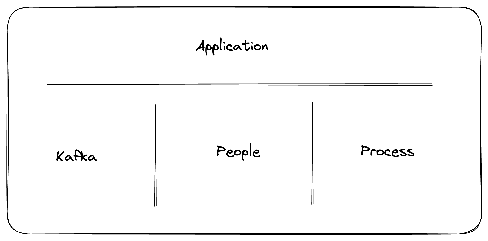

## Overview
Self-Service helps you scale Kafka usage in your organization by facilitating collaboration between the **Central Platform Team** and **Application Teams**.  

It simplifies and automates processes, establishes clear rules and ways of working, and standardizes the creation and management of Kafka resources.  

This approach brings governance into your enterprise through concepts like Ownership and Applications, delegating operations to the Application Teams rather than the Central Platform Team.


### Benefits for Central Platform Team
- Define the general rules of the game
- Enforce naming conventions
- Safeguard from invalid or expensive configurations (wrong replication factor, high partition number, ...)
- Declare the Applications and their rights
- 🍹🏖️
### Benefits for Applications Teams
- Autonomy and responsibility over their resources
- Isolation with Application namespaces
- Collaboration through permission delegation without any help from the Central Platform team
- Discoverability through Topic Catalog

## Concepts
Self-service relies on a central concept, the **Application** which incorporates 3 core concepts:
- Application Ownership on the **Kafka** resources
- How **People** interact with the Application
- Self-service **Processes** & Governance rules
  

## Central Platform Team Resources

### Application
An application represents a streaming app or data pipeline that is responsible for producing, consuming or processing data from Kafka.
Applications give business context to Kafka resources (topics, consumer groups & subjects) that directly relate to the functioning of that application or pipeline.

**Example**
````yaml
---
apiVersion: "self-service/v1"
kind: "Application"
metadata:
  name: "clickstream-app"
spec:
  title: "Clickstream App"
  description: "Clickstream records user’s clicks through their journey on our website"
  owner: "clickstream-group"            # technical-id of the Console Group
````

### Application Instance
**Applications** are generally deployed to one or more Kafka clusters, typically to align with the organization's development cycle or environments.
We call this concept the **Application Instance**.

Each Application Instance:
- Is linked to a Kafka Cluster and a Service Account
- Has ownership on the Kafka resources (topics, consumer groups, subjects, ...)
- Grants the permissions
    - On the Service Account using Kafka ACLs (`Read & Write` on Topics, `Read` on ConsumerGroups)
    - On the Application owner group in Conduktor Console using RBAC (`Admin` permissions)

**Example**
````yaml
# Application Instance (dev environment)
---
apiVersion: "self-service/v1"
kind: "ApplicationInstance"
metadata:
  application: "clickstream-app"
  name: "clickstream-app-dev"
spec:
  cluster: "shadow-it"
  serviceAccount: "sa-clickstream-dev"
  resources:
    - type: TOPIC
      name: "click."
      patternType: PREFIXED
    - type: GROUP
      name: "click."
      patternType: PREFIXED
````

### Application Instance Policies
Application Instance Policies restrict the Application Teams to create their resources following certain rules.
These rules can be related to Kafka configs but can also apply to metadata.  
This is what lets Platform Administrators provide a Self-service experience that doesn't look like the Wild West.

**Example**
````yaml
# Policies that restrict the Application to a certain range of configurations
# on topic configs, but also on topic metadata
---
apiVersion: "self-service/v1"
kind: "TopicPolicy"
metadata:
  name: "generic-dev-topic"
spec:
  policies:
    metadata.labels.data-criticality:
      constraint: OneOf
      values: ["C0", "C1", "C2"]
    spec.configs.retention.ms:
      constraint: "Range"
      max: 42
      min: 3
````


## Application Team Resources
Once an Application & Application Instance are defined, Application Teams can now organize and structure their application as they see fit.
There are two groups of resources where Application Teams are given autonomy:
- **Kafka-related** resources, `Topic`, `Subject`, `Connector`, `ApplicationInstancePermission`.
- **Console-related** resources, in particular `ApplicationGroup`, allowing them to define internally who can do what within their Team.

### Kafka resources
This is how Application Teams can create the Kafka resources they need for their applications.

````yaml
# Topic example
---
apiVersion: kafka/v2
kind: "Topic"
metadata:
  cluster: "shadow-it"
  name: "click.screen-events"
spec:
  replicationFactor: 3
  partitions: 6
  configs:
    min.insync.replicas: "2"
    cleanup.policy: "delete"
    retention.ms: "60000"

````

### Application Instance Permission
Application Instance Permissions lets teams to collaborate with each others.
Deploying this object will grant permission to the `grantedTo` Application Instance:
- To its Service Account (Kafka ACL)
- To the Application Team members in Conduktor Console

**Example**
````yaml
# Read permission granted to the Heatmap Application on click.screen-events topic
---
apiVersion: self-service/v1
kind: "ApplicationInstancePermission"
metadata:
  application: "clickstream-app"
  appInstance: "clickstream-app-dev"
  name: "clickstream-app-dev-to-heatmap"
spec:
  resource:
    type: TOPIC
    name: "click.screen-events"
    patternType: LITERAL
  permission: READ
  grantedTo: heatmap-app-dev
````

### Application Group
Create an Application Group to directly reflect how your Application operates.
You can create as many Application Groups as required to restrict or represent the different teams that use Console on your Application, e.g.:
- Support Team with only Read Access in Production
- DevOps Team with extended access across all environments
- Developers with higher permissions in Dev

**Example**
````yaml
# Permissions granted to Console users in the group, CP-COMPANY-CLICKSTREAM-SUPPORT, for the clickstream-app Application
---
apiVersion: self-service/v1
kind: "ApplicationGroup"
metadata:
  application: "clickstream-app"
  name: "clickstream-support"
spec:
  title: Support Clickstream
  description: |
    Members of the Support Group are allowed:
      Read access on all the resources
      Can restart owned connectors
      Can reset offsets
  permissions:
    - appInstance: clickstream-app-dev
      resourceType: TOPIC
      resourcePatternType: "LITERAL"
      resourcePattern: "*" # All owned & subscribed topics
      permissions: ["topicViewConfig", "topicConsume"]
    - appInstance: clickstream-app-dev
      resourceType: GROUP
      resourcePatternType: "LITERAL"
      resourcePattern: "*" # All owned consumer groups
      permissions: ["consumerGroupCreate", "consumerGroupReset", "consumerGroupDelete", "consumerGroupView"]
    - appInstance: clickstream-app-dev
      resourceType: CONNECTOR
      resourcePatternType: "LITERAL"
      resourcePattern: "*" # All owned connectors
      permissions: ["kafkaConnectorViewConfig", "kafkaConnectorStatus", "kafkaConnectPauseResume", "kafkaConnectRestart"]
  members:
    - user1@company.org
    - user2@company.org
  externalGroups:
    - GP-COMPANY-CLICKSTREAM-SUPPORT

````

### Resource Labels

All resources that can be created using the Conduktor CLI can be annotated with metadata in the form of labels. Labels are key value pairs with no constraints to help you organize and surface business metadata into Console.  

**Example**
````yaml
# Topic annotated with useful metadata
---
apiVersion: kafka/v2
kind: "Topic"
metadata:
  cluster: "shadow-it"
  name: clickstream.events
  labels:
    description: "A description for what kind of data this topic contains."
    business-data-classification: C2
    business-doc-url: "https://confluence.company.org/display/CLICK/Kafka"
    application-code: CLK
    environment-code: dev
spec:
  replicationFactor: 3
  partitions: 6
  configs:
    min.insync.replicas: "2"
    cleanup.policy: "delete"
    retention.ms: "60000"
````
