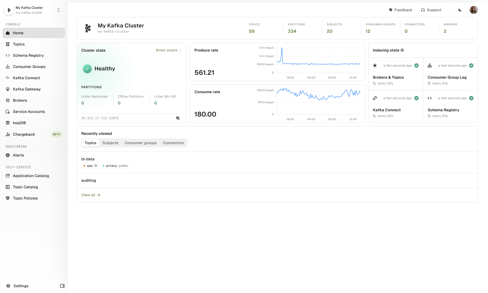

## What is Conduktor?

Conduktor is the Enterprise Data Management Platform for Streaming that integrates with your existing infrastructure to provide centralized visibility and control over your real-time data.

To maximize the value of Conduktor, there are two key components to be aware of:
 - [Console](/platform/navigation/): Unified interface to develop, monitor, and manage data streaming operations
 - [Gateway](/gateway): Proxy that simplifies authentication, authorization, and traffic management

The Conduktor Console is a powerful UI for Apache Kafka. It equips users with functionality to support many essential tasks when working with Kafka.

 - See [Navigation](/platform/navigation/) for more details

The Conduktor Gateway is a Kafka proxy deployed between your client applications and existing Kafka clusters. This can be used to provide functionality that is not available in Kafka natively, such as centrally configured encryption, traffic control policies, and failover for disaster recovery.

 - See [Overview](/gateway) for more details

## Next Steps
 - [Getting Started with Console](/platform/get-started/installation/get-started/docker)
 - [Getting Started with Gateway](/gateway/get-started/docker)

## Resources

- [Changelog](https://conduktor.io/changelog)
- [Roadmap](https://product.conduktor.help)
- [Support](https://www.conduktor.io/contact/support)
- [Arrange a technical demo](https://www.conduktor.io/contact/demo)

Something missing, want more? [Contact us](https://support.conduktor.io/hc/en-gb), we're always reviewing and expanding our documentation.
