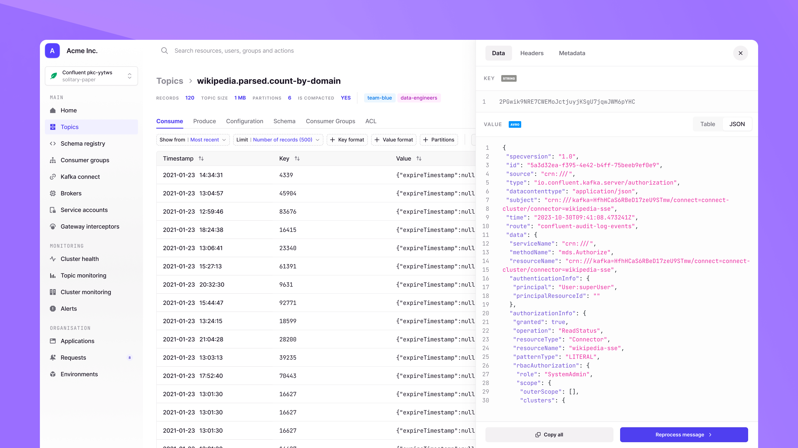

# Overview

- [Getting Started](#getting-started-with-the-docs)
- [What is Conduktor Console](#what-is-conduktor-console)
- [Resources](#resources)

## Getting Started with the Docs

These documents allow you to setup, configure and explore Conduktor Console.

If you are looking at setting up Console, [review the installation](/platform/category/installation/).  

Need to further configure Console for your specific setup, [review the configuration options](/platform/category/configuration/).  

Want to maximise what you can get from Console [dive into the Navigation](/platform/category/configuration/).

## What is Conduktor Console?

The Conduktor Console is a powerful UI for Apache Kafka. The Console equips users with functionality to support many essential tasks when working with Kafka.

**Access and Manage Kafka resource**. Explore topics, reset consumer offsets, manage ACLs, deploy & restart connectors, are just some of the things you can do.

**Self-service**. Solve some of the most recurring problems associated with working with Kafka at scale. Ownership of resources, access request management, topic discvoerability, governance policies, and much more!

**Secure Kafka**. Import your existing groups, configure detailed permissions for your users, set up your external integrations, review audit logs as well as much more.

**Monitor Kafka**. The cluster, topics and consumer groups. Creating alerts to notify you based on Kafka metrics we collect for you.

See [Navigation](/platform/navigation/) for more details.

## Resources

- [Changelog](https://conduktor.io/changelog)
- [Roadmap](https://product.conduktor.help)
- [Support](https://www.conduktor.io/contact/support)
- [Arrange a technical demo](https://www.conduktor.io/contact/demo)

Something missing, want more? [Contact us](https://support.conduktor.io/hc/en-gb), we're always reviewing and expanding our documentation.  

Happy reading 😃.
