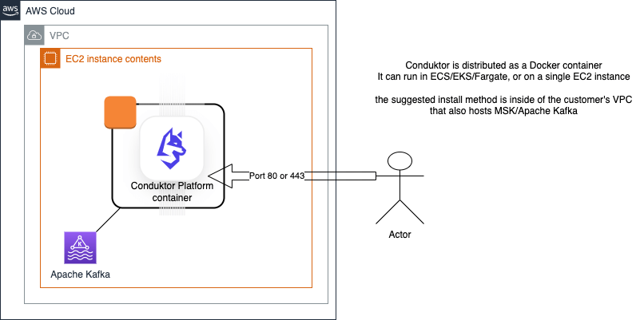

# Deployment on AWS

## Getting started

This blog contains all the information you should need to configure and deploy Conduktor Platform on AWS with MSK. 
https://aws.amazon.com/blogs/big-data/gain-visibility-into-your-amazon-msk-cluster-by-deploying-the-conduktor-platform/

## Resources required 

An S3 bucket to store our configuration files.

An ECR repository to store our final Docker image.

A CodeBuild project to build that Docker image.

An IAM role and policy to allow CodeBuild to perform the build.

## Security

Note that IAM credentials are stored in S3 and on EFS/EBS.  Permissions limiting access to these should be applied.
 
## Networking & Architecture 

