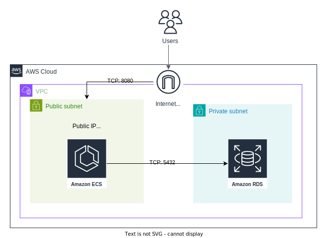
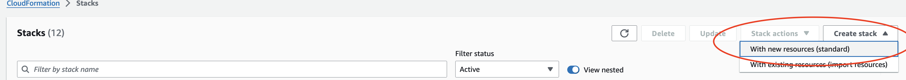
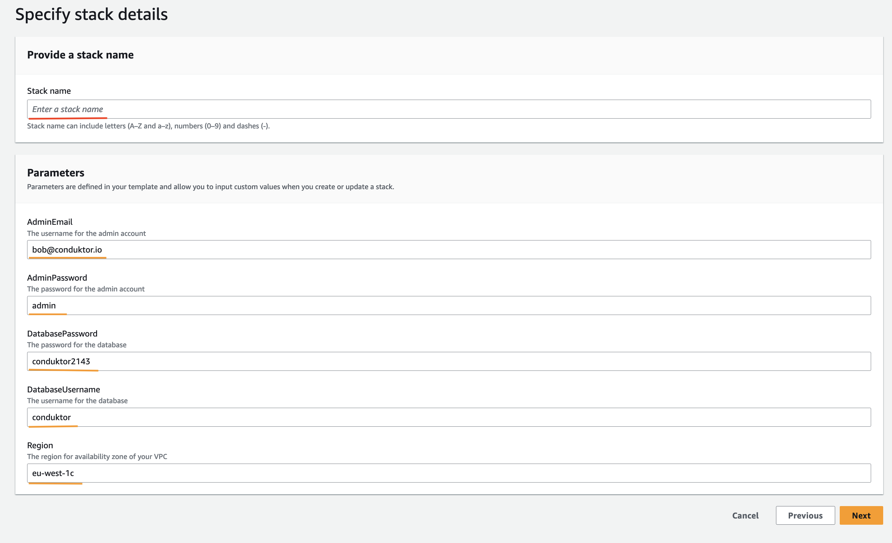
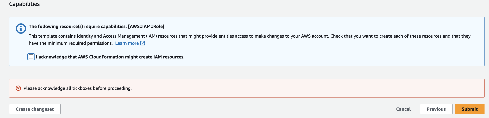
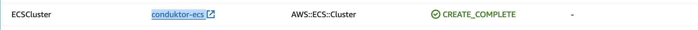
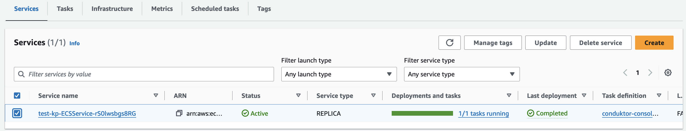
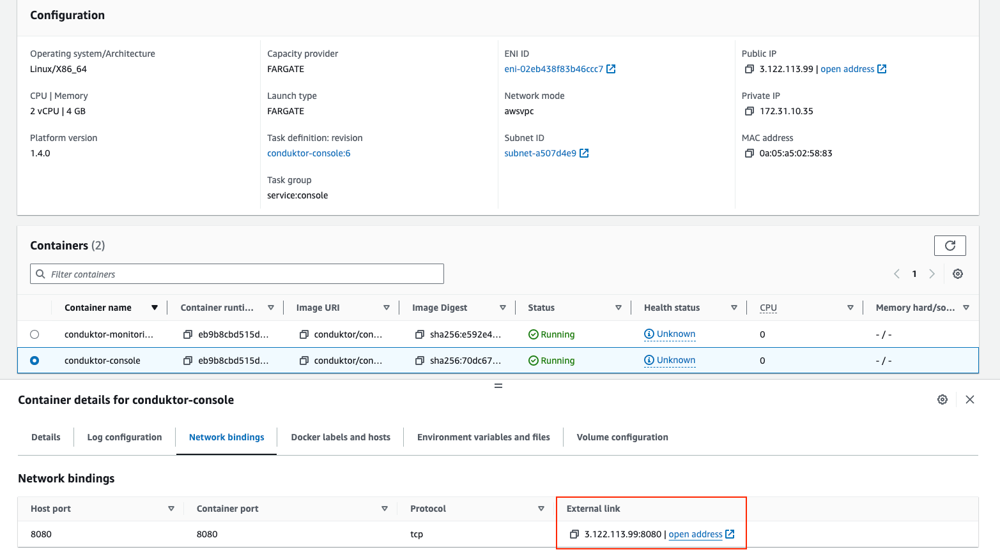
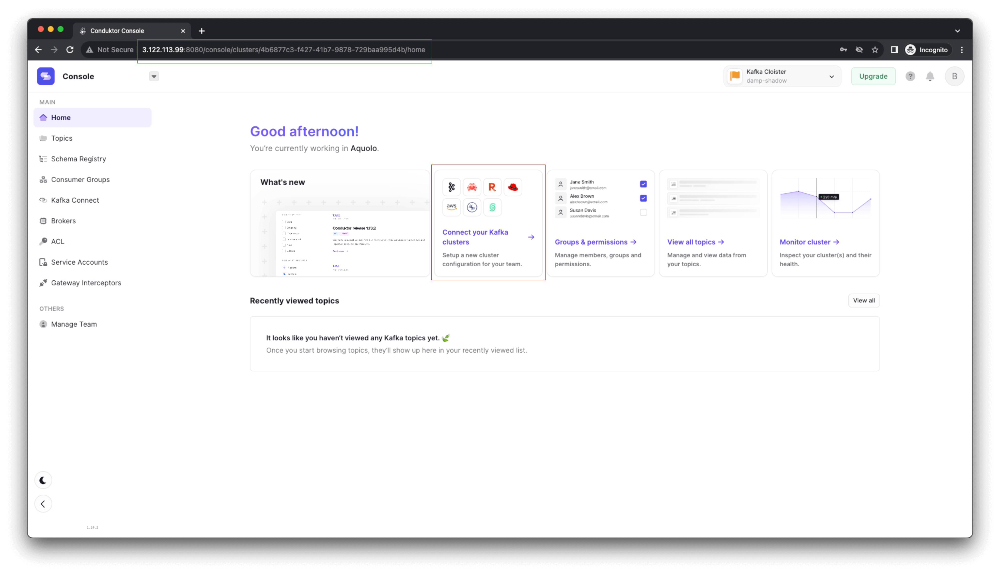

# Deployment on AWS CloudFormation

## Getting started

This guide will demonstrate how to use [AWS CloudFormation](https://aws.amazon.com/cloudformation/) to deploy Console in your AWS environment with all mandatory dependencies. It will deploy Conduktor as a Docker container on an ECS service with Fargate and configure it alongside a PostgreSQL database via RDS.

:::info
While this guide will help you get started, you may need to make additional configurations to ensure your deployment is [production-ready](../hardware.md#production-requirements).
:::

The process should take no more than 15 - 30 minutes.

## Security

This template will create all the resources on a public subnet. It is important to keep this in mind when using it.

## Networking & Architecture

## Deployment Steps

1. Go to `https://\<region>.console.aws.amazon.com/cloudformation`.

1. Click on "create stack" button and choose the "With new resources" option.

    

1. Choose the following options.

    

1. Upload one of our templates:

    > Decide if you want to deploy console using your own resources (cluster, DB, etc.) or if you want us to deploy all resource dependencies alongside console as well.

    To deploy console **only**, you can use the following template:

    - [CDK-lite-template](https://github.com/conduktor/quickstart-conduktor-cloudformation/blob/main/templates/CDK-lite-template.yaml)

    To deploy console and all resources needed (e.g. DB), you can use the following template:

    - [CDK-Full-template](https://github.com/conduktor/quickstart-conduktor-cloudformation/blob/main/templates/CDK-full-template.yaml)

1. Click "next".

1. Give your stack a name and define/ review the parameters.

    - If you have chosen the [CDK-lite-template](https://github.com/conduktor/quickstart-conduktor-cloudformation/blob/main/templates/CDK-lite-template.yaml), then you will have to supply the following values before you can continue.

    | Parameter | Value |
    | -------- | ------- |
    | `Subnet` | The ARN of the subnet you want to deploy your ECS service on. |
    | `SecurityGroup` |  The Security group that will have access to your ECS service. |
    | `ClusterArn` | The ARN of the cluster you want to deploy your ECS service on. |
    | `DatabaseEndpoint` | The endpoint of your DB instance. |
    | `DatabaseUsername` | The username for above DB instance. |
    | `DatabasePassword` | The password for above DB instance. |

    

    - If you have chosen the [CDK-Full-template](https://github.com/conduktor/quickstart-conduktor-cloudformation/blob/main/templates/CDK-full-template.yaml), then you **won't** have to supply any parameter values, but you should override the default ones (e.g. the **admin email**, **admin password** and **AWS region**).

    :::warning
    Note the default value for region is specified in the template as **`eu-west-1c`**, if you are deploying in a **different region** you must update this value. 
    :::

    

1. Click "next".

1. Acknowledge the tick box. *This will ensure we have the right permissions to access our ECS instance!*

    

1. Click "submit".

1. Wait for all resources to be created. *This may take some time!*

1. From the "Resources" tab, click on `conduktor-ecs` then navigate to your newly created **Service** and then **Task**.  

    
    
    

1. Find the `conduktor-console` Container and navigate to the **Network bindings** tab.

    

1. Click on the **External** link to open the Console application.

    

    > In our example, our application is running at 3.122.113.99:8080.

### Access Conduktor

You can now log in as admin with the credentials previously defined in the environment variables:

- e.g. `bob@conduktor.io` / `admin`

