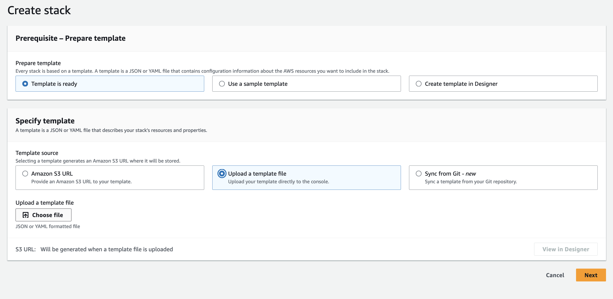
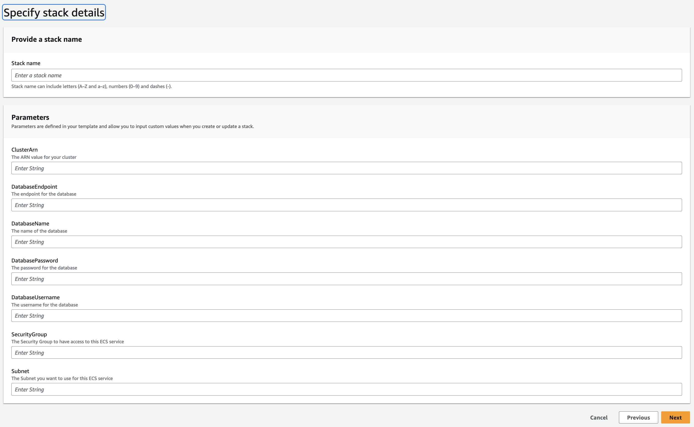
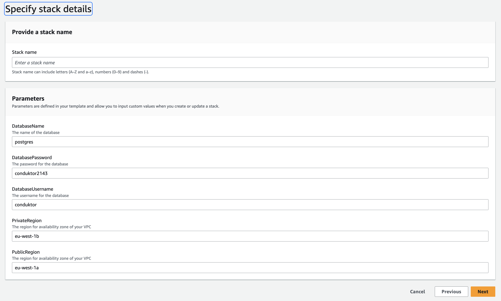
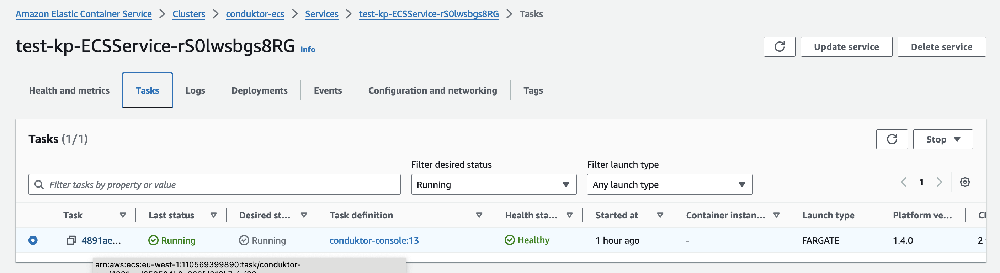

# Deployment on AWS CloudFormation

## Getting started

This guide will demonstrate how to use [AWS CloudFormation](https://aws.amazon.com/cloudformation/) to deploy Console in your AWS environment with all mandatory dependencies. It will deploy Conduktor as a Docker container on an ECS service with Fargate and configure it alongside a PostgreSQL database via RDS.

> While this guide will help you get started, you may need to make additional configurations to ensure your deployment is production-ready.

The process should take no more than 15 - 30 minutes.

## Security

This template will create all of the resources on a public subnet. It is important to keep this in mind when using it.

## Networking & Architecture

## Deployment Steps

1. Go to `https://\<region>.console.aws.amazon.com/cloudformation`. 

1. Click on "create stack" button and choose "With new resources" option.

    

1. Choose the following options.

    

1. Upload one of our templates:

    > Decide if you want to deploy console use your own resources (cluster, DB and etc) or if you want us to deploy the extra resources along side console as well.

    To deploy console **only**, you the following template:

    - [CDK-lite-template](https://github.com/conduktor/quickstart-conduktor-cloudformation/blob/main/templates/CDK-lite-template.yaml)

    To deploy console and extra resources, you the following template:

    - [CDK-Full-template](https://github.com/conduktor/quickstart-conduktor-cloudformation/blob/main/templates/CDK-full-template.yaml)

1. Click "next".

1. Give your stack a name and define/ review the parameters.

    - If you have chosen the [CDK-lite-template](https://github.com/conduktor/quickstart-conduktor-cloudformation/blob/main/templates/CDK-lite-template.yaml), then you will have to supply the following values before you deploy Conduktor.

    | Parameter | Value |
    | -------- | ------- |
    | `Subnet` | The ARN of the subnet you want to deploy your ECS service on. |
    | `SecurityGroup` |  The Security group that will have access to your ECS service. |
    | `ClusterArn` | The ARN of the cluster you want to deploy your ECS service on. |
    | `DatabaseEndpoint` | The endpoint of your DB instance. |
    | `DatabaseUsername` | The username for above DB instance. |
    | `DatabasePassword` | The password for above DB instance. |

    > *Review the default parameters.*

    

    
    - If you have chosen the [CDK-Full-template](https://github.com/conduktor/quickstart-conduktor-cloudformation/blob/main/templates/CDK-full-template.yaml), then you **won't** have to supply any parameter values but you can override the default ones.
    
    

1. Click "next".

1. Acknowledge the tickbox. *This is so that we are able to see the logs Conduktor sends!*

    

1. Click "submit".

1. Wait for all resources to be created. *This may take some time!*

1. From "Resources" tab, click on `conduktor-ecs` then navigate to your newly created **Service** and then **Task**.  

    
    
    

1. Find the Container and navigate to the **Network bindings** tab.

    

    Click on the **External** link to open the Console application.

    

    In our example, our application is running at 3.122.113.99:8080.

### Access Conduktor
You can now log in as admin with the credentials previously defined in the environment variables:
- e.g. `bob@conduktor.io` / `admin`

