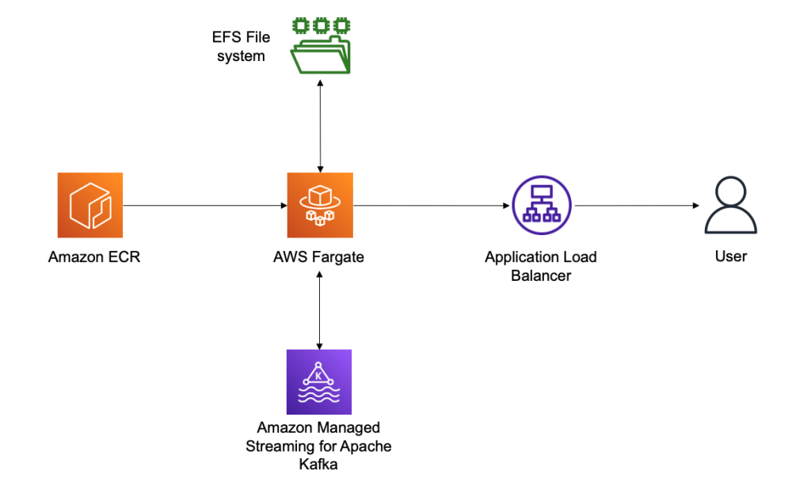

# Cloudformation

The below guide details how to deploy a production-ready instance of Conduktor Platform on MSK.

Everything is deployed using CloudFormation templates and the Platform is deployed in ECS Fargate.

https://aws.amazon.com/blogs/big-data/gain-visibility-into-your-amazon-msk-cluster-by-deploying-the-conduktor-platform/ 

## Skills required

You will need an AWS account with ability to deploy CloudFormation templates into the selected AWS VPC.

## Billing

Note that deploying this CloudFormation template into your environment will result in billable resources being consumed.  See [AWS MSK billing](https://aws.amazon.com/msk/pricing/) for more information.
