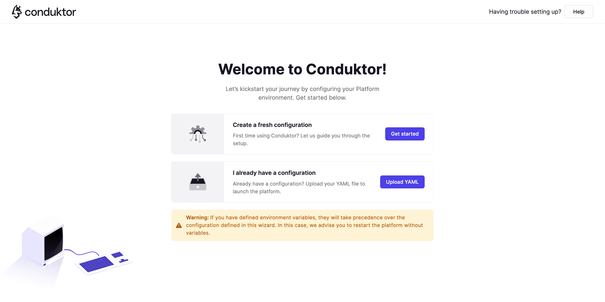

# Docker Quick Start

Get started with the latest Conduktor Docker image. The installation and configuration process takes a few minutes only, the time to download and start the containers and the platform to start.

There are two ways to configure Conduktor via Docker:

- [**Simple Setup**](#simple-setup): Start Conduktor with onboarding and configure your environment inside the Conduktor interface. Great for **experimenting** with how Conduktor can help you quickly.

- [**Advanced Configuration**](#advanced-setup): Use a configuration file or environment variables to declare an external database and SSO. This is the recommended option for **production environments**.

## Simple Setup

When launching Conduktor for the first time, you will presented with onboarding to help configure your environment.

### Step 1: Launch Conduktor

Run the below command to launch Conduktor.

import Tabs from '@theme/Tabs'; import TabItem from '@theme/TabItem';

<Tabs>
<TabItem value="MacOS" label="MacOS">

```bash
docker run --rm --pull always \
  -p 8080:8080 \
  --mount "source=conduktor_data,target=/var/conduktor" \
conduktor/conduktor-platform:latest
```

</TabItem>
<TabItem value="Linux" label="Linux">

```bash
docker run --rm --pull always \
  -p 8080:8080 \
  --add-host=host.docker.internal:host-gateway \
  --mount "source=conduktor_data,target=/var/conduktor" \
conduktor/conduktor-platform:latest
```

</TabItem>
<TabItem value="Windows" label="Windows">

```bash
docker run --rm --pull always `
  -p 8080:8080 `
  --mount "source=conduktor_data,target=/var/conduktor" `
conduktor/conduktor-platform:latest
```

</TabItem>
</Tabs>

### Step 2: Complete Onboarding

After a few seconds, the Conduktor onboarding wizard will be available at **[http://localhost:8080](http://localhost:8080)**.



### Step 3: Configure your first Kafka cluster

Once you complete the wizard, you should configure a Kafka cluster.

Go to [http://localhost:8080/admin/clusters](http://localhost:8080/admin/clusters) and **add** a new cluster configuration.

From within the cluster configuration screen, add the:

- Bootstrap server
- Authentication details
- Additional properties

Configuring an **SSL/TLS** cluster? Use the [Conduktor Certificate Store](../../configuration/ssl-tls-configuration.md#using-the-conduktor-certificate-store).


#### How to connect to Kafka running on localhost:9092?

Add the below to your Kafka **server.properties** file

```
listeners=EXTERNAL://0.0.0.0:19092,PLAINTEXT://0.0.0.0:9092
listener.security.protocol.map=PLAINTEXT:PLAINTEXT,EXTERNAL:PLAINTEXT
advertised.listeners=PLAINTEXT://127.0.0.1:9092,EXTERNAL://host.docker.internal:19092
```

If running Kafka in KRaft mode, add the below to your Kafka **config/kraft/server.properties** file

```
listeners=EXTERNAL://0.0.0.0:19092,PLAINTEXT://0.0.0.0:9092,CONTROLLER://:9093
listener.security.protocol.map=PLAINTEXT:PLAINTEXT,EXTERNAL:PLAINTEXT,CONTROLLER:PLAINTEXT
advertised.listeners=PLAINTEXT://127.0.0.1:9092,EXTERNAL://host.docker.internal:19092
inter.broker.listener.name=PLAINTEXT
```

From within the Conduktor interface, connect using the bootstrap server: `host.docker.internal:19092`

## Advanced Setup

Conduktor can also be configured using a configuration file `platform-config.yaml`, or through environment variables. This is used to setup your organizations environment. The file can be used to declare:

- Organization name
- External database
- SSO

### Step 1: Create a Configuration File

There are two ways to create a configuration file:
 - When starting Conduktor for the first time, the **onboarding will guide** you through this process. See [simple setup](#simple-setup).
 - Manually create a configuration (see below).

The below example shows how to configure Conduktor with an external database, SSO and an optional license key (for Enterprise customers).

All configuration properties can also be parsed as [Environment Variables](/platform/configuration/env-variables/) when starting Conduktor.
If you need some help to convert this file into environment variables, feel free to use our [YAML to ENV converter](https://conduktor.github.io/yaml-to-env/).

For more examples, see:

- [Configuration Properties and Environment Variables](/platform/configuration/env-variables/)
- [Configuring SSO](/platform/category/user-authentication/)

```yaml
organization:
  name: demo

admin:
  email: admin@company.io
  password: admin

database:
  host: 'host'
  port: 5432
  name: 'database'
  username: 'user'
  password: 'password'
  connection_timeout: 30 # in seconds

sso:
  oauth2:
    - name: 'azure'
      default: true
      client-id: ${AZURE_APPLICATION_ID}
      client-secret: ${AZURE_CLIENT_SECRET}
      openid:
        issuer: https://login.microsoftonline.com/{tenantid}/v2.0

license: '<your license key>'
```

### Step 2: Launch Conduktor

Run the below command in the directory containing your `platform-config.yaml` file.

If you are a **Conduktor Enterprise** customer, you can decide either to put the license in your configuration file or to start the platform with the environment variable `LICENSE_KEY`, as bellow.

<Tabs>
<TabItem value="MacOS" label="MacOS">

```bash
docker run --rm \
  -p "8080:8080" \
  -e LICENSE_KEY="<your-license>" \
  --mount "type=bind,source=$PWD/platform-config.yaml,target=/opt/conduktor/default-platform-config.yaml" \
  --mount "source=conduktor_data,target=/var/conduktor" \
conduktor/conduktor-platform:latest
```

</TabItem>
<TabItem value="Linux" label="Linux">

```bash
docker run --rm \
  -p "8080:8080" \
  -e LICENSE_KEY="<your-license>" \
  --add-host=host.docker.internal:host-gateway \
  --mount "type=bind,source=$PWD/platform-config.yaml,target=/opt/conduktor/default-platform-config.yaml" \
  --mount "source=conduktor_data,target=/var/conduktor" \
conduktor/conduktor-platform:latest
```

</TabItem>
<TabItem value="Windows" label="Windows">

```bash
docker run --rm `
  -p "8080:8080" `
  -e LICENSE_KEY="<your-license>" `
  --mount "type=bind,source=$pwd/platform-config.yaml,target=/opt/conduktor/default-platform-config.yaml" `
  --mount "source=conduktor_data,target=/var/conduktor" `
conduktor/conduktor-platform:latest
```

</TabItem>
</Tabs>

### Step 3: Access Conduktor

After a few minutes, **Conduktor will be available at [http://localhost:8080](http://localhost:8080)**

If using [SSO](/platform/category/user-authentication/), you will see an option to login via the relevant identity provider.


### Step 4: Configure your first cluster

See [configuring your first cluster](#step-3-configure-your-first-kafka-cluster)
