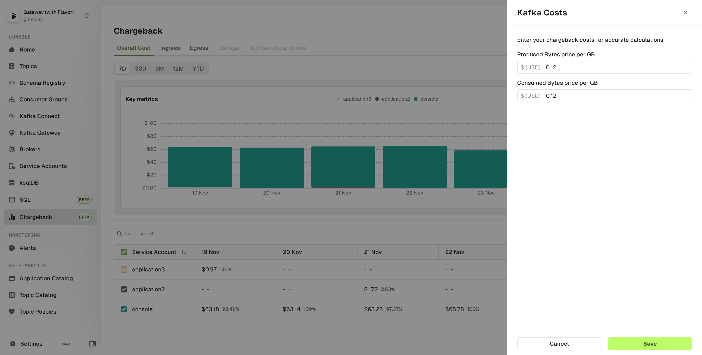

## Overview

:::danger[Scale Plus functionality]
This feature is available with [Conduktor Scale Plus](https://conduktor.io/scale) only.
:::

Chargeback lets you visualize the cost allocation of Service Accounts on a few key metrics.
:::info
At the moment, the data is aggregated per Service Account and the available metrics collected are the produced and consumed bytes.  
We plan to add more features over time. [Let us know](https://conduktor.io/roadmap) how you want to aggregate your data or which features are important to you.
:::

Chargeback data can be viewed from the perspective of Overall Cost, Ingress or Egress. Cost is user configured $ per byte, more below.

- **Overall Cost** displays the total dollar cost by adding together the Ingress + Egress costs
- **Ingress** shows the produced data per Service Account, by cost, percentage or bytes
- **Egress** shows the consumed data per Service Account, by cost, percentage or bytes

The measured period can be changed from 7D, 30D, 6M, 12M, or YTD (Year To Date).

The configuration button lets you configure the Dollar cost of a Produced GB and a Consumed GB. This allows you to align the chargeback model with your specific infrastructure costs.

## Exporting chargeback data

To facilitate external analysis and reporting, the data shown in the table can be exported as a CSV file.

To export the data, click on the "Export all" button located at the top right corner of the graph.

The default exported file name will be `Chargeback_<startDate>_<endDate>_<activeTabName>.csv`.

### Filtering and sorting the data

Any filters or sorting applied to the table will be reflected in the exported data. Only the data matching your current view will be included in the CSV file.

#### Selecting the data to export

The exported data will depend on the currently selected tab:
- Selecting the **Overall Cost** tab will export the cost values
- Selecting the **Ingress** or **Egress** tab will export the produced/consumed bytes

#### Exporting data for different time periods

The exported data will be formatted based on the selected time period:
- Selecting **7D** or **30D** will export the relevant data broken down per day
- Selecting **6M**, **12M** or **YTD** will export the relevant data broken down per month

## Configure chargeback
When you want to set this up checkout the dedicated page on how to [configure chargeback](docs/platform/guides/configure-chargeback.md).