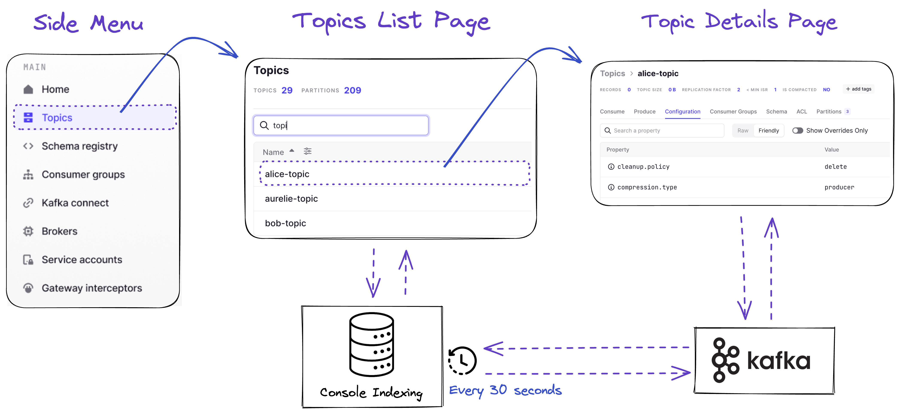
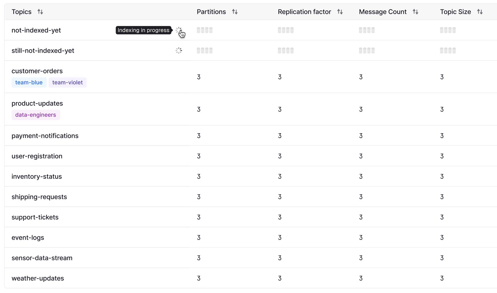
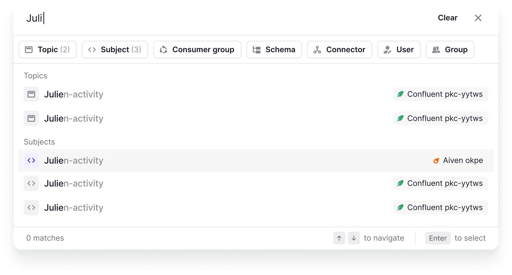
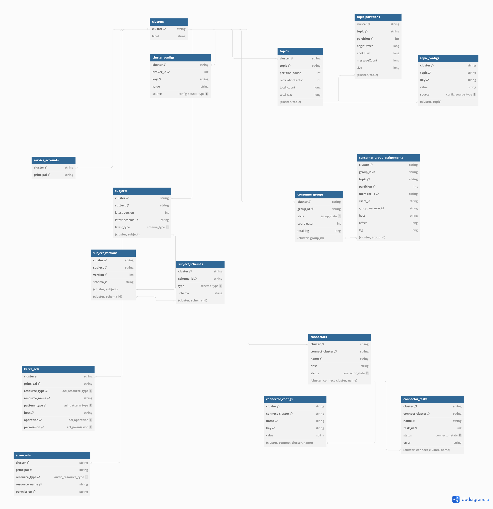

In Console, many of the list pages (Topics, Consumer Groups, Schema Registry, Kafka Connect) are served from an internal table instead of making AdminClient calls to Kafka.

Theses tables are updated by a background process that we call **Indexing**. This Indexing process collects changes that happened to your Kafka every 30 seconds and stores the collected metadata in internal tables.

:::info
Resource details pages are not using this mechanism. As soon as you are on a specific Topic page or Consumer group page, the data is fetched directly on the Kafka cluster.
:::

## FAQ: I've just created a Topic, but can't see the metadata in the list?

Indexing is a trade-off: for all the positive aspects it brings to the overall user experience, we lose on one key element.

Topics created 'now' would not be indexed until the next Indexing cycle. This means they wouldn't appear in Console for up to 30 seconds, but we know this is not acceptable.

To mitigate the negative effect of Indexing, we have come up with an elegant counter-measure. Any user request to the Topic List will ALWAYS make one AdminClient call to Kafka: `listTopics`. It’s cheap, simple, and it will only return the topic names.

So, whenever the user lists topics using Console,

-   99% of the time, the Indexing will serve all the topics with all the columns (name, partitions, count, size, ...)
-   1% of the time, the Indexing will serve most topics except for one or two “not-indexed yet” topics where **only the name** will be available

## Why are we doing this?

We do this to provide you with the best UX possible and provide features that you've never seen before associated to your Kafka resources:

-   (Today): **Smart tables** with sorting and filtering capabilities on a lot of interesting dimensions like message count, size, retention, last-message, produce-rate, consume-rate, and much more!
-   (Tomorrow): A **Global Search Bar** accessible from anywhere in Console, that autocompletes as you start typing, scanning through ALL your resource types across ALL you connected Kafka clusters.

-   (Later) **Alerting** or **Watch** capabilities on any Kafka resources.
    -   Want to know when a new version of a subject is published? Sure!
    -   Someone's just created a topic with a replication factor that doesn't make sense? No problem!
    -   Your DLQ topic got new messages? We fire a Slack Alert!

None of those features, or anything else we have planned for you, could have been created using only AdminClient calls, Schema Registry API calls, or Kafka Connect API calls. They are simply not efficient enough, especially as the number of active users or connected clusters on Console grows.

Here's the underlying database model we are using to store all of the data.

I hope you can start to identify interesting correlations you could make or some reports you'd like us to build on top of this data model. 

-   **Idle topics**: which topics have no active consumers and producers haven't published data there since more than a week?
-   **Overpartitioned topics**: which topics have a large number of partition while the biggest consumer group only have a few members consuming in parallel?
-   **Data at risk topics**: which topics are at risk of loosing data, because either the replication factor or the min ISR is incorrect.
-   **Outliers topics**: topics are just bad configs or overridden configurations that they shouldn't have.
-   **Over-replicated Applications**: which consumer groups are having idle members, typically because the number of consumers exceed the number of total partitions. Could help you scale down your applications and save a bit on infra costs.

          