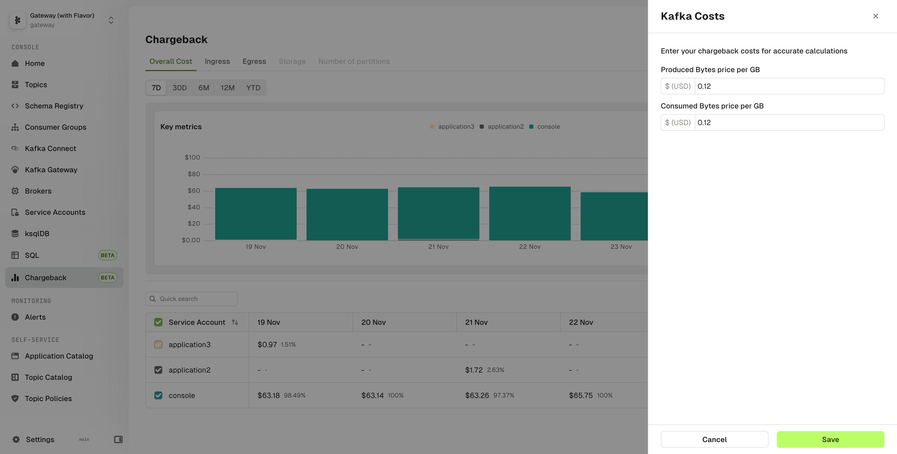

## Overview

Chargeback lets you visualize the cost allocation of Service Accounts on a few key metrics.
:::info
At the moment, the data is aggregated per Service Account and the available metrics collected are the produced and consumed bytes.  
We plan to add more features over time. [Let us know](https://conduktor.io/roadmap) which feature is important to you.
:::

- Overall Cost tab displays the dollar costs by adding up the dollar cost for each available metric (Ingress + Egress)
- Ingress tab shows the produced bytes of the Service Accounts
- Egress tab shows the consumed bytes of the Service Accounts

The measured period can be changed from 7D, 30D, 6M, 12M, or YTD (Year To Date)

The configuration button lets you configure the Dollar cost of a Produced GB and a Consumed GB. This allows you to align the chargeback model with your specific infrastructure costs.

