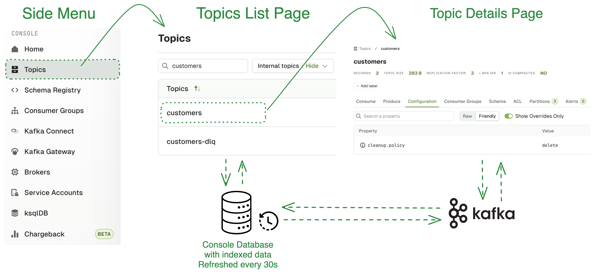

Each sub-section will bring you to the resource type you want to explore.  
You will be presented with a list, and upon clicking an item it the list, you will land on the corresponding detail page of this resource.
:::info
List Pages in Console are served from a snapshot table refreshed periodically instead of making direct calls to Kafka per user.

Read more [About Indexing](/platform/navigation/console/about-indexing/)
:::

