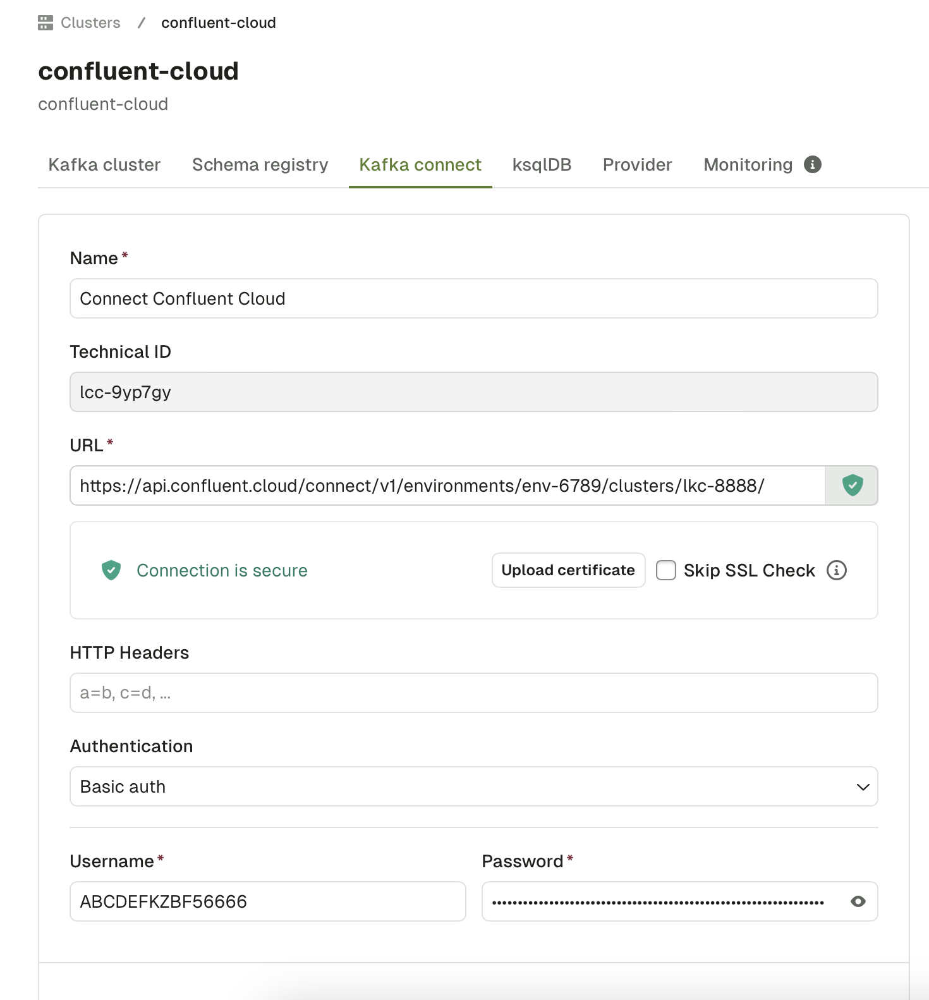

Enabling Confluent Cloud Managed Connectors

## Generating an API key
In order for Conduktor to access a Kafka Connect, you need to generate an API key and secret to act as a username and password. This can be achieved through the Confluent Cloud CLI tool: `ccloud`. To install it, you can follow the [official Confluent documentation](https://docs.confluent.io/ccloud-cli/current/install.html).


Once installed, complete the following steps:
- Login and select the appropriate environment:
```text
$ ccloud login
$ ccloud environment
```
- Generate an API key and secret and write them down
```text
$ ccloud api-key create --resource cloud
+---------+------------------------------------------------------------------+
| API Key | ABCDEFKZBF56666                                                  |
| Secret  | ToMaHaWkjQ1bt7BxvdyFjaJ8j3nSokaAd83Nhan739snAiufIAfdk7fFAAnBKxai |
+---------+------------------------------------------------------------------+
```
- The API key is the username, the secret is the token. Store these somewhere as we will need them later in the process.

## Obtaining your environment and cluster identifiers
Now we need to obtain the identifiers of the environment and cluster.
- Retrieving the ID of your environment can be achieved through the ``ccloud environment list` command.
```
$ ccloud environment list                                                                     
      Id      |    Name
+-------------+------------+
    env-1234 | staging
  * env-6789 | production
```
In this scenario, the environment ID for the production cluster would be `env-6789`.
- Retrieving the ID of your Kafka cluster can be achieved from the ``ccloud kafka cluster list` command.
```
 ccloud environment use env-6789
 ccloud kafka cluster list                                                                    16:21:10
      Id      |         Name         | Type  | Provider |    Region    | Availability | Status
+-------------+----------------------+-------+----------+--------------+--------------+--------+
    lkc-8888 | analytics-production | BASIC | gcp      | europe-west4 | single-zone  | UP
```

In this scenario, the ID of the cluster would be `lkc-8888`.

## Building the Kafka connection URL
With your obtained environment and cluster IDs, build the URL as so:
`https://api.confluent.cloud/connect/v1/environments/${ENVIRONMENT_ID}/clusters/${CLUSTER_ID}/`

## Populating the configuration information in Conduktor console
Navigate to cluster settings and go to the 'Kafka connect' tab. Once there, fill in the form with the following information:
- Technical ID: The cluster ID you have obtained
- URL: The Kafka connection URL you have built
- Authentication: Basic auth
- Username: The API key you have generated
- Password: The token you have generated.



