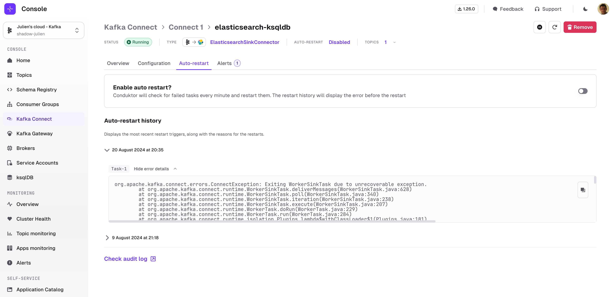

Sometimes, Kafka Connect tasks experience failures due to transient issues:
- A database which isn't available for a few minutes
- A networking issue
- ...

When this happens, Kafka Connect tasks shut down and you need to manually start the tasks again.

Console lets you enable **Auto-restart** on any connector instance. Once enabled, you can additionally configure the time between 2 consecutive restart attempts.

Console will check for failed tasks **every minute** and attempt to restart them.

Before doing so, Console will capture the logs of the failed task so that you can review them at a later date.

