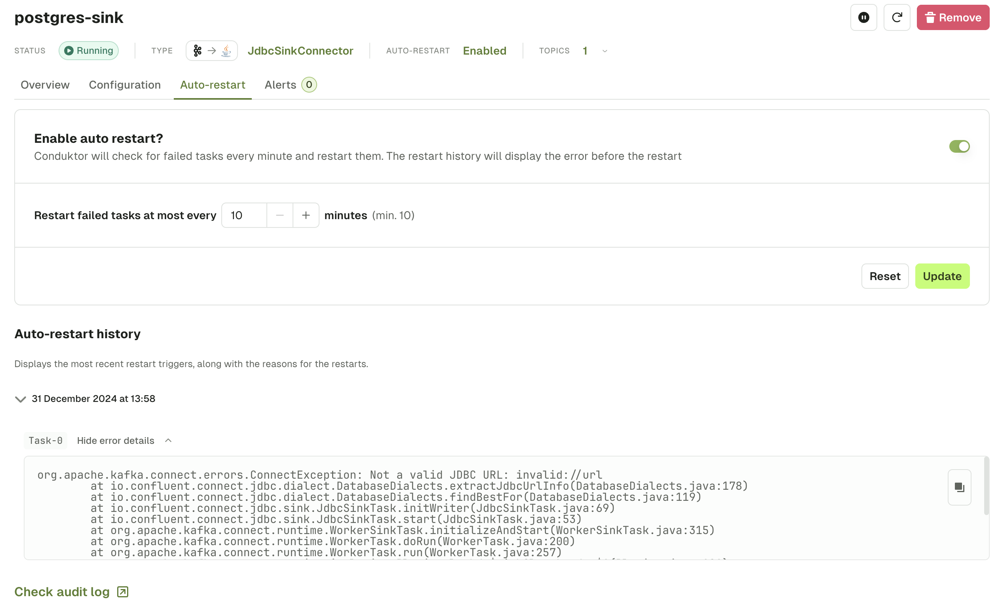

Sometimes, Kafka Connect tasks experience failures due to transient issues, database which isn't available for a few minutes or a networking issue, etc.

When this happens, Kafka Connect tasks shut down and you need to manually start the tasks again.

## Enable Auto-restart
Conduktor lets you enable **Auto-restart** on any connector instance. Once enabled, you can additionally configure the **delay** (default 10 minutes) between 2 consecutive restart attempts.

:::caution
For Confluent Cloud clusters, the auto-restart functionality will hit Confluent Cloud's [restart connector API](https://docs.confluent.io/cloud/current/api.html#tag/Lifecycle-(connectv1)/operation/restartConnectv1Connector). This will restart the entire connector and all its associated tasks. This is the only publicly documented API that Confluent has exposed to achieve task restarts.
:::

### How Auto-restart works
**Every minute**, Console will check for failed tasks for this Connector. For failed tasks:
- If the Auto-restart process hasn't tried to restart the task in the past **10 minutes** (configurable):
  - Capture the task error message
  - Restart the failed task
- Otherwise, do nothing

## Auto-restart history
You can review all the occurrences when Auto-restart triggered and the error message of the failed task before restarting.

