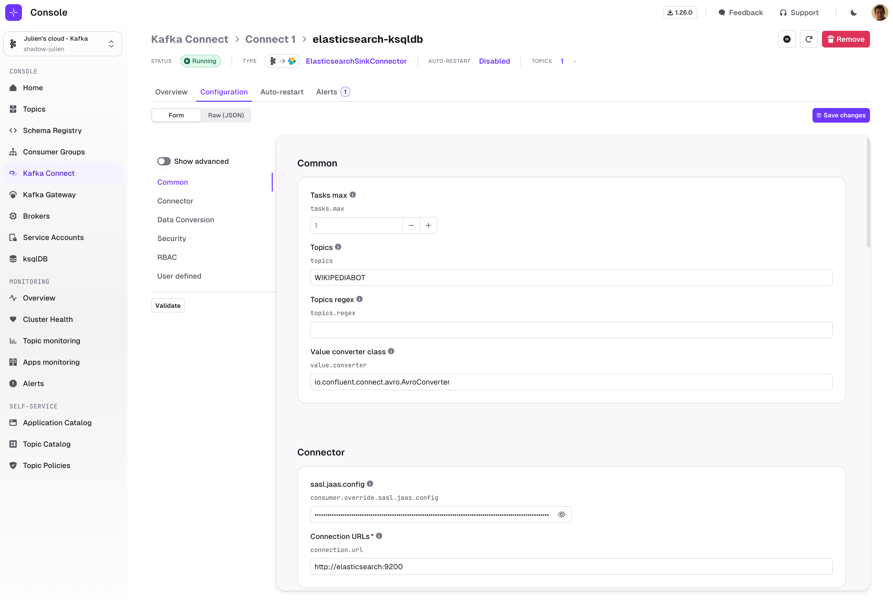
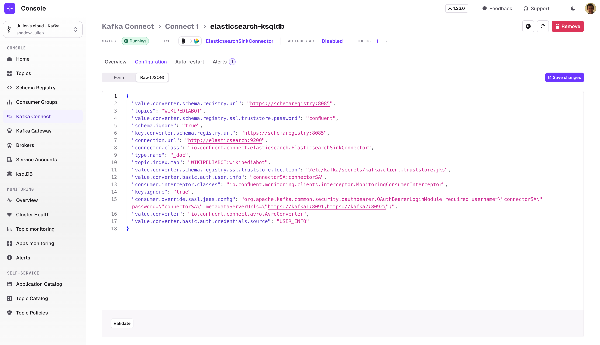

Similarly to the Create Connector workflow, the Connector Configuration tab lets you **view** or **edit** your Connector configuration using a wizard which is taking full advantage of the [Kafka Connect Validate API](https://docs.confluent.io/platform/current/connect/references/restapi.html#put--connector-plugins-(string-name)-config-validate):

- Form is generated with structured configuration groups
- Much nicer error handling, attached to each individual field
- Embedded documentation that helps you understand which fields are required and what are their expected and default values
- Ability to toggle advanced configuration to visualize only the most important fields
- Ability to switch seamlessly between Form View and JSON View at any time.

 