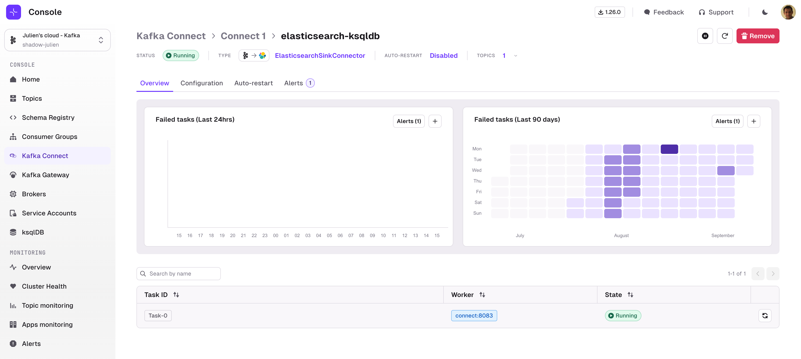
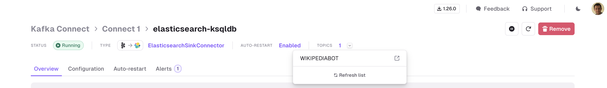
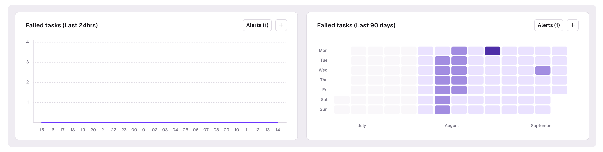
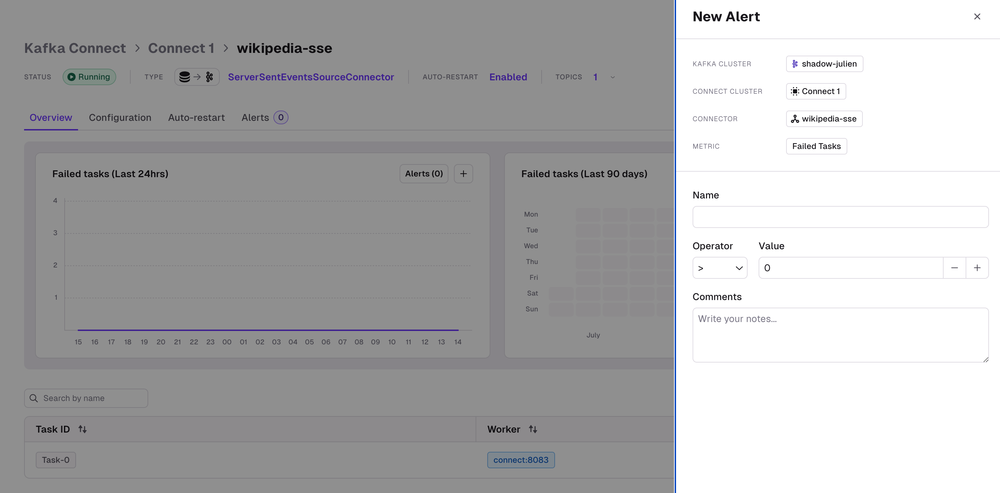
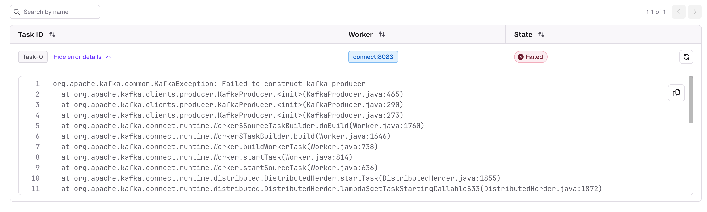

The Connector Overview page is split in 3 main sections:
- Statistics
- Graphs & Alerts
- Tasks list

## Statistics
This section gives you relevant information about the current state of your Connector that will stay visible across all tabs
- Connector Status
- Connector Class
- Whether Auto-restart is enabled
- How many Topics are associated. You can click on the icon next to it to visualize their names

### Operations
A few operations are available:
- **Pause/Resume** uses the Kafka Connect API to Pause or Resume the Connector
- **Restart Connector** restarts the Connector (**not the tasks**)
- **Remove Connector** deletes the Connector from the Kafka Connect Cluster
- You can also **Refresh** the list of topics used by that Connector. This is useful if your Connector is configured with `topics.regex` and new topics were added recently
  - This makes use of the Kafka Connect [Topics API](https://docs.confluent.io/platform/current/connect/references/restapi.html#topics)

## Graphs and Alerts
The Graph section lets you visualize the number of Failed Tasks of your Connector over the past 24 hours (Line chart on the left) or over the past 3 months (Heatmap on the right).   
This can help you understand if there is a specific pattern associated with your Kafka Connect Tasks failures.

### Create an Alert

To create an Alert, click on the "+" button inside the graph to open the "Create Alert" page.

There, define the threshold for your alert as well as a name, and click Save.

You can get a summary of all alerts associated to this Connector in the dedicated [Alerts tab](../connector-alerts)

## Tasks list

The task list displays all the information related to the tasks associated to the Connector:
- The task ID
- The Kafka Connect worker on which the task is running
- The current task state
- An option to **Restart task**

If a task is in a Failed state, you can see the detailed logs about the failed task.  

