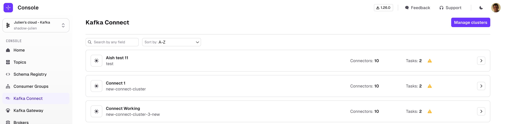
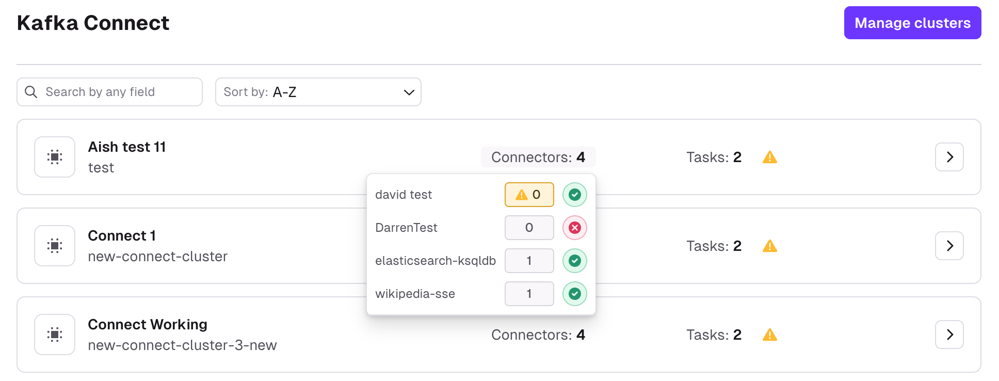
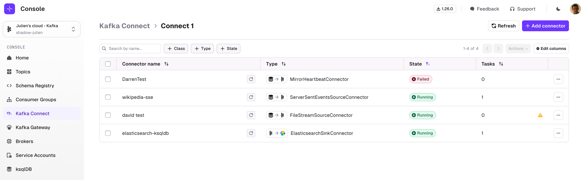
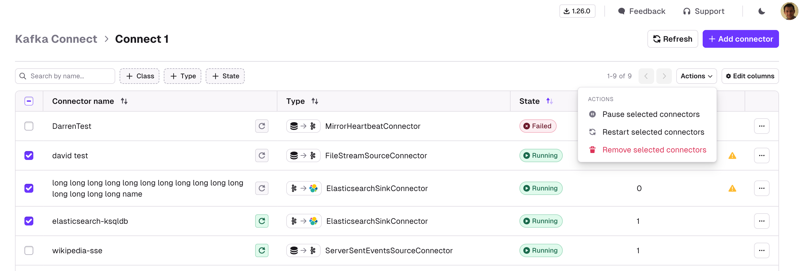
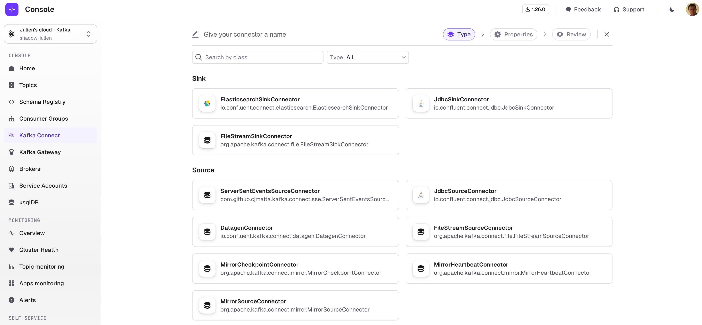
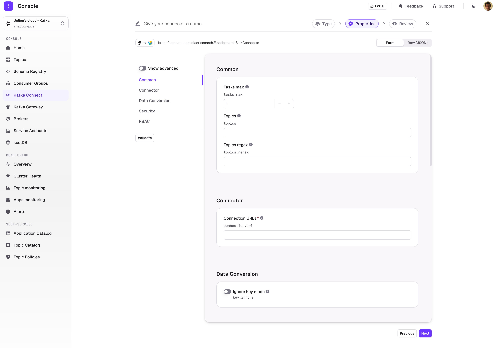
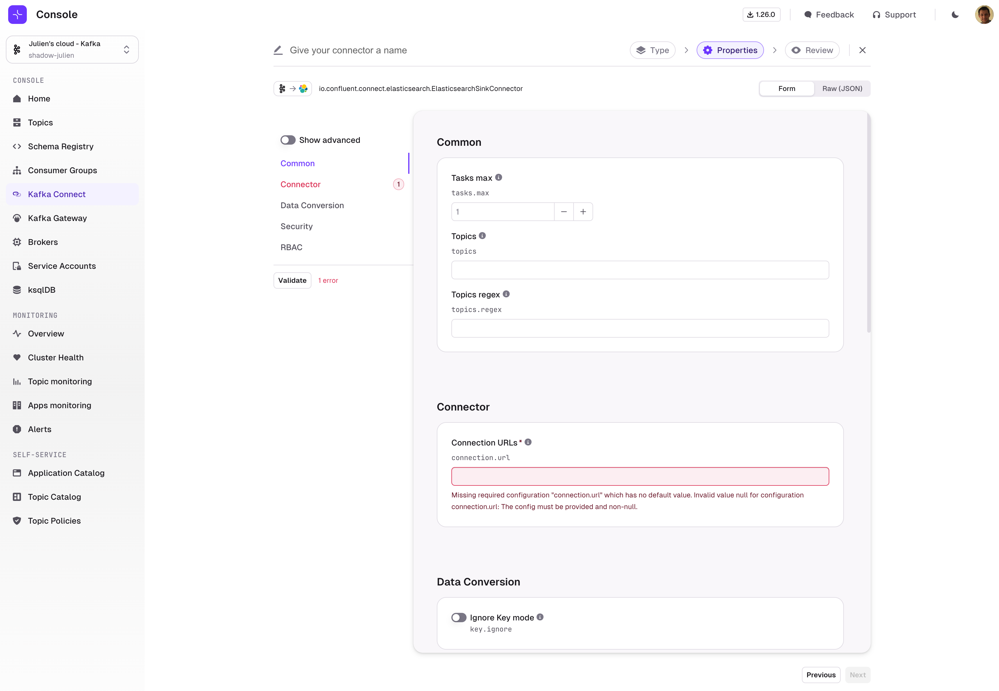
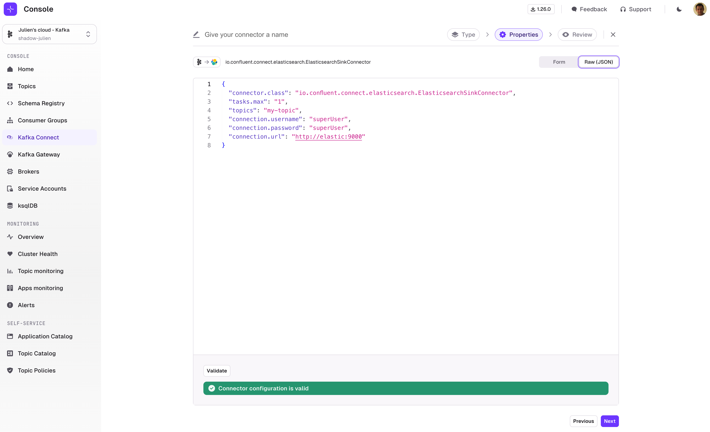
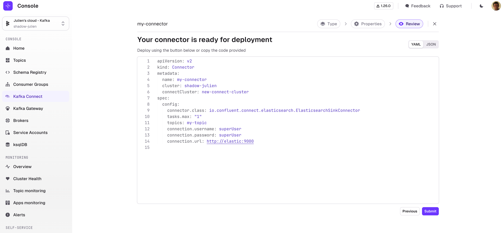

Kafka Connect is a tool to stream data between Apache Kafka and other data systems in a reliable & scalable way. Conduktor provides a simple interface for managing all of your source and sink connectors in one place.

## Kafka Connect Cluster List

The Connect Cluster List is a summary view of all your configured Kafka Connect Clusters attached to your currently selected Kafka Cluster.

You can filter by Connect Cluster name and order by 
- Number of Connectors
- Number of Tasks
- Connect Cluster Name

The list is warning you that some tasks have failed and gives you a high level overview by hovering over "Connectors".

## Connector List

The Connector List page lets you search for any Connector on your currently selected Kafka Connect Cluster.
:::caution
Configure **RBAC** to restrict your users to View, Browse, or perform any operation only to certain topics.  
Check the [Settings](https://docs.conduktor.io/platform/admin/rbac/) for more info.
:::
Multiple search capabilities can be combined to help you find the Connector you want faster.

**Filtering** is possible on:

- Connector name
- Connector class
- Connector type (source / sink)
- Connector status

**Sorting** is possible on all columns.

**Active columns** can be picked from a list of Available columns from the side button « ⚙️ Edit columns »

The round arrow icon next to the Connector name indicates whether the connector will be auto-restarted by Conduktor: (Grey: disabled, Green: enabled)

Clicking a Connector in the list brings you to the Connector overview page where you can perform further actions on the selected Connector:
- [Review the Connector Task details and status](connector-overview)
- [View and Edit the Connector configuration](connector-config)
- [Create and manage Alerts for this Connector](connector-alerts)
- [Toggle Auto-restart feature](connector-autorestart)

Several actions are also directly available from the Connector List:
- Add a Connector
- Pause/Resume & Restart
- Delete Connector

All List Operations can be applied either on single Connector or by selecting multiple Connectors at once:

## Add a Connector

To deploy a new Connector, click "Add a Connector". You will be presented with the list of all Connector Plugin classes installed on this Connect Cluster.

Next, you will get to our configuration wizard for Kafka Connect, which is taking full advantage of the [Kafka Connect Validate API](https://docs.confluent.io/platform/current/connect/references/restapi.html#put--connector-plugins-(string-name)-config-validate):

- A form is generated with structured configuration groups to be filled out
- Supportive error handling is included with each individual field
- Embedded documentation helps you understand which fields are required and what their expected, and default, values are
- Toggle advanced configuration to visualize only the most important fields
- Switch seamlessly between Form View and JSON View at any time

Configure your Connector to your convenience and use the **Validate** button to verify that your configuration is valid. 

This will highlight the parts of the configuration that are invalid, and give you precise information on how to correct your Connector configuration.

:::caution warning

While Kafka Connect Validate API generally checks for most configuration inconsistencies, there are some limits:
- It usually doesn't check for external configuration such as URL and user / passwords.
- Some Kafka Connect Plugins classes are notoriously badly implemented and don't take full advantage of Kafka Connect Validate API

When errors happen outside the nominal scope of Kafka Connect Validate API, you will see the errors as Toasts

:::

At any point in time, you can switch to JSON view and edit the JSON payload directly.  
You can switch back and forth between JSON and Form view at your convenience.

When you're done, click "Next" and you'll be presented with a Review screen where you will be able to copy the YAML associated to your Kafka Connect configuration.

This YAML will help you automate your deployment with the help of [Conduktor CLI](/platform/reference/cli-reference/).  
This is entirely optional and you can just deploy your Connector from the UI by clicking "Submit".

