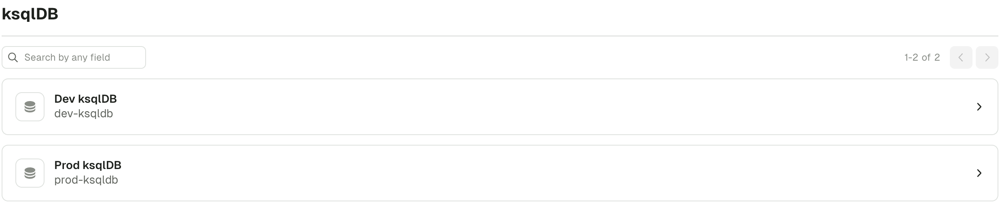
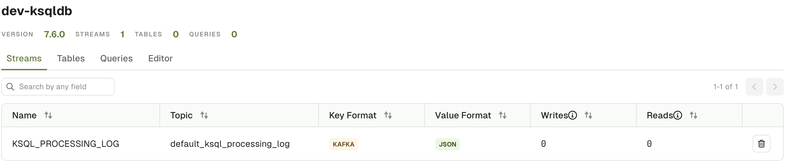
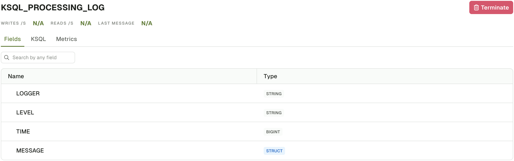
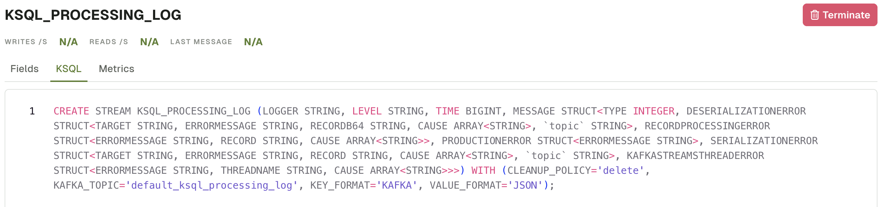
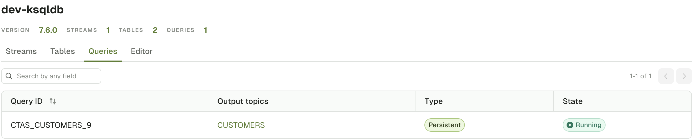
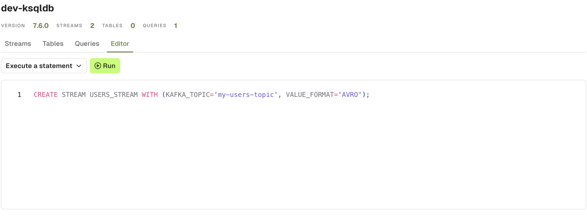

# ksqlDB

## ksqlDB Clusters List

The landing page for ksqlDB shows the list of all configured ksqlDB clusters for this Kafka cluster. If you have multiple ksqlDB clusters, use the input to filter them by name or by technical ID.

Click on an element to get to the ksqlDB Cluster Details page.

:::caution
Configure [**RBAC**](/platform/navigation/settings/rbac/) to restrict your users from accessing to certain ksqlDB Clusters.
:::

## ksqlDB Cluster Details

The ksqlDB Cluster details page is split into multiple tabs that lets you visualize all the currently running queries as well as write your own queries or executes statements.

In particular, the following tabs are available:

-   **Streams** tab lets you visualize and act on the running Streams (resulting from CREATE STREAM statements)
-   **Tables** tab lets you visualize and act on the running Streams (resulting from CREATE TABLE statements)
-   **Queries** tab shows you all the Persistent and Push queries currently running on the ksqlDB Cluster.
-   **Editor** tab lets you execute Pull and Pull Queries (SELECT) and Statements (CREATE, DESCRIBE, DROP, ...)

:::info
Check the ksqlDB documentation for more info about the [ksqlDB concepts](https://docs.ksqldb.io/en/latest/concepts/)
:::

## Streams & Tables tabs

Both Streams and Tables tabs are similar, the only difference is the kind of resource it's showing. The first one shows the result of `CREATE STREAM` statements while the other one is about `CREATE TABLE` statements.

The table of Steams / Tables consists of the following columns:

-   Name: The name of the ksqlDB Steam/Table
-   Topic: The target topic this Steam/Table write its data into
-   Key Format & Value Format: The [ksqlDB Serialization](https://docs.ksqldb.io/en/latest/reference/serialization/) format used for key and value
-   Writes: Number of ksqlDB queries that writes into this Stream/Table
-   Reads: Number of ksqlDB queries that reads from this Stream/Table

You can either click on a item in the table to navigate to the Steam/Table details page or delete it using the Delete button.

### Stream / Table details page

This page contains 3 sections: Fields, kSQL, Metrics

**Fields** let you visualize on the structure of the records on the given Stream or Table.

**kSQL** gives you the exact kSQL statement that is running behind the scenes

**Metrics** provides runtime statistics for the topic backing the Stream or Table. More info about the [metrics here](https://docs.ksqldb.io/en/latest/developer-guide/ksqldb-reference/describe/)

Additionally, the "Terminate" button lets you delete the current Steam or Table.

## Queries tab

The Queries tab gives you all the currently running queries on this ksqlDB cluster.

The table has of the following columns:
-   Query ID
-   Output topic: when application, the topic into which the query is writing to
-   Type: Either **Persistent** for the queries originating from CREATE statements or **Push** for Queries executed by users in the Query Editor or via calls to `/query-stream` endpoint

Click on the **Peristent** type queries to see more information (Fields, kSQL)

## Editor tab
:::info
Check the [ksqlDB syntax](https://docs.ksqldb.io/en/latest/reference/sql/syntax/lexical-structure/) to figure out how to execute queries and statements
:::

### Run a query

You can run Push or Pull queries there. The records will appears in a streaming fashion in the result section.

This will send requests to the `/query-stream` endpoint of ksqlDB.

[https://docs.ksqldb.io/en/latest/developer-guide/ksqldb-rest-api/streaming-endpoint/](https://docs.ksqldb.io/en/latest/developer-guide/ksqldb-rest-api/streaming-endpoint/)

### Execute a statement

Alternatively, select the "Execute a statement" option from the dropdown to run a sequence of SQL statements. The `/ksql` endpoint of ksqlDB will be used.

[https://docs.ksqldb.io/en/latest/developer-guide/ksqldb-rest-api/ksql-endpoint/](https://docs.ksqldb.io/en/latest/developer-guide/ksqldb-rest-api/ksql-endpoint/)

