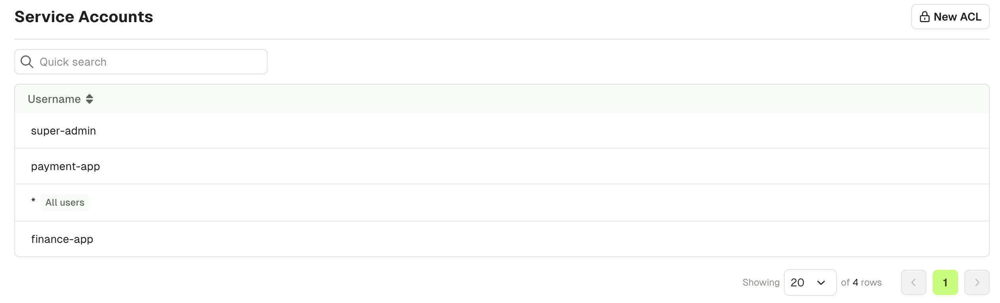
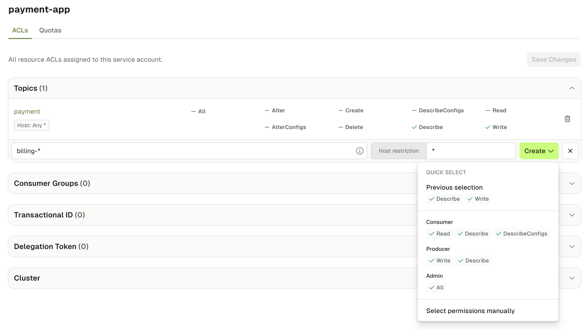
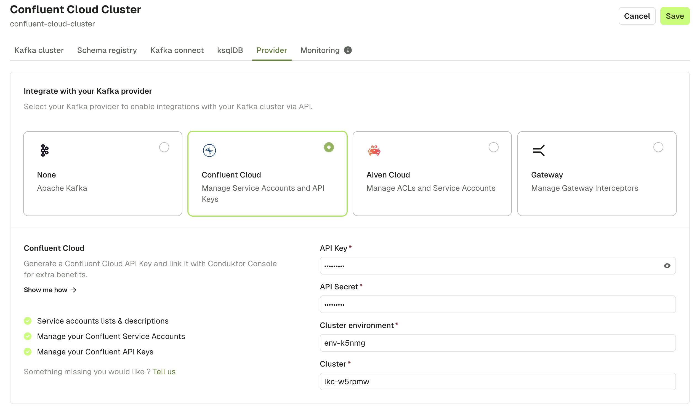
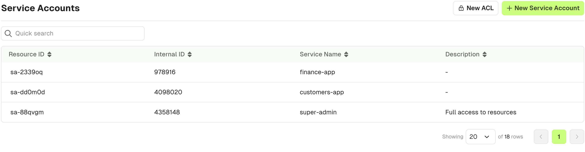
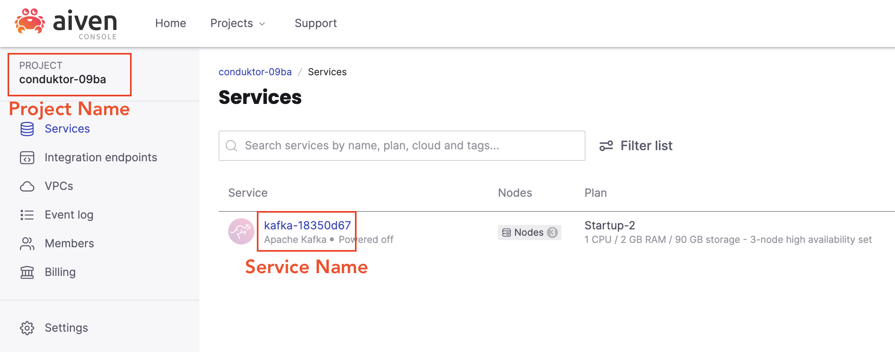

Console enables you to manage service accounts and your Kafka ACLs. 

What you see in the **Service Accounts** screen will depend on whether you have configured a Kafka [provider](#provider-integrations) such as Confluent or Aiven. 

 - [View Service Accounts and Manage ACLs](#view-service-accounts-and-manage-acls)
 - [Provider Integrations](#provider-integrations)
    - [Confluent Cloud](#confluent-cloud)
    - [Aiven](#aiven)

## View Service Accounts and Manage ACLs

When viewing the Service Accounts screen, you will observe a powerful design that aggregates ACLs to principal granularity. This makes it possible to more easily understand all resource ACLs assigned to each service account.

After selecting a service account, you can **edit** existing ACLs and **add** new resource ACLs. When you create new ACLs for a resource, you can:
 - Use preconfigured permissions (e.g. Consumer, Producer, Admin)
 - Manually define permissions

To manually edit permissions, select the operation and choose **Allow**, **Deny** or **Not Set**.

## Provider Integrations

Connect your Kafka provider to manage their benefits directly in Conduktor Console. The additional functionality you get from connecting your provider is made possible via their APIs.

To use Kafka provider service account functionality, you must first configure the **Provider** tab from within your cluster configuration.

### Confluent Cloud

:::info
When configuring Confluent Cloud as your provider, ensure you use [Confluent Cloud API Keys](https://docs.confluent.io/cloud/current/access-management/authenticate/api-keys/api-keys.html) as opposed to resource API keys.
:::

Once you have configured Confluent Cloud as your [provider](#provider-integrations), you can:
 - Manage Service Accounts and ACLs
 - Manage API Keys

To manage Confluent Cloud resources, navigate to the **Service Accounts** screen when connected to a Confluent Cloud Kafka cluster. Note you will have a different view that's tailored to Confluent resources.

Additionally, you can **list** and **create API Keys** associated with a Confluent Cloud service account:

### Aiven

:::info
When configuring Aiven as your [provider](#provider-integrations), you can generate your API token following [this guide](https://aiven.io/docs/platform/howto/create_authentication_token), and get the **project name** and **service name** fields in the below locations from within the Aiven console.

:::

Once you have configured Aiven as your [provider](#provider-integrations), you can:
 - Manage Service Accounts
 - Manage ACLs

To manage Aiven resources, navigate to the **Service Accounts** screen when connected to an Aiven Kafka cluster.

You'll see the list of your Aiven users, and their associated Aiven ACLs.

