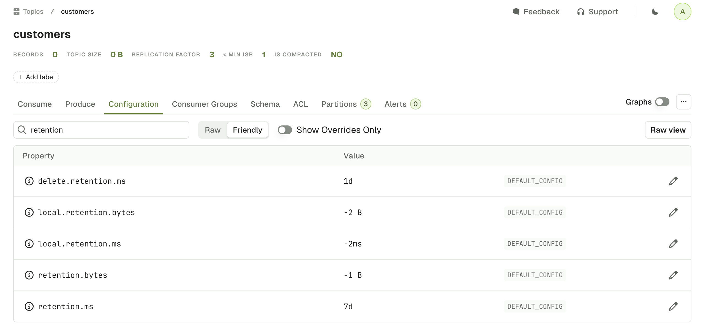

The Topic Configuration tab lets you visualize and edit your topic configuration.

## List configurations




On top of the table you have different fields to help you:

**Search input**  
filters out the configurations by name. In the example below, we display only configuration with the term `retention`.

**Raw** / **Friendly**  
Formats the information either in its original form or in a more human readable way.  
For instance, `retention.ms` can be reprensented as Raw(`43200000`) or Friendly(`12h`)  
Default: `Friendly`

**Show Overrides only**
Displays only the configurations that are set at topic level, as opposed to the configurations set at the broker level.  
Default: `true`  

**Raw view button**  
This button shows all the Topic Configurations as key value pairs  

**More Button `...`**  
This lets you do the same 3 operations that are available on the [Topic List Page](/platform/navigation/console/topics/#add-partitions) : Add partitions, Empty Topic and Delete Topic.

## Edit configurations

When clicking on the edit button from the table rows, a new screen will appear with the following details:

- The name and description of the topic configuration
- The Kafka default value
- The current value

import EditTopicConfiguration from './img/topic-config-item.png';


You can choose to either Update the value to something new or revert to the Kafka default, which will apply the change directly on the Kafka cluster, similarly to the `kafka-configs` commands below.

```shell-session
# Update value
$ kafka-configs --bootstrap-server broker_host:port \
  --entity-type topics --entity-name my_topic_name  \
  --alter --add-config cleanup.policy=<new-value>

# Reset to default
$ kafka-configs --bootstrap-server broker_host:port \
  --entity-type topics --entity-name my_topic_name  \
  --alter --delete-config cleanup.policy
```

          