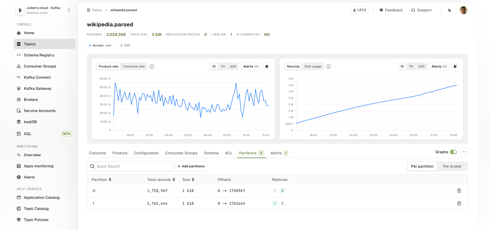
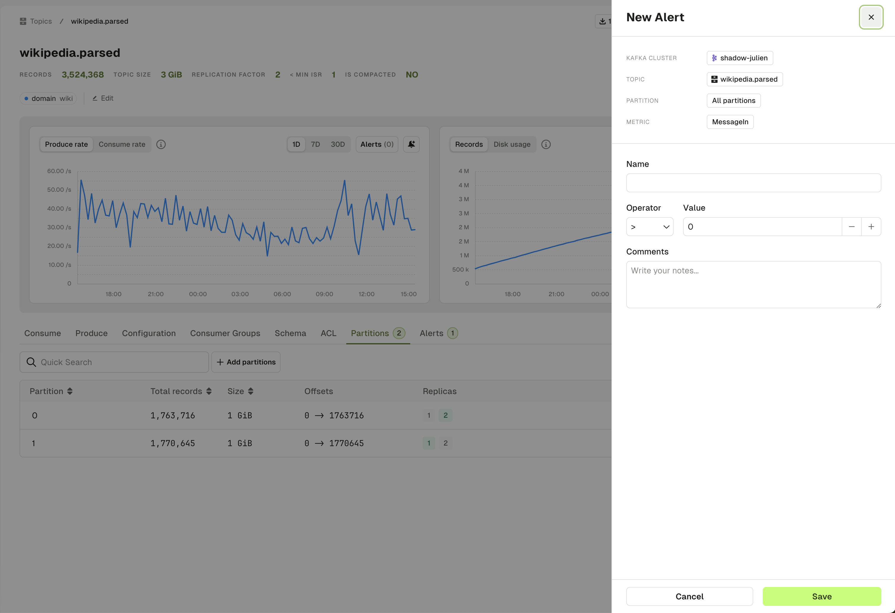
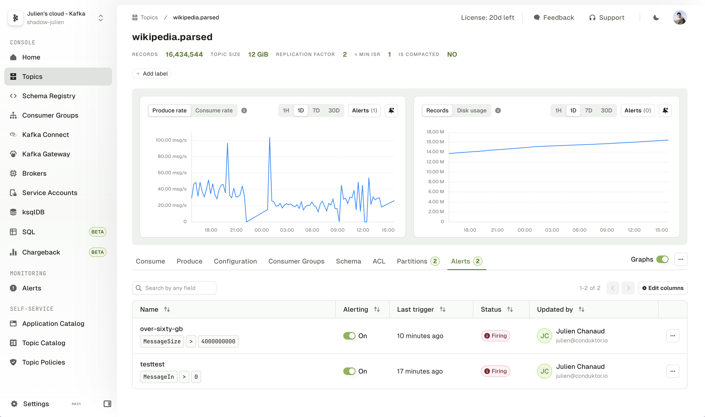

## Topic Graphs 

When you browse any Topic Details page, you will see the associated Graphs associated to this topic:
- Produce and Consume rate
- Number of Records
- Disk Usage

Graphs can be visualized over 24h, 7 days or 30 days periods.

On each metric you have the option to create an Alert. This will open a side panel requesting you to set the parameters to triggers your Alert.

## Alerts Tab

The topic Alert tab lets you visualize all active alerts associated to this Kafka Cluster.  
You can edit them or toggle them on or off.

