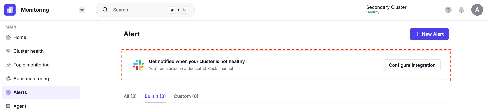
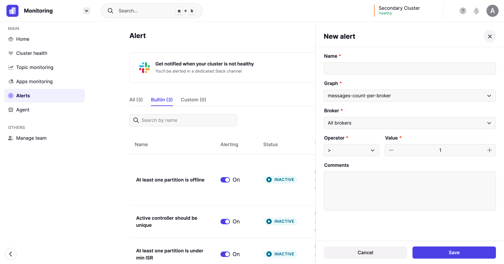
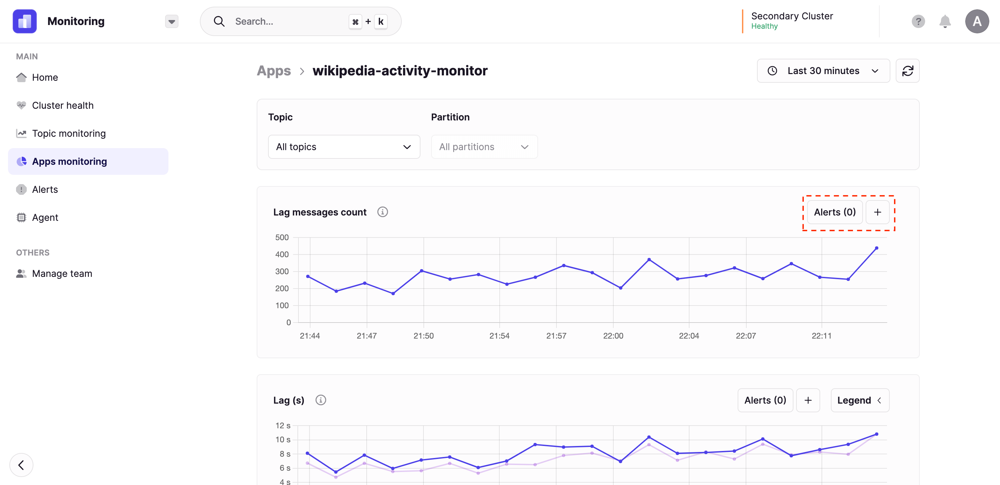

- [Create an Alert](#create-an-alert)
  - [Overview](#overview)
  - [Configure the Integration](#configure-the-integration)
  - [Create an Alert](#create-an-alert-1)
    - [Option 1: From the Alerts Tab](#option-1-from-the-alerts-tab)
    - [Option 2: From a Graph](#option-2-from-a-graph)

# Create an Alert

:::caution Deprecation notice
We plan to remove these original alerts in the near future in favor of the new ones. We'll let you know a few releases in advances but it will happen in this order:
- First we are going to cover all original alerts with new alerts through the dedicated resources pages. We are missing Consumer Group today.
- Then, we'll block the creation of original alerts while still keeping them functional.
- Finally, we'll remove the original alerts from the product.

We'll give you in the next release changelog timelines for you to migrate your existing alerts to the new model.

Starting today, we recommend you use the new alerts for [Brokers page](/platform/navigation/console/brokers/) and [Topics page](/platform/navigation/console/topics/topic-graphs/).
:::

## Overview

Our alerting solution will enable you to react to Kafka infrastructure and application irregularities. Currently, we integrate with **Slack** and **MS Teams** so that you can receive real-time notifications.

If you require an additional integration, please [let us know](https://conduktor.io/roadmap) so we can consider it.

## Configure the Integration

From within Monitoring, navigate to the **Alerts** tab. If you have not yet configured an integration, then follow the link to set this up as a pre-requisite.

If you have any issues with this process, please contact us through the chat box at the bottom of your window.

## Create an Alert

### Option 1: From the Alerts Tab

Once you have configured your integration, click the **+ New Alert** button from within the **Alerts** tab.

Fill in the:

- **Name**: Unique name to identify your alert
- **Graph**: The metric you wish to create an alert on
- **Broker / Topic / Consumer Group**: Further options to filter your alert granularity
- **Operator**: The operator used to define your alert condition (for example, greater than or less than)
- **Value**: The value to use as threshold for the alert
- **Comments**: Any additional comments to share with your colleagues

### Option 2: From a Graph

Alternatively, you can create an alert more dynamically when viewing a graph.

Next to each graph, you have a **+** button that can be used to create the alert. Once you have clicked the button, follow the steps from Option 1 to fill out the form.

