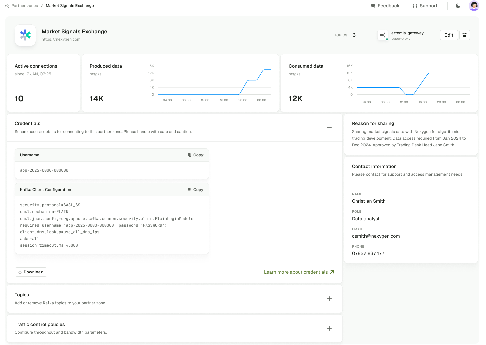

## Overview

Partner Zones allow you to share Kafka topics with external partners selectively and securely. You can:

- set up **dedicated zones** with **customized access** to Kafka topics
- create a **single source of truth** because data isn't duplicated
- **reduce operational costs**, since you don't have to keep data streams synchronized



## Prerequisites

Before creating a Partner Zone, you have to:

- use **Conduktor Console 1.32** or later
- use **Conduktor Gateway 3.6.1** or later with the following configurations:
  - `GATEWAY_SECURITY_PROTOCOL` set to `SASL_PLAIN` or `SASL_SSL` (`DELEGATED_SASL_*` modes are not supported)
  - `GATEWAY_USER_POOL_SERVICE_ACCOUNT_REQUIRED` set to `true`
- use a service account to connect to Gateway, that can access the topics you want to share
- be logged in as an admin to Console UI, or using an admin token for the CLI
- in Console, [configure your Gateway cluster](/platform/navigation/settings/managing-clusters/) and fill in the **Provider** tab with Gateway API credentials

:::warning Current limitations
As of version 1.32, Partner Zones have the following limitations:

- Partners will only be able to connect to your zone using **Local Gateway Service Accounts**.
- Passwords do not expire. If you need **to revoke access** to your partner, you will have to delete the Partner Zone.
:::

## Create a Partner Zone

You can create a Partner Zone from the **Console UI**, or the **Conduktor CLI**.

import Tabs from '@theme/Tabs'; import TabItem from '@theme/TabItem';

<Tabs>
<TabItem value="First Tab" label="Console UI">
Use the Console UI to create a Partner Zone in just a few steps.

:::warning
 Currently, only `admin` users have access to Partner Zones.
:::

1. In Conduktor Console, go to **Settings** > **Partner Zones** and click **+New zone**.
1. Define the Partner Zone details:
   - Add a descriptive **name** for the zone.
   - The **Technical ID** will be auto-populated as you type in the name. This is used to identify this zone in CLI/API.
   - **Service account** will also be auto-generated based on the name but you can edit this as required. [Service accounts](/platform/navigation/console/service-accounts/) are used to define permissions to Kafka resources, called ACLs (Access Control Lists).
   - (Optional) Enter a relevant **URL** for your partner.
   - (Optional) Enter a **Description** to explain your reasons/requirements for sharing data.
   - (Optional) Specify contact details of the beneficiary/recipient of this Partner Zone.
   - **Select Gateway** to choose the one you want to use and click **Continue**.
1. Choose what and how to share:
   - **Select the Kafka topics** to include in this Partner Zone, you can filter topics by custom labels you've defined or search for topic name.
   - **Select Read/Write**. By default, any topics that are shared, will be shared with **Read**-only access, but you can additionally allow **Write** access.
   - (Optional) **Rename topics** for how you want the consumer to read them by hovering over the name of any topic being shared, and selecting the **pencil icon**.
   - **Continue** when done.
1. (Optional) Protect your cluster by limiting clients with Traffic Control Policies. Limit their rate of producing, consuming or committing offsets.
1. Review the details and if you're happy with the data you're about to share, click **Create**.

It will *take a few moments* for the zone to be created.

Once completed, the **Credentials** will be displayed. Copy/download and share these as required.

:::warning
If these credentials are lost, you may have to re-create the Partner Zone.
:::

To view and manage all the zones you have access to, go to **Settings** > **Partner Zones**. You'll see the total number of zones and topics shared, as well as a list of zones, each showing:

- name and URL
- the number of topics shared
- Gateway details
- the status:
  - **Pending**: means the configuration isn't deployed or refreshed yet
  - **Ready**: shows that the configuration is up-to-date on Gateway
  - **Failed**: indicates that something unexpected happened during the creation. Check that the connected Gateway is active.
- the date the zone was last updated

Click on a Partner Zone to view its details.

</TabItem>
<TabItem value="Second Tab" label="Conduktor CLI">
You can also use the [Conduktor CLI (Command Line Interface)](/gateway/reference/cli-reference/) to create Partner Zones.

1. Save this example to file, e.g. `pz.yaml`:

    ```yaml
    apiVersion: v2
    kind: PartnerZone
    metadata:
      name: external-partner-zone
    spec:
      cluster: partner1
      displayName: External Partner Zone
      url: https://partner1.com
      serviceAccount: johndoe
      topics:
        - name: topic-a
          backingTopic: kafka-topic-a
          permission: WRITE
        - name: topic-b
          backingTopic: kafka-topic-a
          permission: READ
      partner:
        name: John Doe
        role: Data analyst
        email: johndoe@company.io
        phone: 07827 837 177
    ```

1. Use [Conduktor CLI](/gateway/reference/cli-reference/) to apply the configuration:

    ```bash
    conduktor apply -f pz.yaml
    ```

1. Check the status of the Partner Zone:

    ```bash
    ❯ conduktor get PartnerZone
    ---
    apiVersion: v2
    kind: PartnerZone
    metadata:
        name: john-partner-zone
        id: 332b30cd-7bda-4659-b1c1-39986986f0bd
        updatedAt: "2025-01-27T12:55:05.387368Z"
        status: PENDING
    spec:
        cluster: partner1
        displayName: Johns partner zone
        url: https://partner1.com
        serviceAccount: johndoe
        topics:
            - name: topic-a
              backingTopic: kafka-topic-a
              permission: WRITE
            - name: topic-b
              backingTopic: kafka-topic-a
              permission: READ
        partner:
            name: John Doe
            role: Data analyst
            email: johndoe@company.io
            phone: 07827 837 177
    ```

    The `metadata status` can have one of these values:
      - **Pending**: the configuration isn't deployed or refreshed yet
      - **Ready**: the configuration is up to date on Gateway
      - **Failed**: something unexpected happened during the creation

1. To securely connect to a Partner Zone through Kafka client, we've created a service account `spec.serviceAccount`. For additional security, you have to also generate a password for it:

    ```bash
    curl --request POST \
        --url 'http://localhost:8080/public/partner-zone/v2/$PARTNER_ZONE_NAME/generate-credentials' \
        --header "Authorization: Bearer $CDK_API_KEY"
    ```

1. Once generated, retrieve the password and create a `config.properties` file:

    ```bash
    security.protocol=SASL_PLAINTEXT
    sasl.mechanism=PLAIN
    sasl.jaas.config=org.apache.kafka.common.security.plain.PlainLoginModule required username=johndoe password=${SERVICE_ACCOUNT_PASSWORD};
    ```

1. Finally, use CLI to list the topics of the Partner Zone:

    ```bash
    ❯ kafka-topics --bootstrap-server gateway:9094 --list --command-config config.properties
    topic-a
    topic-b
    ```

</TabItem>
</Tabs>

## Edit a Partner Zone

<Tabs>
<TabItem value="First Tab" label="Console UI">
To edit a Partner Zone you can either:
- go to the zone list view and click the **three dots** on the right-hand side then select **Edit**
- go to the zone details view, click the **Edit** button in the top right corner

This will open up the Partner Zone details view in edit mode. You can edit the following details by updating the input fields:

- URL
- Description
- Contact details

To edit the name of the Partner Zone, hover over the name and click the **pencil** icon that appears to focus into the input field, then make the required changes.

### Topics management

To add a new topic to the Partner Zone, click the **+Add topic** button at the bottom of the **Topics** section. This will open a drawer where you can search for a topic by name and select it from the list. By default, any topics that are shared, will be shared with **Read** access for security. You can additionally allow access to **Write** (this will also include **read**).

For added security, you can also rename the topic that are shared. Click the **pencil icon** next to the topic name to focus into the input field, then make the required changes. Click **Continue** when done.

To remove an existing topic from the Partner Zone, click the **trash can** icon next to the topic listed under the **Topics** section. Note that you cannot remove the topic if it is the only topic in the Partner Zone.

### Traffic control policies

Expand the **Traffic control policies** section by clicking on it.

You can then toggle the switch next to the policy you want to enable/disable, and update the value of the policy when it is enabled.

Once you have made your changes, click **Save** in the top right corner.
</TabItem>
<TabItem value="Second Tab" label="Conduktor CLI">

1. Update the YAML file you have created previously (e.g. `pz.yaml`) to create Partner Zones with the required changes.

2. Use [Conduktor CLI](/gateway/reference/cli-reference/) to apply the updated configuration:

    ```bash
    conduktor apply -f pz.yaml
    ```

</TabItem>
</Tabs>

## Delete a Partner Zone

<Tabs>
<TabItem value="First Tab" label="Console UI">
To delete a Partner Zone you can:
- go to the zone list view and click the **three dots** on the right-hand side then select **Delete** or
- in the zone details view, click the **trash can** in the top right corner

Deleting a Partner Zone will remove a partner's access.

A confirmation window will pop up. Enter `DELETE` to confirm the deletion. *This can't be undone.*
</TabItem>

<TabItem value="Second Tab" label="Conduktor CLI">
Deleting a Partner Zone will remove a partner's access to it. *This can't be undone.*
  ```bash
     conduktor delete PartnerZone {name}
    ```
</TabItem>
</Tabs>

## Troubleshoot

<details>
  <summary>What does Partner Zone status mean?</summary>
  <p>
  This is the status of a Partner Zone:
    - **Pending**: the configuration isn't deployed or refreshed yet
    - **Ready**: the configuration is up-to-date on Gateway
    - **Failed**: something unexpected happened during the deployment. Check that the connected Gateway is active.
  </p>
</details>
<details>
  <summary>Does **Generate password** invalidate the previous credentials of service account?</summary>
  <p>No, you can't invalidate the credentials. If unsure, delete the Partner Zone and re-create it.</p>
</details>
<details>
  <summary>My Partner Zone creation failed, how do I find out what the issue is?</summary>
  <p>To check status, [use the API](https://developers.conduktor.io/?product=console&version=1.31.2#tag/cli_partner-zone_console_v2_16) or check Gateway/Console logs.</p>
</details>

## Related resources

- [Connect to clusters](/platform/navigation/settings/managing-clusters/)
- [Manage service accounts](/platform/navigation/console/service-accounts/)
- [Gateway service accounts](/gateway/concepts/service-accounts-authentication-authorization/)
- [Give us feedback/request a feature](https://conduktor.io/roadmap)
