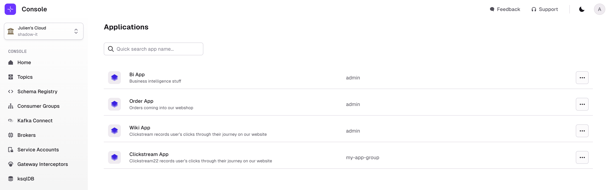
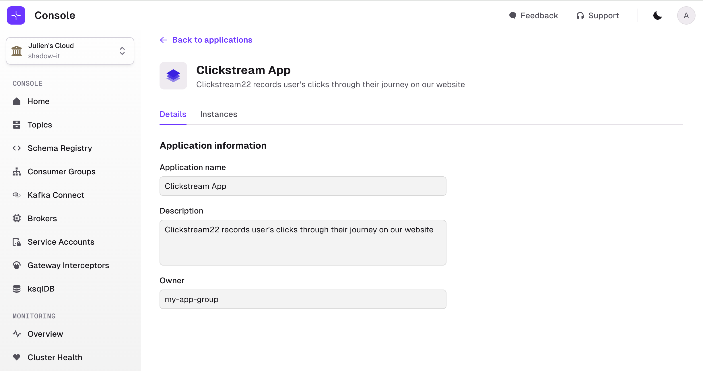

:::tip 
Self-service UI is almost entirely Read-only for now.  
Use the CLI to interact with the product.
:::

## Application Catalog List Page

The Application Catalog lets you search through the Applications deployed in your organization.  

You can filter by any element available in the list: Name, Description, Owner.

You can click on an Application to get to its details page.

## Application Details

Application Details page summarize all the information that relates to the Application:
- Application General information
- Application Instances & Ownership
- Subscribed topics
- Shared topics

Additionally, if you belong to the owner Group of the Application, you can generate Application Instance Tokens to use with the CLI to create resources.

