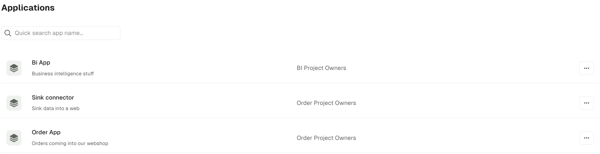
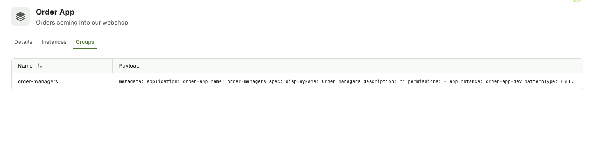
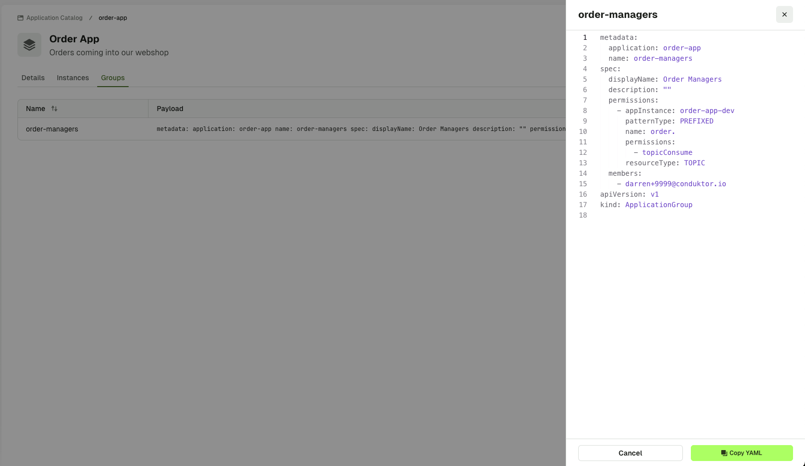

:::tip Self-service UI is almost entirely Read-only for now. Use the CLI to interact with the product. :::

## Applications Catalog

The **Applications Catalog** page in Console is designed to improve application discovery and team collaboration by providing a comprehensive view of all the applications deployed in your organization.

You can search for an application by any element available in the list (name, description, owner). You can also:

- **filter by ownership**: see only applications you own using the **My applications** tab
- **search using label**: filter applications by labels for better organization and categorization
- **use advanced search**: search across application names, descriptions and metadata

Each application entry displays:

- Application name and description
- Owner group and team member avatars
- Public topics count
- Subscription information (incoming/outgoing)
- Application instances count
- Instance details (hover over an application to see instance details)

Click on an application to view its details.

## Manage topic subscriptions

When users request to subscribe to topics via the Topic Catalog page, these requests can be managed using the **Application Catalog** page, the **Access requests** tab.

Using this tab **application owners can approve or deny** incoming subscription requests. During the approval process, administrators can modify the originally requested permissions to align with organizational requirements, adjusting read or write access, as needed.

For teams managing infrastructure as code, subscription requests can also be approved using the CLI with YAML configuration which automatically closes the request and finalizes the subscription. [Find out more about CLI reference](/platform/reference/cli-reference/).

## Application details

The application details page summarizes all the information related to the application:

- Application General Information
- Application Instances Overview
- Application Groups
- Access Requests

For better categorization and organization of applications, you can add & remove labels on this page.

import AppDetails from './assets/app-details.png';

## Application Instance Details

We've introduced a dedicated **Application Instance Details** page that consolidates all instance-specific operational information. This new page provides comprehensive visibility into individual application instances and can be accessed by clicking on a specific instance from the Application Details page.

The application instance details page includes:

- Instance Configuration: Cluster assignment, Incoming / Outgoing subscriptions and public topics
- Resource Ownership: Topics, consumer groups, and subjects owned by this specific instance
- Granted Permissions: Detailed view of permissions granted to and from this instance
- API Key Management: Generate and manage API keys for CLI operations
- Resource Policies: Instance-specific policies and restrictions

### Groups Tab

To see a list of application groups that belong to an application, open on the **Groups** tab.

To see the details of the group, click on it in the table. A side panel showing the same YAML will be shown. You can also retrieve this via the CLI.

