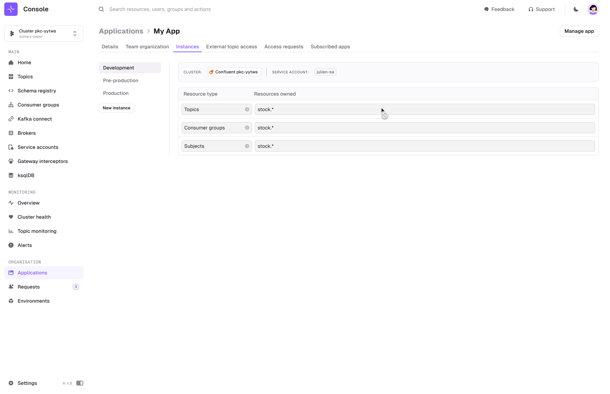

# Kafka Self-service

## Overview

Self-service helps you scale Kafka usage in your organization by facilitating collaboration between the **Central Platform Team** and **Application Teams**.  
It simplifies and automates processes, establishes clear rules and ways of working, and standardizes the creation and management of Kafka resources.  
This approach brings governance into your enterprise through concepts like Ownership and Applications, delegating operations to the Application Teams rather than the Central Platform Team.

- For a presentation of Self-service and its key concepts, see [Get Started with Self-service](/platform/guides/self-service/)
- For the full definition of each resource, check the [Self-service Resources Reference](/platform/reference/resource-reference/self-service/).

## Self-service User Interface
For now, Self-service relies principally on the Conduktor CLI. 

The UI focus on Read Only features around [Application Catalog](/platform/navigation/self-serve/application-catalog/) and [Topic Catalog](/platform/navigation/self-serve/topic-catalog/).

